# HỆ THỐNG KHẢO SÁT Ý KIẾN SINH VIÊN

**Báo cáo đồ án môn học**

**Đề tài:** Hệ thống khảo sát ý kiến sinh viên  
**Tên hệ thống:** student-feedback-system  
**Nhóm thực hiện:** TODO - bổ sung thông tin nhóm  
**Giảng viên hướng dẫn:** TODO - bổ sung thông tin giảng viên  
**Lớp/Học phần:** TODO - bổ sung thông tin học phần  
**Thời gian thực hiện:** TODO - bổ sung thời gian

> [Hình 0.1: TODO - logo trường/khoa hoặc hình minh họa hệ thống]

---

# LỜI CẢM ƠN

Nhóm thực hiện xin gửi lời cảm ơn đến giảng viên hướng dẫn và nhà trường đã tạo điều kiện để nhóm có cơ hội nghiên cứu, thiết kế và triển khai đề tài “Hệ thống khảo sát ý kiến sinh viên”. Trong quá trình thực hiện, nhóm đã có cơ hội vận dụng kiến thức về phân tích yêu cầu, thiết kế hệ thống, lập trình web, cơ sở dữ liệu, bảo mật, triển khai ứng dụng và vận hành hạ tầng.

Đề tài không chỉ tập trung vào việc xây dựng các chức năng khảo sát/phản hồi, mà còn hướng đến cách tổ chức hệ thống có khả năng triển khai thực tế: backend được thiết kế theo Ports and Adapters / Hexagonal Architecture, frontend là SPA theo cấu trúc feature-based, cơ sở dữ liệu được quản lý bằng Flyway migration, pipeline CI/CD có kiểm thử, build image và security scan. Bên cạnh đó, hệ thống còn được đặt trong bối cảnh hạ tầng vận hành có reverse proxy, VPN management, monitoring và các biện pháp hardening bảo mật.

Do giới hạn về thời gian và phạm vi đồ án, báo cáo vẫn còn những phần cần tiếp tục bổ sung bằng ảnh chụp triển khai, sơ đồ chi tiết và kết quả kiểm thử thực tế. Nhóm rất mong nhận được góp ý để hoàn thiện hệ thống và báo cáo tốt hơn.

---

# MỞ ĐẦU

## 1. Lý do chọn đề tài

Trong môi trường giáo dục, việc thu thập ý kiến phản hồi của sinh viên là một hoạt động quan trọng giúp nhà trường, khoa và giảng viên đánh giá chất lượng đào tạo, cải thiện dịch vụ hỗ trợ và phát hiện kịp thời các vấn đề trong quá trình học tập. Tuy nhiên, nếu quá trình khảo sát được thực hiện rời rạc, thủ công hoặc thiếu công cụ thống kê tập trung, dữ liệu phản hồi thường khó tổng hợp, khó theo dõi lịch sử và khó khai thác cho việc ra quyết định.

Từ nhu cầu đó, đề tài “Hệ thống khảo sát ý kiến sinh viên” được lựa chọn nhằm xây dựng một hệ thống web hỗ trợ quản lý khảo sát, thu thập phản hồi, phân quyền theo vai trò và phân tích kết quả. Hệ thống không được tiếp cận như một ứng dụng CRUD đơn giản, mà được thiết kế theo hướng có khả năng triển khai, vận hành và mở rộng trong bối cảnh thực tế.

Repository `student-feedback-system` cho thấy hệ thống đã có nhiều thành phần kỹ thuật đáng chú ý: backend Spring Boot theo Ports and Adapters / Hexagonal Architecture, frontend React SPA theo feature-based structure, cơ sở dữ liệu SQL Server quản lý bằng Flyway migration, Docker containerization, CI/CD bằng GitHub Actions, security scan bằng Trivy, cùng các tích hợp như RabbitMQ, MinIO, Resend API, WebSocket/STOMP, BIRT reporting và AI/Gemini-compatible API.

## 2. Mục tiêu đề tài

Mục tiêu chính của đề tài là phân tích, thiết kế và xây dựng một hệ thống khảo sát/phản hồi sinh viên có khả năng hỗ trợ nhiều nhóm người dùng khác nhau:

- Sinh viên có thể đăng ký, xác minh tài khoản, gửi giấy tờ, tham gia khảo sát, gửi feedback và nhận thông báo.
- Giảng viên có thể xem kết quả khảo sát trong phạm vi được phân quyền và phản hồi feedback.
- Quản trị viên có thể quản lý người dùng, duyệt sinh viên, tạo và vận hành khảo sát, xem thống kê, audit log và phân tích AI.

Các mục tiêu kỹ thuật bao gồm:

- Thiết kế backend có cấu trúc rõ ràng, tách biệt controller, use case, domain model, port và adapter.
- Thiết kế frontend SPA có routing, layout, API layer và phân quyền theo actor.
- Quản lý thay đổi cơ sở dữ liệu bằng Flyway migration.
- Containerize frontend và backend bằng Docker.
- Xây dựng pipeline CI/CD có kiểm thử, lint/build và quét bảo mật.
- Đặt hệ thống trong bối cảnh triển khai thực tế với reverse proxy, VPN management, monitoring và hardening bảo mật.

## 3. Đối tượng và phạm vi nghiên cứu

Đối tượng nghiên cứu của đề tài là hệ thống web quản lý khảo sát và phản hồi sinh viên. Các actor chính gồm:

- **Admin:** quản trị hệ thống, quản lý người dùng, duyệt sinh viên, tạo và quản lý khảo sát, xem thống kê và audit log.
- **Lecturer:** xem kết quả khảo sát trong phạm vi được phép và phản hồi feedback.
- **Student:** đăng ký, xác minh, tham gia khảo sát, gửi feedback và nhận thông báo.

Phạm vi phân tích trong báo cáo dựa trên code và cấu hình thực tế trong repository, kết hợp với thông tin hạ tầng vận hành được cung cấp. Trong phạm vi repository hiện tại, phần triển khai tự động lên server production chưa được tìm thấy; báo cáo sẽ mô tả đây là phần nằm ngoài repository và cần bổ sung bằng tài liệu/hình ảnh vận hành.

## 4. Phương pháp thực hiện

Báo cáo được xây dựng theo phương pháp kết hợp giữa phân tích mã nguồn và phân tích kiến trúc hệ thống:

- Đọc cấu trúc repository để xác định module backend, frontend, database, deployment, CI/CD và tài liệu.
- Đọc backend controller, service, port, adapter, entity và migration để suy luận nghiệp vụ, API và mô hình dữ liệu.
- Đọc frontend routing, context, API layer và component structure để mô tả trải nghiệm theo actor.
- Đọc Dockerfile, Docker Compose, Nginx config, GitHub Actions và env config để phân tích triển khai, vận hành và bảo mật.
- Đối chiếu với thông tin hạ tầng ngoài repository như Proxmox VE, VyOS, VLAN, Headscale/Tailscale, VPS nginx-proxy, Prometheus, Grafana và Loki.

Mọi nội dung chưa có bằng chứng trực tiếp từ repository hoặc dữ liệu được cung cấp sẽ được đánh dấu rõ bằng TODO hoặc ghi chú “Trong phạm vi repository hiện tại, chưa tìm thấy...”.

## 5. Cấu trúc báo cáo

Báo cáo được tổ chức thành bốn phần chính:

- **Phần 1:** Thu thập và phân tích yêu cầu.
- **Phần 2:** Phân tích và thiết kế hệ thống.
- **Phần 3:** Triển khai, hạ tầng và vận hành.
- **Phần 4:** Bảo mật, kiểm thử và đánh giá.

Các chương cuối trình bày kết quả thực hiện, hạn chế, hướng phát triển, kết luận, tài liệu tham khảo và phụ lục.

---

# MỤC LỤC

- [LỜI CẢM ƠN](#lời-cảm-ơn)
- [MỞ ĐẦU](#mở-đầu)
  - [1. Lý do chọn đề tài](#1-lý-do-chọn-đề-tài)
  - [2. Mục tiêu đề tài](#2-mục-tiêu-đề-tài)
  - [3. Đối tượng và phạm vi nghiên cứu](#3-đối-tượng-và-phạm-vi-nghiên-cứu)
  - [4. Phương pháp thực hiện](#4-phương-pháp-thực-hiện)
  - [5. Cấu trúc báo cáo](#5-cấu-trúc-báo-cáo)
- [PHẦN 1. THU THẬP VÀ PHÂN TÍCH YÊU CẦU](#phần-1-thu-thập-và-phân-tích-yêu-cầu)
  - [Chương 1. Khảo sát và phân tích yêu cầu hệ thống](#chương-1-khảo-sát-và-phân-tích-yêu-cầu-hệ-thống)
- [PHẦN 2. PHÂN TÍCH VÀ THIẾT KẾ HỆ THỐNG](#phần-2-phân-tích-và-thiết-kế-hệ-thống)
  - [Chương 2. Phân tích nghiệp vụ và mô hình hệ thống](#chương-2-phân-tích-nghiệp-vụ-và-mô-hình-hệ-thống)
  - [Chương 3. Thiết kế kiến trúc ứng dụng](#chương-3-thiết-kế-kiến-trúc-ứng-dụng)
  - [Chương 4. Thiết kế cơ sở dữ liệu và mô hình miền](#chương-4-thiết-kế-cơ-sở-dữ-liệu-và-mô-hình-miền)
- [PHẦN 3. TRIỂN KHAI, HẠ TẦNG VÀ VẬN HÀNH](#phần-3-triển-khai-hạ-tầng-và-vận-hành)
  - [Chương 5. Công nghệ sử dụng và triển khai ứng dụng](#chương-5-công-nghệ-sử-dụng-và-triển-khai-ứng-dụng)
  - [Chương 6. Thiết kế hạ tầng triển khai và kiến trúc mạng](#chương-6-thiết-kế-hạ-tầng-triển-khai-và-kiến-trúc-mạng)
  - [Chương 7. Giám sát và quan sát hệ thống](#chương-7-giám-sát-và-quan-sát-hệ-thống)
- [PHẦN 4. BẢO MẬT, KIỂM THỬ VÀ ĐÁNH GIÁ](#phần-4-bảo-mật-kiểm-thử-và-đánh-giá)
  - [Chương 8. Bảo mật hệ thống](#chương-8-bảo-mật-hệ-thống)
  - [Chương 9. Kiểm thử hệ thống](#chương-9-kiểm-thử-hệ-thống)
  - [Chương 10. Kết quả thực hiện và demo](#chương-10-kết-quả-thực-hiện-và-demo)
  - [Chương 11. Đánh giá, hạn chế và hướng phát triển](#chương-11-đánh-giá-hạn-chế-và-hướng-phát-triển)
- [KẾT LUẬN](#kết-luận)
- [TÀI LIỆU THAM KHẢO](#tài-liệu-tham-khảo)
- [PHỤ LỤC](#phụ-lục)

---

# PHẦN 1. THU THẬP VÀ PHÂN TÍCH YÊU CẦU

## Chương 1. Khảo sát và phân tích yêu cầu hệ thống

### 1.1 Giới thiệu bài toán

Trong môi trường đại học, khảo sát ý kiến sinh viên là một kênh quan trọng để thu thập phản hồi về chất lượng giảng dạy, nội dung môn học, cơ sở vật chất, dịch vụ đào tạo và các hoạt động hỗ trợ học tập. Thông qua phản hồi này, nhà trường và các đơn vị đào tạo có thêm dữ liệu để đánh giá thực trạng, phát hiện vấn đề và đưa ra quyết định cải tiến.

Tuy nhiên, để hoạt động khảo sát có giá trị thực tiễn, hệ thống cần đáp ứng nhiều yêu cầu hơn việc tạo biểu mẫu và lưu câu trả lời. Sinh viên cần một kênh phản hồi thuận tiện và bảo đảm quyền riêng tư. Phòng giáo vụ hoặc quản trị viên cần quản lý tập trung khảo sát, câu hỏi, đối tượng nhận khảo sát và tiến độ tham gia. Giảng viên cần xem kết quả phản hồi trong phạm vi được phân quyền, không truy cập vượt quá phạm vi chuyên môn hoặc đơn vị phụ trách.

Từ góc độ vận hành, hệ thống cũng cần hỗ trợ thống kê, xuất báo cáo, kiểm soát quyền truy cập, audit log cho các hành động quan trọng và cơ chế triển khai đủ tin cậy. Repository `student-feedback-system` cho thấy hệ thống được xây dựng theo định hướng đó: có backend Spring Boot, frontend SPA, cơ sở dữ liệu SQL Server quản lý bằng Flyway, pipeline CI/CD, containerization, security scan, cùng các tích hợp phục vụ email, lưu trữ tài liệu, realtime notification, xuất báo cáo và phân tích AI.

### 1.2 Thực trạng và vấn đề hiện tại

Trong nhiều bối cảnh, khảo sát sinh viên có thể được thực hiện bằng giấy, file bảng tính hoặc các form rời rạc. Cách làm này phù hợp với quy mô nhỏ, nhưng khi số lượng khảo sát, lớp học, khoa và người tham gia tăng lên, các hạn chế bắt đầu xuất hiện rõ:

- **Dữ liệu phân tán:** kết quả nằm ở nhiều file, nhiều form hoặc nhiều người quản lý khác nhau, gây khó khăn khi tổng hợp.
- **Khó tổng hợp kết quả:** việc tính toán tỷ lệ tham gia, điểm trung bình, phân bố đánh giá và ý kiến text thường phải xử lý thủ công.
- **Khó kiểm soát tiến độ khảo sát:** người quản lý khó biết sinh viên nào đã được giao khảo sát, đã mở khảo sát hay đã nộp câu trả lời.
- **Thiếu phân quyền:** giảng viên, phòng giáo vụ và admin có nhu cầu truy cập khác nhau nhưng công cụ rời rạc thường khó kiểm soát quyền chi tiết.
- **Khó đảm bảo tính riêng tư:** dữ liệu phản hồi sinh viên là dữ liệu nhạy cảm, cần được kiểm soát truy cập và lưu vết phù hợp.
- **Thiếu audit log:** các hành động như duyệt sinh viên, publish khảo sát, đóng khảo sát hoặc thay đổi trạng thái người dùng cần có dấu vết phục vụ kiểm tra.
- **Khó triển khai và vận hành lâu dài:** nếu không có quy trình build, test, deploy, backup, monitoring và bảo mật, hệ thống khó duy trì ổn định.

Các vấn đề trên là cơ sở để xây dựng một hệ thống khảo sát/phản hồi tập trung, có phân quyền, có quản lý dữ liệu, có khả năng thống kê và có định hướng vận hành thực tế.

### 1.3 Sự cần thiết của hệ thống

Hệ thống khảo sát ý kiến sinh viên giúp chuẩn hóa quy trình từ khâu tạo khảo sát, chọn đối tượng nhận khảo sát, thu thập câu trả lời đến phân tích kết quả. Thay vì xử lý thủ công, dữ liệu được lưu tập trung trong cơ sở dữ liệu, có quan hệ rõ ràng giữa người dùng, khảo sát, câu hỏi, người nhận và câu trả lời. Cách tiếp cận này tăng tính minh bạch trong quản lý khảo sát, giảm thao tác tổng hợp thủ công và hỗ trợ ra quyết định dựa trên dữ liệu.

Đối với sinh viên, hệ thống cung cấp giao diện để đăng ký, xác minh tài khoản, tham gia khảo sát được giao, gửi feedback và nhận thông báo. Đối với giảng viên, hệ thống hỗ trợ xem kết quả phản hồi trong phạm vi được phân quyền. Đối với admin hoặc phòng giáo vụ, hệ thống hỗ trợ quản lý người dùng, duyệt hồ sơ sinh viên, quản lý khảo sát, xem thống kê, xuất báo cáo và theo dõi audit log.

Về mặt kỹ thuật, hệ thống cũng đáp ứng nhu cầu bảo mật, mở rộng và vận hành: backend có kiến trúc tách lớp rõ ràng, frontend được tổ chức theo feature, database có migration, CI/CD có kiểm thử và security scan, ứng dụng được container hóa bằng Docker. Ngoài repository, hệ thống còn được đặt trong bối cảnh hạ tầng có reverse proxy, VPN management, monitoring và security hardening.

### 1.4 Mục tiêu hệ thống

#### 1.4.1 Mục tiêu nghiệp vụ

- Quản lý tập trung hoạt động khảo sát ý kiến sinh viên.
- Cho phép sinh viên tham gia khảo sát được giao và gửi phản hồi thuận tiện.
- Cho phép admin quản lý người dùng, hồ sơ sinh viên, khảo sát, câu hỏi và mẫu khảo sát.
- Cho phép giảng viên xem kết quả khảo sát trong phạm vi được phân quyền.
- Hỗ trợ feedback giữa sinh viên và đội ngũ admin/lecturer, bao gồm luồng staff phản hồi feedback.
- Hỗ trợ notification để thông báo khảo sát mới, trạng thái onboarding và nhắc hạn khảo sát.
- Hỗ trợ xuất báo cáo kết quả khảo sát dưới dạng PDF/XLSX thông qua Eclipse BIRT.
- Hỗ trợ phân tích AI summary cho các ý kiến text trong kết quả khảo sát.
- Ghi nhận audit log cho các hành động quản trị quan trọng.

#### 1.4.2 Mục tiêu kỹ thuật

- Backend có kiến trúc dễ bảo trì, được tổ chức theo Ports and Adapters / Hexagonal Architecture.
- Frontend là SPA có cấu trúc feature-based, dễ mở rộng theo từng nhóm chức năng.
- Database sử dụng Microsoft SQL Server và quản lý thay đổi schema bằng Flyway migration.
- CI/CD có kiểm thử backend, lint/build frontend, quét bảo mật filesystem/image bằng Trivy và build/push Docker images.
- Ứng dụng được container hóa bằng Docker với Dockerfile multi-stage cho backend và frontend.
- Hạ tầng triển khai có reverse proxy, VPN management, monitoring và các lớp hardening bảo mật theo thông tin triển khai được cung cấp.
- Hệ thống áp dụng bảo mật nhiều lớp: JWT authentication, RBAC authorization, CORS, quản lý secrets bằng environment variables, audit log và security scan trong pipeline.

### 1.5 Các bên liên quan

| Bên liên quan | Vai trò / mối quan tâm chính |
|---|---|
| Sinh viên | Tham gia khảo sát, gửi feedback, nhận thông báo và theo dõi trạng thái tài khoản. |
| Giảng viên | Theo dõi kết quả phản hồi trong phạm vi được phân quyền, phản hồi feedback khi cần. |
| Admin / Phòng giáo vụ | Quản lý người dùng, duyệt sinh viên, tạo khảo sát, quản lý câu hỏi/mẫu khảo sát, xem thống kê và audit log. |
| Nhà trường | Sử dụng dữ liệu khảo sát để cải thiện chất lượng đào tạo, dịch vụ và quy trình quản lý. |
| Nhóm vận hành hệ thống | Triển khai, giám sát, bảo mật, xử lý sự cố, quản lý reverse proxy, VPN, monitoring và hạ tầng phụ trợ. |

### 1.6 Đối tượng sử dụng hệ thống

#### 1.6.1 Admin

Admin là người dùng có quyền quản trị cao nhất trong hệ thống. Theo các route và controller thực tế, admin có thể thực hiện các nhóm chức năng sau:

- Quản lý người dùng, bao gồm xem danh sách, xem chi tiết, cập nhật hồ sơ, kích hoạt và vô hiệu hóa tài khoản.
- Duyệt hồ sơ sinh viên sau khi sinh viên xác minh email và upload giấy tờ.
- Từ chối hồ sơ sinh viên và ghi lý do để sinh viên có thể chỉnh sửa, upload lại tài liệu.
- Quản lý khảo sát: tạo draft, cập nhật, publish, close, archive, ẩn/hiện khảo sát.
- Quản lý ngân hàng câu hỏi (`Question_Bank`).
- Quản lý mẫu khảo sát (`Survey_Template`).
- Xem dashboard analytics và các chỉ số tham gia khảo sát.
- Xem audit log cho các hành động quản trị.
- Xem hoặc generate AI summary cho kết quả khảo sát.
- Xuất báo cáo khảo sát dưới dạng PDF/XLSX.

#### 1.6.2 Lecturer

Lecturer là người dùng có quyền chuyên môn, được truy cập kết quả khảo sát trong phạm vi phù hợp. Các chức năng chính gồm:

- Đăng nhập vào hệ thống.
- Xem dashboard lecturer.
- Xem danh sách kết quả khảo sát trong phạm vi được phân quyền.
- Xem chi tiết thống kê khảo sát, bao gồm số lượng người nhận, số người đã mở, số người đã nộp, tỷ lệ phản hồi, breakdown theo câu hỏi và các comment text.
- Phản hồi feedback của sinh viên thông qua màn hình quản lý feedback.
- Xem AI summary nếu survey nằm trong phạm vi được phép.

#### 1.6.3 Student

Student là người dùng chính tham gia khảo sát và gửi phản hồi. Các chức năng chính gồm:

- Đăng ký tài khoản sinh viên.
- Xác minh email thông qua link được gửi bằng Resend API.
- Upload student card và national ID trong quá trình onboarding.
- Theo dõi trạng thái onboarding, bao gồm trạng thái bị từ chối và lý do từ chối.
- Xem danh sách khảo sát được giao.
- Mở chi tiết khảo sát và nộp câu trả lời.
- Gửi feedback tự do đến nhà trường/đội ngũ phụ trách.
- Xem notification và trạng thái đã đọc/chưa đọc.

### 1.7 Quy tắc nghiệp vụ

- **Hệ thống có 3 role chính:** `ADMIN`, `LECTURER`, `STUDENT`. Role được lưu trong bảng `User` và được backend sử dụng để phân quyền.
- **Người dùng phải đăng nhập mới truy cập chức năng nội bộ:** các API nội bộ yêu cầu JWT hợp lệ, ngoại trừ các endpoint công khai như login, register, verify email, forgot/reset password.
- **Student phải verify email và được admin duyệt `ACTIVE` trước khi tham gia khảo sát:** backend kiểm tra trạng thái tài khoản sinh viên trước khi cho phép xem/nộp khảo sát.
- **Student bị `REJECTED` được đăng nhập lại để xem lý do và upload lại tài liệu:** frontend điều hướng sinh viên ở trạng thái `EMAIL_VERIFIED` hoặc `REJECTED` về màn hình upload documents.
- **Admin duyệt/từ chối sinh viên phải ghi nhận trạng thái và tạo notification:** code backend có module approval, notification và audit log cho các hành động quản trị quan trọng.
- **Survey mới tạo ở trạng thái `DRAFT`:** `CreateSurveyService` tạo survey với lifecycle `DRAFT`.
- **Chỉ survey `DRAFT` hợp lệ mới được publish:** trước khi publish, backend kiểm tra lịch khảo sát, danh sách câu hỏi và assignment hợp lệ.
- **Khi publish, hệ thống tạo snapshot người nhận trong `Survey_Recipient`:** bảng này lưu sinh viên được gán survey, thời điểm được giao, đã mở và đã nộp.
- **`Survey_Recipient` không tự động thay đổi khi có sinh viên mới được duyệt sau thời điểm publish:** theo mô hình dữ liệu và ghi chú trong database docs, recipient là snapshot tại thời điểm publish.
- **Student không thấy survey `DRAFT`, `CLOSED`, `ARCHIVED`, hidden hoặc hết hạn:** backend lọc visibility dựa trên lifecycle, hidden flag, thời gian và recipient.
- **Student chỉ nộp survey một lần:** trạng thái nộp được theo dõi qua `Survey_Recipient.submitted_at` và logic submit.
- **Câu hỏi `RATING` có điểm 1-5:** đây là thang đánh giá định lượng phục vụ tổng hợp thống kê kết quả khảo sát.
- **Câu hỏi `TEXT` cần comment không rỗng:** câu trả lời dạng văn bản cần có nội dung để bảo đảm dữ liệu phản hồi có giá trị phân tích.
- **Lecturer chỉ xem kết quả trong phạm vi được phân quyền:** `GetSurveyResultService` kiểm tra role lecturer, khoa và assignment trước khi trả kết quả chi tiết.

### 1.8 Yêu cầu chức năng

| Nhóm chức năng | Yêu cầu chức năng chính |
|---|---|
| Authentication & Onboarding | Đăng ký sinh viên, xác minh email, đăng nhập, đổi mật khẩu, quên/reset mật khẩu, upload giấy tờ, xem trạng thái onboarding. |
| User Management | Admin xem danh sách user, lọc/tìm kiếm/phân trang, xem chi tiết, cập nhật thông tin, activate/deactivate user. |
| Survey Management | Admin tạo survey draft, cập nhật survey, chọn recipient scope, quản lý câu hỏi, publish, close, archive, hide/show survey. |
| Survey Participation | Student xem danh sách survey được giao, mở chi tiết survey, nộp câu trả lời rating/text, hệ thống ghi nhận opened/submitted state. |
| Feedback | Student gửi feedback; student xem lịch sử feedback; admin/lecturer xem feedback queue và phản hồi feedback. |
| Notification | Hệ thống tạo notification cho student, hỗ trợ unread count, mark read, mark all read và realtime notification qua WebSocket/STOMP. |
| Survey Results & Reporting | Admin/lecturer xem danh sách kết quả, xem thống kê chi tiết theo câu hỏi, rating breakdown, comments và export PDF/XLSX. |
| AI Summary | Admin/lecturer có quyền có thể xem/generate AI summary cho kết quả khảo sát text; hệ thống quản lý job, summary, stale/refresh state. |
| Audit | Ghi audit log cho các hành động quản trị như duyệt sinh viên, publish/close/archive survey, thay đổi visibility và cập nhật/kích hoạt/vô hiệu hóa user. |

### 1.9 Yêu cầu phi chức năng

| Nhóm yêu cầu | Mô tả |
|---|---|
| Security | Hệ thống cần xác thực bằng JWT, phân quyền theo role, giới hạn CORS, quản lý secret bằng environment variables và quét bảo mật trong CI/CD. |
| Privacy | Dữ liệu phản hồi, thông tin sinh viên và giấy tờ onboarding cần được kiểm soát truy cập; giảng viên chỉ xem dữ liệu trong phạm vi được phân quyền. |
| Performance | Các danh sách quản trị, khảo sát, feedback, notification và survey result cần hỗ trợ pagination/filter/sort để tránh tải dữ liệu quá lớn. |
| Availability | Ứng dụng được container hóa, có thể chạy frontend/backend độc lập; hạ tầng ngoài repo có reverse proxy và monitoring để hỗ trợ vận hành. |
| Maintainability | Backend được tổ chức theo Ports and Adapters; frontend theo feature-based structure; database thay đổi bằng Flyway migration. |
| Scalability | Thiết kế tách frontend/backend/database và các thành phần phụ trợ như RabbitMQ, MinIO, AI provider, embedding service giúp mở rộng theo từng lớp khi cần. |
| Observability | Theo thông tin triển khai, monitoring stack gồm Prometheus, Grafana OSS và Loki; trong repository hiện tại chưa tìm thấy cấu hình monitoring. |
| Deployability | Backend/frontend có Dockerfile multi-stage; CI/CD build và push image lên GHCR; `docker-compose.yml` deploy frontend/backend image. |

### 1.10 Use Case Diagram

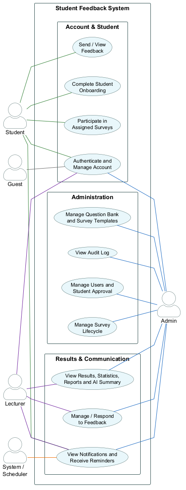

> [Hình 1.1: Use Case Diagram tổng quát của Student Feedback System]

Use Case Diagram tổng quát mô tả các chức năng nghiệp vụ cốt lõi của hệ thống từ góc nhìn các tác nhân bên ngoài. Sơ đồ không trình bày chi tiết API endpoint, bảng cơ sở dữ liệu, hạ tầng triển khai hay các adapter kỹ thuật, mà tập trung trả lời câu hỏi: hệ thống phục vụ những ai và mỗi nhóm người dùng thực hiện những mục tiêu nghiệp vụ nào.

Trong phạm vi repository hiện tại, các actor chính gồm:

- Guest: người dùng chưa đăng nhập, có thể truy cập các luồng xác thực như đăng nhập, đăng ký, xác minh tài khoản hoặc khôi phục mật khẩu.
- Student: sinh viên sử dụng hệ thống để hoàn tất onboarding, tham gia khảo sát được giao, gửi/xem feedback và nhận thông báo.
- Lecturer: giảng viên sử dụng hệ thống để xem kết quả khảo sát trong phạm vi được phân quyền, xem báo cáo/tóm tắt và phản hồi feedback.
- Admin: người quản trị/phòng giáo vụ quản lý người dùng, duyệt sinh viên, quản lý vòng đời khảo sát, ngân hàng câu hỏi, template khảo sát, audit log và kết quả thống kê.
- System/Scheduler: thành phần tự động của hệ thống, chịu trách nhiệm hỗ trợ gửi reminder và notification theo lịch hoặc theo sự kiện.

Các use case trong sơ đồ được chia thành ba nhóm chức năng. Nhóm **Account & Student** bao gồm xác thực và quản lý tài khoản, onboarding sinh viên, tham gia khảo sát, gửi/xem feedback và nhận thông báo. Nhóm **Administration** bao gồm quản lý người dùng và duyệt sinh viên, quản lý vòng đời khảo sát, quản lý question bank/survey template và xem audit log. Nhóm **Results & Communication** bao gồm xem kết quả, thống kê, báo cáo, AI summary, quản lý/phản hồi feedback và notification/reminder.

Sơ đồ được rút gọn có chủ đích để phù hợp với báo cáo học thuật: các chức năng nội bộ như ghi audit log, tạo snapshot người nhận khi publish survey, lưu tài liệu qua MinIO, gửi email qua Resend, xử lý RabbitMQ hoặc gọi AI/embedding service đã được xác nhận trong phần kiến trúc và triển khai, nhưng không được tách thành use case riêng trên sơ đồ tổng quát để tránh làm hình quá rối. Cách trình bày này giúp giảng viên nhìn nhanh được phạm vi nghiệp vụ chính của hệ thống, đồng thời vẫn nhất quán với source code backend, frontend và migration đã phân tích.

### 1.11 Đặc tả Use Case chính

#### Use Case 1: Đăng nhập

| Thuộc tính | Mô tả |
|---|---|
| Actor | Admin, Lecturer, Student |
| Điều kiện đầu vào | Người dùng có tài khoản trong bảng `User`; email/password hợp lệ; tài khoản ở trạng thái được phép đăng nhập. |
| Luồng xử lý chính | Người dùng nhập email/password trên frontend. Frontend gọi `POST /api/auth/login`. Backend tìm user theo email, kiểm tra password bằng `PasswordEncoder`, kiểm tra `User.verify`. Nếu user là student, backend load thêm hồ sơ `Student` và kiểm tra trạng thái. Nếu hợp lệ, backend sinh JWT bằng `JwtTokenService` và trả về `userId`, `role`, `studentStatus`, `accessToken`. Frontend lưu session vào localStorage và điều hướng theo role. |
| Kết quả đầu ra | Đăng nhập thành công và có JWT để gọi các API nội bộ; hoặc trả về business code như `INVALID_CREDENTIALS`, `ACCOUNT_INACTIVE`, `ACCOUNT_PENDING`. |
| Thành phần liên quan | `AuthController`, `AuthUseCaseService`, `JwtTokenService`, `JwtAuthenticationFilter`, `User`, `Student`. |

#### Use Case 2: Admin duyệt sinh viên

| Thuộc tính | Mô tả |
|---|---|
| Actor | Admin |
| Điều kiện đầu vào | Admin đã đăng nhập; sinh viên đã đăng ký, xác minh email và upload giấy tờ; hồ sơ sinh viên đang chờ duyệt hoặc cần xét lại. |
| Luồng xử lý chính | Admin mở danh sách sinh viên pending tại `/admin/students/pending`. Frontend gọi `GET /api/admin/students/pending`. Admin xem thông tin và tài liệu sinh viên. Khi approve, frontend gọi `POST /api/admin/students/{studentId}/approve`; khi reject, gọi `POST /api/admin/students/{studentId}/reject`. Backend cập nhật trạng thái student, lưu thông tin review, ghi audit log và tạo notification cho sinh viên. |
| Kết quả đầu ra | Student được chuyển sang trạng thái `ACTIVE` nếu approve, hoặc `REJECTED` nếu bị từ chối. Sinh viên nhận được thông báo và có thể đăng nhập lại để xem trạng thái/lý do. |
| Thành phần liên quan | `AdminStudentController`, `AdminStudentApprovalService`, `Student`, `User`, `Audit_Log`, `Notification`, `Notification_User`, MinIO document storage. |

#### Use Case 3: Admin tạo và publish khảo sát

| Thuộc tính | Mô tả |
|---|---|
| Actor | Admin |
| Điều kiện đầu vào | Admin đã đăng nhập; có thông tin survey, thời gian, câu hỏi và phạm vi người nhận hợp lệ. |
| Luồng xử lý chính | Admin tạo survey qua màn hình `/admin/surveys/create`. Frontend gọi `POST /api/admin/surveys`. Backend validate title, ngày bắt đầu/kết thúc, câu hỏi và recipient scope. Survey được lưu ở trạng thái `DRAFT`; câu hỏi được lưu vào `Question`; assignment được lưu vào `Survey_Assignment`. Khi admin publish, frontend gọi `POST /api/admin/surveys/{surveyId}/publish`. Backend kiểm tra survey còn ở `DRAFT`, có lịch hợp lệ, có câu hỏi và assignment hợp lệ; sau đó chuyển lifecycle sang `PUBLISHED`, tạo snapshot người nhận trong `Survey_Recipient`, ghi audit log và gửi notification cho sinh viên. |
| Kết quả đầu ra | Survey được publish, sinh viên trong phạm vi nhận survey có thể thấy và nộp khảo sát; notification được tạo. |
| Thành phần liên quan | `AdminSurveyController`, `CreateSurveyService`, `AdminSurveyManagementService`, `Survey`, `Question`, `Survey_Assignment`, `Survey_Recipient`, `Notification`, `Audit_Log`, RabbitMQ translation task. |

#### Use Case 4: Student xem và nộp khảo sát

| Thuộc tính | Mô tả |
|---|---|
| Actor | Student |
| Điều kiện đầu vào | Student đã đăng nhập, tài khoản active, user verified; survey đã publish, không hidden, còn hiệu lực và student nằm trong `Survey_Recipient`. |
| Luồng xử lý chính | Student mở `/surveys`, frontend gọi `GET /api/v1/surveys`. Backend lọc các survey mà student được nhận và đủ điều kiện hiển thị. Student mở chi tiết survey, frontend gọi `GET /api/v1/surveys/{id}/detail`. Khi nộp câu trả lời, frontend gọi `POST /api/v1/surveys/{surveyId}/submit`. Backend kiểm tra quyền tham gia, trạng thái survey, dữ liệu câu trả lời và điều kiện chưa nộp trước đó. Sau đó backend tạo `Survey_Response`, lưu các dòng `Response_Detail`, cập nhật `Survey_Recipient.submitted_at` và gửi task dịch cho câu trả lời text nếu có. |
| Kết quả đầu ra | Câu trả lời khảo sát được lưu; student không thể nộp lại survey đó; số liệu thống kê participation được cập nhật. |
| Thành phần liên quan | `SurveyController`, `GetSurveyService`, `GetSurveyDetailService`, `SubmitSurveyService`, `Survey`, `Question`, `Survey_Recipient`, `Survey_Response`, `Response_Detail`, `Student`. |

#### Use Case 5: Admin/Lecturer xem kết quả khảo sát

| Thuộc tính | Mô tả |
|---|---|
| Actor | Admin, Lecturer |
| Điều kiện đầu vào | Actor đã đăng nhập; role là `ADMIN` hoặc `LECTURER`. Với lecturer, survey phải nằm trong phạm vi được phân quyền. |
| Luồng xử lý chính | Actor mở `/survey-results`. Frontend gọi `GET /api/v1/survey-results` với filter/sort/pagination. Backend xác định role. Nếu là admin, backend trả dữ liệu tổng quan. Nếu là lecturer, backend load profile lecturer, xác định khoa và giới hạn dữ liệu theo scope. Khi xem chi tiết, frontend gọi `GET /api/v1/survey-results/{surveyId}`. Backend trả metrics, participation, rating breakdown, comment và thống kê theo câu hỏi. |
| Kết quả đầu ra | Actor xem được danh sách và chi tiết kết quả khảo sát phù hợp quyền truy cập. Lecturer bị chặn nếu survey nằm ngoài phạm vi. |
| Thành phần liên quan | `SurveyResultController`, `GetSurveyResultService`, `Survey`, `Survey_Assignment`, `Survey_Recipient`, `Survey_Response`, `Response_Detail`, `Question`, `Lecturer`, `Department`. |

#### Use Case 6: Student gửi feedback và staff phản hồi

| Thuộc tính | Mô tả |
|---|---|
| Actor | Student, Admin, Lecturer |
| Điều kiện đầu vào | Student đã đăng nhập và active; feedback có title/content hợp lệ. Admin hoặc Lecturer đã đăng nhập để phản hồi. |
| Luồng xử lý chính | Student mở `/feedback` và gửi feedback. Frontend gọi `POST /api/v1/feedback`. Backend kiểm tra student, lưu `Feedback` và gửi translation task qua RabbitMQ sau khi transaction commit. Admin hoặc Lecturer mở `/feedback/manage`, frontend gọi `GET /api/v1/feedback/staff`. Khi phản hồi, frontend gọi `POST /api/v1/feedback/{feedbackId}/responses`. Backend kiểm tra feedback tồn tại, responder tồn tại và role là `ADMIN` hoặc `LECTURER`, sau đó lưu `Feedback_Response`. |
| Kết quả đầu ra | Feedback được lưu và có thể được dịch song ngữ; phản hồi của staff được lưu để student xem lại. |
| Thành phần liên quan | `FeedbackController`, `StudentFeedbackService`, `Feedback`, `Feedback_Response`, `Student`, `User`, RabbitMQ translation task. |

Chương 1 đã xác định bối cảnh bài toán, các bên liên quan, actor, quy tắc nghiệp vụ, yêu cầu chức năng, yêu cầu phi chức năng và các use case chính của hệ thống. Đây là cơ sở để tiếp tục phân tích nghiệp vụ chi tiết, thiết kế kiến trúc ứng dụng và thiết kế cơ sở dữ liệu ở các chương sau.

---

# PHẦN 2. PHÂN TÍCH VÀ THIẾT KẾ HỆ THỐNG

## Chương 2. Phân tích nghiệp vụ và mô hình hệ thống

### 2.1 Tổng quan nghiệp vụ hệ thống

Hệ thống `student-feedback-system` được thiết kế xoay quanh vòng đời khảo sát ý kiến sinh viên, kết hợp với quy trình định danh sinh viên, quản trị người dùng, thống kê kết quả và các kênh phản hồi nội bộ. Ở mức nghiệp vụ tổng quan, hệ thống vận hành theo chuỗi bước sau:

1. Người dùng đăng ký hoặc đăng nhập vào hệ thống. Với tài khoản đã tồn tại, backend xác thực thông tin đăng nhập và cấp JWT để truy cập các chức năng nội bộ.
2. Sinh viên mới đăng ký cần xác minh email và upload giấy tờ như student card hoặc national ID trong quá trình onboarding.
3. Admin xem danh sách sinh viên chờ duyệt, kiểm tra hồ sơ và quyết định approve hoặc reject. Kết quả xử lý được ghi nhận và thông báo lại cho sinh viên.
4. Admin tạo khảo sát ở trạng thái `DRAFT`, cấu hình thông tin khảo sát, thời gian, câu hỏi và phạm vi người nhận.
5. Khi khảo sát hợp lệ, Admin publish khảo sát. Từ thời điểm này, khảo sát được phát hành cho nhóm sinh viên được chọn.
6. Hệ thống tạo danh sách người nhận trong `Survey_Recipient`. Đây là snapshot tại thời điểm publish, giúp cố định tập sinh viên được giao khảo sát.
7. Sinh viên nhận notification, xem danh sách khảo sát được giao, mở chi tiết khảo sát và nộp câu trả lời.
8. Admin và Lecturer xem kết quả khảo sát. Admin có phạm vi quản trị tổng thể; Lecturer chỉ xem trong phạm vi được phân quyền.
9. Hệ thống hỗ trợ xuất báo cáo PDF/XLSX và AI summary cho dữ liệu phản hồi dạng text.
10. Ngoài khảo sát định kỳ, sinh viên có thể gửi feedback nội bộ; Admin hoặc Lecturer có quyền có thể xem và phản hồi feedback.

Vòng đời trên cho thấy hệ thống không chỉ xử lý việc thu thập câu trả lời, mà còn bao gồm định danh người tham gia, phân quyền truy cập, quản lý trạng thái khảo sát, thống kê, xuất báo cáo, notification, audit log và tích hợp dịch vụ ngoài.

### 2.2 Mô hình actor và trách nhiệm

| Actor | Mục tiêu sử dụng | Nhóm chức năng | Quyền truy cập |
|---|---|---|---|
| Student | Tham gia khảo sát, gửi feedback và theo dõi thông báo cá nhân. | Đăng ký, xác minh email, upload giấy tờ, xem/nộp khảo sát, gửi feedback, xem notification. | Truy cập chức năng cá nhân sau khi đăng nhập; chỉ thấy khảo sát được giao và đang khả dụng; cần trạng thái active để tham gia khảo sát. |
| Lecturer | Theo dõi kết quả phản hồi liên quan đến phạm vi chuyên môn được phân quyền. | Xem dashboard lecturer, xem survey results, xem thống kê chi tiết, phản hồi feedback, xem AI summary nếu được phép. | Truy cập API kết quả và feedback dành cho staff; dữ liệu kết quả cần bị giới hạn theo scope lecturer. |
| Admin | Quản trị toàn bộ hoạt động khảo sát và người dùng. | Quản lý user, duyệt sinh viên, quản lý survey, question bank, survey template, audit log, dashboard analytics, export report, AI summary. | Có quyền cao nhất trong hệ thống; truy cập các API `/api/admin/**` và các API kết quả/báo cáo theo role admin. |
| System/Scheduler | Thực hiện các tác vụ nền hỗ trợ vận hành nghiệp vụ. | Tạo/gửi notification, xử lý reminder nếu được cấu hình, theo dõi thay đổi dữ liệu AI summary, xử lý job nền. | Không phải người dùng trực tiếp; hoạt động thông qua service nội bộ, scheduled job hoặc adapter bất đồng bộ. |
| External Services | Cung cấp năng lực ngoài phạm vi backend chính. | Resend email, MinIO storage, RabbitMQ translation queue, AI/Gemini-compatible API, embedding service. | Được backend gọi qua adapter; thông tin kết nối cần quản lý bằng environment variables/secrets. |

Các actor trên được phản ánh trong code qua các nhóm controller như `AuthController`, `AdminStudentController`, `AdminUserController`, `AdminSurveyController`, `SurveyController`, `SurveyResultController`, `FeedbackController`, `NotificationController` và `SurveyAiSummaryController`. Ở frontend, các nhóm màn hình tương ứng nằm trong `features/auth`, `features/admin`, `features/surveys`, `features/survey-results`, `features/feedback`, `features/notifications` và `features/dashboard`.

### 2.3 Activity Diagram

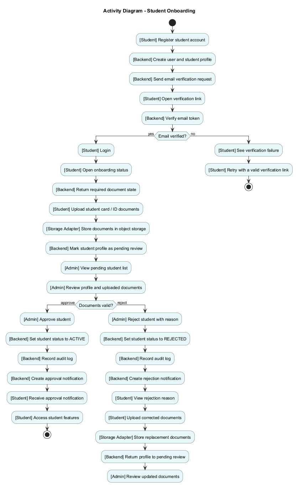

> [Hình 2.1: Activity Diagram quy trình onboarding sinh viên]

Quy trình onboarding sinh viên bắt đầu khi sinh viên đăng ký tài khoản. Backend tạo tài khoản student, khởi tạo trạng thái onboarding và gửi email xác minh. Sau khi sinh viên xác minh email, hệ thống cho phép đăng nhập để xem trạng thái onboarding và upload giấy tờ định danh. Tài liệu được lưu qua adapter lưu trữ, trong repository hiện tại có `MinioStudentDocumentStorageAdapter`. Admin sau đó xem danh sách sinh viên pending, kiểm tra hồ sơ/tài liệu và approve hoặc reject. Nếu approve, sinh viên chuyển sang trạng thái `ACTIVE`, hệ thống ghi audit log và tạo notification để sinh viên có thể truy cập các chức năng nội bộ. Nếu reject, sinh viên nhận lý do từ chối, upload lại tài liệu đã chỉnh sửa và hồ sơ quay lại hàng chờ xét duyệt.

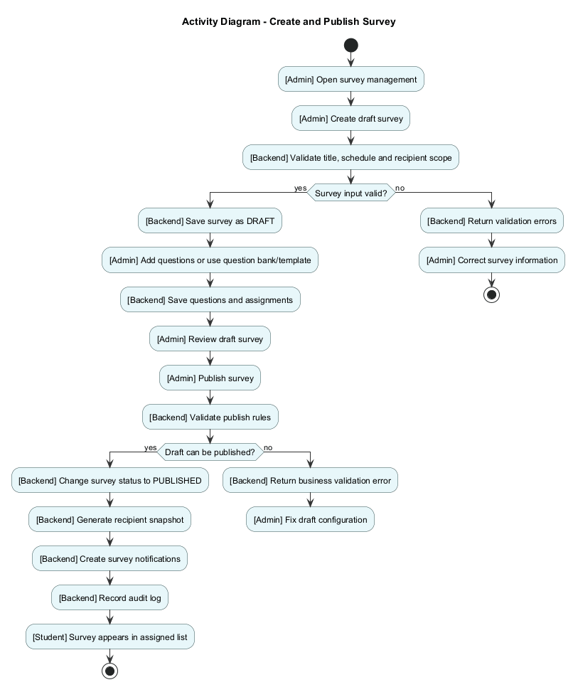

> [Hình 2.2: Activity Diagram quy trình tạo và publish khảo sát]

Quy trình tạo khảo sát bắt đầu từ Admin. Admin nhập thông tin khảo sát, cấu hình thời gian, thêm câu hỏi trực tiếp hoặc từ question bank/template, đồng thời xác định phạm vi người nhận. Backend lưu khảo sát ở trạng thái `DRAFT`. Khi Admin publish, backend kiểm tra điều kiện hợp lệ như trạng thái hiện tại, thời gian, câu hỏi và assignment. Nếu hợp lệ, hệ thống chuyển survey sang trạng thái phát hành, tạo snapshot người nhận trong `Survey_Recipient`, ghi nhận audit log và tạo notification cho nhóm sinh viên được giao khảo sát.

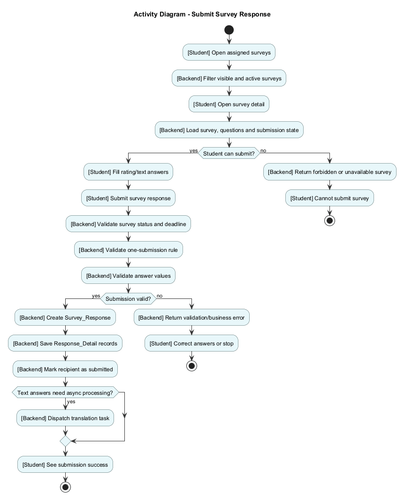

> [Hình 2.3: Activity Diagram quy trình sinh viên nộp khảo sát]

Quy trình nộp khảo sát bắt đầu khi Student mở danh sách khảo sát. Backend chỉ trả về các khảo sát mà student nằm trong danh sách recipient, survey đã publish, không hidden, chưa đóng và còn trong thời hạn. Khi student mở chi tiết, hệ thống ghi nhận trạng thái đã mở nếu cần. Student nhập câu trả lời rating hoặc text rồi submit. Backend kiểm tra quyền tham gia, trạng thái survey, điều kiện chưa nộp trước đó và tính hợp lệ của câu trả lời. Nếu hợp lệ, hệ thống tạo `Survey_Response`, lưu `Response_Detail`, cập nhật `Survey_Recipient.submitted_at` và kích hoạt các tác vụ liên quan như dịch nội dung text hoặc cập nhật trạng thái AI summary.

### 2.4 Sequence Diagram

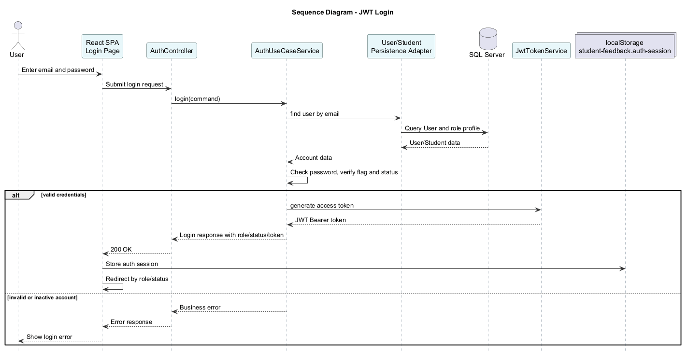

> [Hình 2.4: Sequence Diagram đăng nhập bằng JWT]

Các thành phần tham gia gồm:

- **Frontend:** màn hình đăng nhập trong `features/auth/pages/LoginPage.tsx`, gọi API qua `authApi.ts`.
- **Controller:** `AuthController` nhận request đăng nhập.
- **Use Case Service:** `AuthUseCaseService` xử lý nghiệp vụ xác thực.
- **Repository/Adapter:** `AuthPersistenceAdapter`, `UserRepository`, `StudentRepository` và `JwtTokenService`.
- **Database:** bảng `User`, `Student` và các bảng liên quan đến token nếu có.
- **External service:** không bắt buộc trong luồng đăng nhập chính.

Luồng chính: frontend gửi email/password, controller chuyển request vào use case service, service kiểm tra user và mật khẩu, xác định role/trạng thái, sinh JWT bằng adapter bảo mật và trả response cho frontend. Frontend lưu session để dùng cho các API nội bộ.

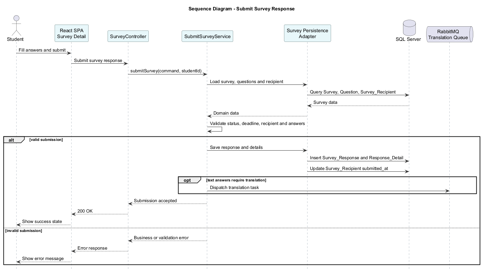

> [Hình 2.5: Sequence Diagram nộp khảo sát]

Các thành phần tham gia gồm:

- **Frontend:** `SurveyDetailPage`, `SurveyDetailMain` và hook `useSubmitSurvey`.
- **Controller:** `SurveyController`.
- **Use Case Service:** `SubmitSurveyService`.
- **Repository/Adapter:** các adapter/repository cho survey, question, recipient, response và response detail.
- **Database:** `Survey`, `Question`, `Survey_Recipient`, `Survey_Response`, `Response_Detail`.
- **External service:** RabbitMQ translation queue có thể được dùng khi câu trả lời text cần xử lý dịch.

Luồng chính: student submit câu trả lời từ frontend, controller nhận request, use case service kiểm tra quyền và trạng thái survey, lưu response, cập nhật recipient, sau đó phát sinh tác vụ bất đồng bộ nếu cần. Kết quả trả về cho frontend cho biết nộp thành công hoặc lỗi nghiệp vụ.

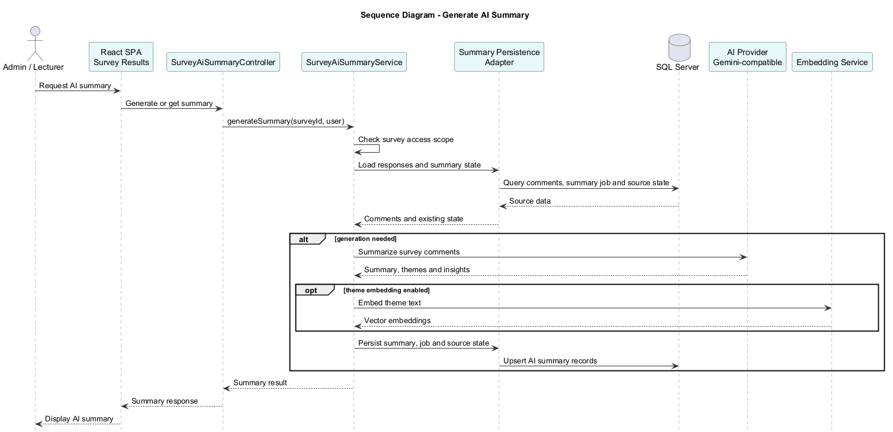

> [Hình 2.6: Sequence Diagram generate AI summary]

Các thành phần tham gia gồm:

- **Frontend:** màn hình survey result và API layer `surveyAiSummaryApi.ts`.
- **Controller:** `SurveyAiSummaryController`.
- **Use Case Service:** `SurveyAiSummaryService` và `SurveyAiSummaryChangeService`.
- **Repository/Adapter:** `SurveyAiSummaryPersistenceAdapter`, các repository summary/job/source state/pending change/theme embedding.
- **Database:** `Survey_AI_Summary`, `Survey_AI_Summary_Job`, `Survey_AI_Source_State`, `Survey_AI_Pending_Change`, `Survey_AI_Summary_Theme_Embedding`, cùng dữ liệu response/comment liên quan.
- **External service:** AI/Gemini-compatible API qua `ChatCompletionSurveyCommentSummaryAdapter` và embedding service/local embedding qua `LocalTextEmbeddingAdapter`.

Luồng chính: Admin hoặc Lecturer có quyền yêu cầu xem hoặc generate AI summary. Backend kiểm tra quyền truy cập survey, thu thập dữ liệu comment, gọi adapter AI để tạo bản tóm tắt và có thể dùng embedding để nhóm/chấm mức tương đồng nội dung. Kết quả summary được lưu vào database để tái sử dụng và theo dõi trạng thái stale/refresh khi dữ liệu nguồn thay đổi.

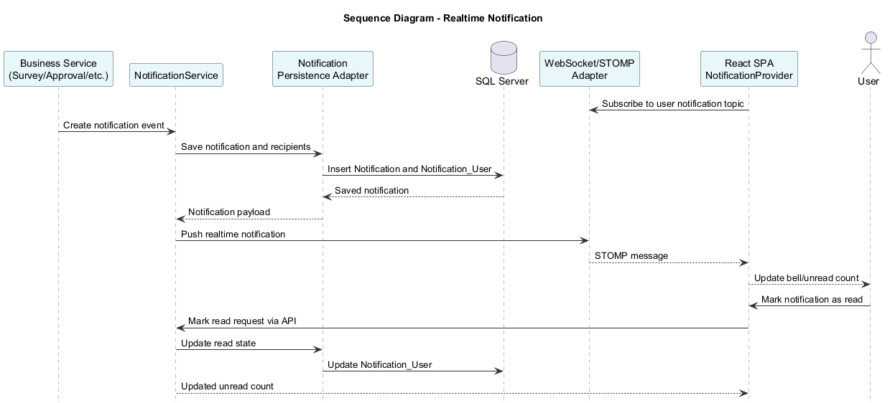

> [Hình 2.7: Sequence Diagram realtime notification]

Các thành phần tham gia gồm:

- **Frontend:** `NotificationProvider`, `NotificationBell`, `notificationApi.ts` và kết nối STOMP/SockJS.
- **Controller:** `NotificationController` cho các API đọc danh sách, unread count, mark read; kênh WebSocket/STOMP cho realtime.
- **Use Case Service:** `NotificationService`.
- **Repository/Adapter:** `NotificationPersistenceAdapter`, `NotificationRepository`, `NotificationUserRepository`, `WebSocketNotificationAdapter`.
- **Database:** `Notification`, `Notification_User`.
- **External service:** không bắt buộc; WebSocket/STOMP là cơ chế realtime nội bộ giữa backend và frontend.

Luồng chính: khi một nghiệp vụ tạo notification, service lưu notification vào database và tạo bản ghi liên kết người nhận. Sau đó adapter WebSocket đẩy sự kiện realtime tới frontend đang kết nối. Frontend cập nhật unread count, hiển thị notification bell và cho phép người dùng đánh dấu đã đọc qua API.

### 2.5 Mô hình domain ở mức khái niệm

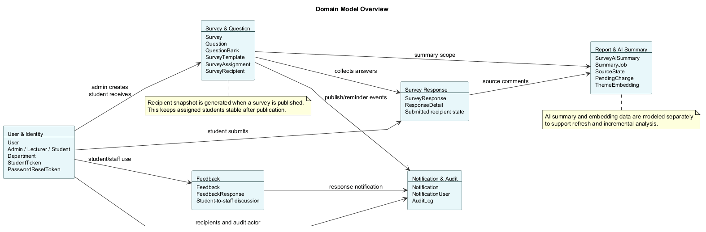

> [Hình 2.8: Domain Model tổng quát theo cụm nghiệp vụ]

Ở mức khái niệm, domain của hệ thống có thể chia thành các cụm sau:

- **User & Identity:** quản lý `User`, `Admin`, `Lecturer`, `Student`, role, trạng thái tài khoản, xác minh email, onboarding và reset password. Cụm này quyết định ai được truy cập hệ thống và truy cập với quyền nào.
- **Survey & Question:** quản lý `Survey`, `Question`, `Question_Bank`, `Survey_Template`, trạng thái lifecycle của survey và cấu hình assignment. Đây là lõi nghiệp vụ tạo, chuẩn bị và phát hành khảo sát.
- **Survey Response:** quản lý `Survey_Recipient`, `Survey_Response` và `Response_Detail`. Cụm này ghi nhận sinh viên nào được giao khảo sát, đã mở, đã nộp và nội dung câu trả lời.
- **Feedback:** quản lý feedback độc lập ngoài survey thông qua `Feedback` và `Feedback_Response`, cho phép sinh viên gửi phản hồi và staff phản hồi lại.
- **Notification:** quản lý `Notification` và `Notification_User`, hỗ trợ thông báo theo người nhận, unread count, mark read và realtime notification.
- **Report & AI Summary:** quản lý dữ liệu thống kê, export report và các bảng AI summary/job/source state/pending change/theme embedding. Cụm này phục vụ phân tích kết quả và tóm tắt phản hồi text.
- **Audit:** quản lý `Audit_Log` để lưu dấu các thao tác quản trị quan trọng, phục vụ truy vết và kiểm toán.

Việc chia domain theo cụm giúp báo cáo có thể mô tả hệ thống ở mức nghiệp vụ trước khi đi vào chi tiết kiến trúc kỹ thuật. Ở Chương 4, các cụm này sẽ được ánh xạ cụ thể sang bảng dữ liệu và quan hệ trong Flyway migration.

### 2.6 Nhận xét về nghiệp vụ

Các điểm mạnh trong mô hình nghiệp vụ của hệ thống gồm:

- **Vòng đời survey rõ ràng:** survey được tạo ở trạng thái `DRAFT`, sau đó mới publish, close hoặc archive. Điều này giúp kiểm soát quá trình chuẩn bị và phát hành khảo sát.
- **Có onboarding sinh viên:** sinh viên không mặc định được tham gia khảo sát ngay sau khi đăng ký, mà cần xác minh email và được Admin duyệt.
- **Có snapshot recipient khi publish:** `Survey_Recipient` cố định danh sách người nhận tại thời điểm phát hành, giúp kết quả khảo sát có phạm vi rõ ràng.
- **Có audit log:** các hành động quản trị quan trọng có cơ sở để truy vết.
- **Có feedback riêng ngoài survey:** sinh viên có thêm kênh phản hồi không phụ thuộc vào khảo sát định kỳ.
- **Có notification realtime:** hệ thống kết hợp notification lưu trong database với WebSocket/STOMP để cải thiện khả năng thông báo kịp thời.
- **Có export report và AI summary:** kết quả khảo sát không chỉ được xem trên dashboard mà còn có thể xuất báo cáo và hỗ trợ tóm tắt bằng AI.

Một số điểm cần chú ý khi hoàn thiện hoặc vận hành hệ thống:

- **Bảo vệ quyền riêng tư khi thống kê:** cần đảm bảo kết quả hiển thị cho Lecturer không làm lộ danh tính sinh viên ngoài nhu cầu nghiệp vụ hợp lệ.
- **Kiểm soát quyền Lecturer:** mọi API kết quả khảo sát cần kiểm tra scope dữ liệu, không chỉ kiểm tra role.
- **Ngăn sinh viên nộp lại survey:** backend cần tiếp tục duy trì kiểm tra chặt chẽ trên `Survey_Recipient` và response để tránh submit trùng.
- **Bảo vệ dữ liệu định danh upload lên MinIO:** tài liệu như student card hoặc national ID là dữ liệu nhạy cảm, cần kiểm soát truy cập, thời hạn link tải, cấu hình bucket và secret.

Từ các nghiệp vụ trên, hệ thống được thiết kế theo kiến trúc ứng dụng có khả năng bảo trì và mở rộng. Chương 3 sẽ trình bày cách backend, frontend, database và các adapter phụ trợ được tổ chức để đáp ứng các yêu cầu nghiệp vụ này.

## Chương 3. Thiết kế kiến trúc ứng dụng

### 3.1 Kiến trúc tổng thể hệ thống

Hệ thống `student-feedback-system` được tổ chức theo mô hình ứng dụng web gồm frontend SPA, backend Spring Boot, cơ sở dữ liệu quan hệ và các adapter tích hợp dịch vụ ngoài. Cách mô tả phù hợp với repository hiện tại là: **Backend chính được tổ chức theo kiến trúc Ports and Adapters/Hexagonal Architecture, kết hợp với một số thành phần phụ trợ như embedding-service, RabbitMQ, MinIO, AI provider và monitoring stack.** Hệ thống không nên được mô tả là microservice thuần túy, vì backend chính vẫn là một ứng dụng Spring Boot tập trung, được module hóa rõ ràng theo package và port/adapter.

Ở mức tổng thể, kiến trúc có thể chia thành các lớp sau:

- **Presentation Layer:** React SPA trong thư mục `frontend/`. Lớp này cung cấp giao diện cho Admin, Lecturer và Student, quản lý routing, session, API call và hiển thị thông báo.
- **API/Application Layer:** Spring Boot backend trong thư mục `backend/`. Lớp này cung cấp REST API, WebSocket/STOMP, xác thực JWT, phân quyền, validation, exception handling và điều phối use case.
- **Domain/Application Core:** các domain model, input port, output port và use case service nằm trong `application/domain` và `application/port`. Đây là phần chứa nghiệp vụ chính như đăng nhập, onboarding, tạo khảo sát, publish khảo sát, nộp khảo sát, xem kết quả, feedback, notification và AI summary.
- **Persistence Layer:** Microsoft SQL Server được truy cập thông qua Spring Data JPA/Hibernate. Flyway migration trong `backend/src/main/resources/db/migration/` quản lý thay đổi schema.
- **Integration Layer:** các tích hợp ngoài gồm RabbitMQ cho task dịch bất đồng bộ, MinIO cho lưu trữ tài liệu sinh viên, Resend cho email, AI/Gemini-compatible provider cho tóm tắt phản hồi, embedding service cho vector hóa nội dung text và Eclipse BIRT cho xuất báo cáo PDF/XLSX.
- **Deployment/Operation Layer:** Dockerfile backend/frontend, `docker-compose.yml`, Nginx frontend/reverse proxy, GitHub Actions CI/CD, Trivy scan và monitoring stack ngoài repo như Prometheus, Grafana OSS, Loki theo thông tin triển khai được cung cấp.

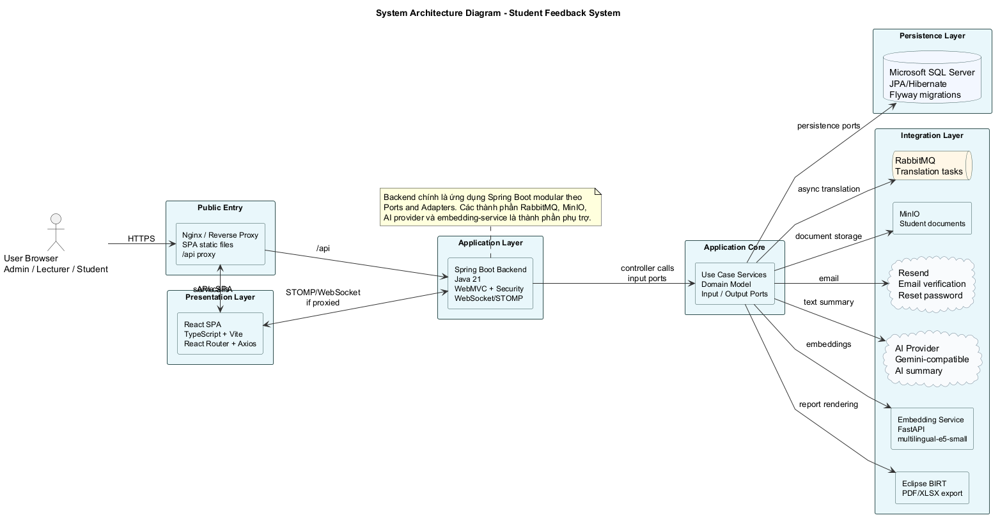

> [Hình 3.1: System Architecture Diagram tổng thể gồm browser, frontend, reverse proxy, backend, database và external services]

Request flow điển hình của hệ thống:

```text
User Browser
-> React SPA
-> Nginx/Reverse Proxy
-> Spring Boot Controller
-> Input Port / Use Case Service
-> Output Port
-> Adapter
-> Database / External Service
```

Ví dụ, khi sinh viên nộp khảo sát, trình duyệt gửi request từ React SPA tới backend thông qua Axios. Nginx hoặc reverse proxy chuyển request đến Spring Boot. `SurveyController` nhận request, chuyển dữ liệu vào `SubmitSurveyService` thông qua use case contract. Service kiểm tra nghiệp vụ, gọi output port để lưu `Survey_Response`, `Response_Detail`, cập nhật `Survey_Recipient`, sau đó adapter persistence thực thi thao tác với database. Nếu câu trả lời text cần xử lý dịch hoặc phân tích sau đó, backend có thể phát sinh task qua RabbitMQ hoặc cập nhật trạng thái liên quan đến AI summary.

### 3.2 Tổ chức repository

Repository được tổ chức thành các module rõ ràng cho backend, frontend, database, embedding service, tài liệu và cấu hình triển khai. Bảng sau mô tả vai trò của các thành phần chính:

| Module | Vị trí | Vai trò |
|---|---|---|
| Backend | `backend/` | Ứng dụng Spring Boot chính, cung cấp REST API, WebSocket/STOMP, nghiệp vụ khảo sát, xác thực, phân quyền, persistence adapter và tích hợp ngoài. |
| Frontend | `frontend/` | React SPA viết bằng TypeScript, cung cấp giao diện cho Admin, Lecturer và Student. |
| Database | `database/` | Chứa tài liệu hoặc script liên quan đến cơ sở dữ liệu nếu có; nguồn schema chính của backend là Flyway migration trong `backend/src/main/resources/db/migration/`. |
| Embedding Service | `embedding-service/` | Thành phần phụ trợ FastAPI phục vụ tạo embedding cho nội dung text, dùng model `intfloat/multilingual-e5-small` theo thông tin dự án. |
| Docs | `docs/` | Tài liệu bổ sung của dự án, dùng làm nguồn tham khảo khi viết báo cáo nếu có nội dung phù hợp. |
| CI/CD workflows | `.github/workflows/` | GitHub Actions cho backend test, frontend lint/build, Trivy scan, build Docker images và push GHCR. |
| Compose file | `docker-compose.yml` | Cấu hình chạy/deploy image frontend/backend, hiện tập trung vào hai thành phần ứng dụng chính. |
| Environment example | `.env.example` | Mẫu biến môi trường cho cấu hình kết nối và secrets cần thiết khi triển khai. |
| API Contract | `API_CONTRACT.md` | Tài liệu mô tả hợp đồng API giữa frontend và backend. |
| README | `README.md` | Tài liệu giới thiệu và hướng dẫn tổng quan của repository. |

Tổ chức này giúp tách biệt rõ phần ứng dụng chính, phần giao diện, phần dữ liệu, phần dịch vụ phụ trợ và phần vận hành. Khi viết báo cáo hoặc bảo trì dự án, mỗi module có thể được phân tích độc lập nhưng vẫn liên kết qua API contract và cấu hình triển khai.

### 3.3 Kiến trúc backend theo Ports and Adapters

Backend nằm tại `backend/src/main/java/com/ttcs/backend/` và được tổ chức theo định hướng Ports and Adapters/Hexagonal Architecture. Cấu trúc package thực tế gồm các nhóm chính:

- `adapter/in`
- `adapter/out`
- `application/domain`
- `application/port`
- `config`
- `infrastructure`
- `common`

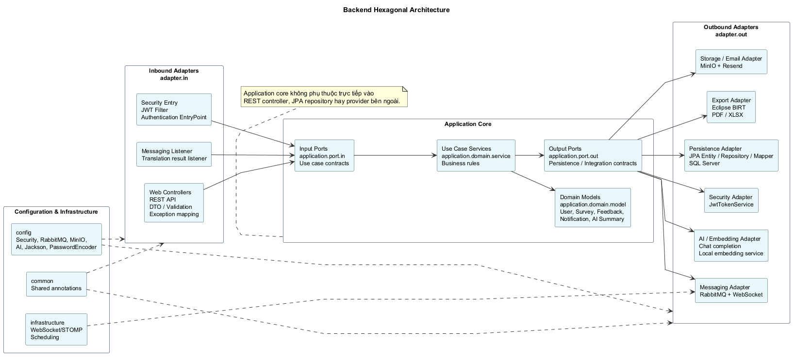

> [Hình 3.2: Sơ đồ backend Ports and Adapters / Hexagonal Architecture]

Vai trò của từng nhóm package:

- **`adapter.in.web`:** chứa REST controllers như `AuthController`, `AdminSurveyController`, `SurveyController`, `SurveyResultController`, `FeedbackController`, `NotificationController`, `SurveyAiSummaryController`; đồng thời có DTO phục vụ request/response và các thành phần xử lý lỗi ở biên web nếu có.
- **`adapter.in.security`:** chứa các thành phần bảo vệ request đầu vào, tiêu biểu là JWT filter và authentication entrypoint. Nhóm này đưa thông tin người dùng đã xác thực vào Spring Security context.
- **`adapter.in.messaging`:** chứa message listener cho các luồng nhận message từ hạ tầng messaging, ví dụ kết quả dịch bất đồng bộ.
- **`adapter.out.persistence`:** chứa JPA entity, Spring Data repository, mapper và persistence adapter theo từng cụm domain như user, student, survey, survey recipient, survey response, feedback, notification, audit log, AI summary. Đây là lớp hiện thực output port bằng database.
- **`adapter.out.ai`:** chứa adapter gọi AI chat completion và embedding/local embedding, ví dụ `ChatCompletionSurveyCommentSummaryAdapter` và `LocalTextEmbeddingAdapter`.
- **`adapter.out.messaging`:** chứa adapter gửi task qua RabbitMQ và đẩy notification realtime qua WebSocket, ví dụ `RabbitMQTranslationAdapter` và `WebSocketNotificationAdapter`.
- **`adapter.out.export`:** chứa adapter xuất báo cáo bằng Eclipse BIRT, phục vụ kết xuất PDF/XLSX cho kết quả khảo sát.
- **`adapter.out.security`:** chứa `JwtTokenService`, chịu trách nhiệm sinh và xử lý JWT ở phía backend.
- **`application.domain.model`:** chứa domain model như user, student, survey, question, response, feedback, notification, audit log và các model nghiệp vụ khác.
- **`application.domain.service`:** chứa use case service như `AuthUseCaseService`, `AdminStudentApprovalService`, `CreateSurveyService`, `AdminSurveyManagementService`, `SubmitSurveyService`, `GetSurveyResultService`, `StudentFeedbackService`, `NotificationService`, `SurveyAiSummaryService`. Đây là nơi tập trung nghiệp vụ chính.
- **`application.port.in`:** định nghĩa input contracts cho các use case. Controller phụ thuộc vào các port này thay vì phụ thuộc trực tiếp vào implementation chi tiết.
- **`application.port.out`:** định nghĩa output contracts để domain/application core gọi ra persistence, security, AI, translation hoặc các dịch vụ ngoài.
- **`config`:** chứa cấu hình Spring Security, RabbitMQ, MinIO, AI client, Jackson, password encoder và async processing như `SecurityConfig`, `RabbitMqConfig`, `MinioConfig`, `AiClientConfig`, `JacksonConfig`, `PasswordConfig`, `AsyncConfig`.
- **`infrastructure`:** chứa cấu hình hạ tầng nội bộ như WebSocket/STOMP và scheduling. Trong repo có các package `infrastructure/configuration` và `infrastructure/scheduling`.
- **`common`:** chứa các annotation hoặc thành phần dùng chung, ví dụ annotation đánh dấu web adapter/persistence adapter.

Thiết kế này có một số lợi ích quan trọng:

- **Tách nghiệp vụ khỏi framework:** use case service và port không bị trộn trực tiếp với chi tiết REST, JPA, RabbitMQ hoặc AI provider.
- **Dễ kiểm thử:** nghiệp vụ có thể được kiểm thử bằng mock output port mà không cần khởi động toàn bộ hạ tầng ngoài.
- **Dễ thay adapter:** nếu thay MinIO bằng storage khác, đổi AI provider hoặc thay cơ chế message queue, thay đổi chủ yếu nằm ở adapter tương ứng.
- **Controller không gọi trực tiếp repository:** controller chỉ nhận request, chuyển đổi DTO và gọi use case; persistence được truy cập qua port/adapter.
- **Dễ maintain lâu dài:** package được chia theo hướng inbound/outbound/application core giúp giảm phụ thuộc vòng và giúp nhóm phát triển dễ xác định vị trí sửa đổi.

### 3.4 Nhóm API backend

Backend cung cấp các nhóm API chính sau:

| Nhóm API | Base path | Chức năng chính |
|---|---|---|
| Auth | `/api/auth` | Đăng ký sinh viên, xác minh email, upload giấy tờ, xem onboarding status, đăng nhập, đổi mật khẩu, forgot/reset password. |
| Student Survey | `/api/v1/surveys` | Student xem danh sách khảo sát được giao, xem chi tiết khảo sát và nộp câu trả lời. |
| Admin Survey | `/api/admin/surveys` | Admin tạo, cập nhật, publish, close, archive, hide/show và quản lý cấu hình khảo sát. |
| Survey Results | `/api/v1/survey-results` | Admin/Lecturer xem danh sách kết quả, xem chi tiết thống kê và export báo cáo khảo sát. |
| Admin User | `/api/admin/users` | Admin quản lý user, xem danh sách, xem chi tiết, cập nhật, activate/deactivate tài khoản. |
| Admin Student Approval | `/api/admin/students` | Admin xem sinh viên chờ duyệt, xem tài liệu, approve hoặc reject hồ sơ sinh viên. |
| Feedback | `/api/v1/feedback` | Student gửi feedback; Admin/Lecturer xem, quản lý và phản hồi feedback. |
| Notification | `/api/v1/notifications` | Xem notification, unread count, mark read và mark all read. |
| Analytics/Audit/Template/Question Bank | `/api/admin/analytics`, `/api/admin/audit-logs`, `/api/admin/survey-templates`, `/api/admin/question-bank` | Dashboard analytics, audit log, quản lý mẫu khảo sát và ngân hàng câu hỏi. |
| AI Summary | `/api/v1/survey-results/{surveyId}/ai-summary` | Xem hoặc generate AI summary cho kết quả khảo sát, phục vụ tóm tắt phản hồi text. |

Các API này phản ánh cách backend phân chia nghiệp vụ theo actor: student dùng các API khảo sát cá nhân, admin dùng API quản trị, lecturer dùng API kết quả và feedback trong phạm vi được phân quyền.

### 3.5 Kiến trúc frontend

Frontend trong thư mục `frontend/` là một React SPA viết bằng TypeScript và build bằng Vite. Ứng dụng sử dụng React Router để điều hướng, Axios làm API layer, AuthProvider để quản lý session đăng nhập, NotificationProvider để quản lý thông báo và các route guard như `ProtectedRoute`, `PublicOnlyRoute`, `AdminRoute`, `RoleRoute` để điều hướng theo trạng thái xác thực và role.

Frontend được tổ chức theo feature-based structure. Thay vì gom toàn bộ màn hình theo kiểu kỹ thuật thuần túy, các tính năng được đặt trong `features/` như `auth`, `admin`, `surveys`, `survey-results`, `feedback`, `notifications`, `dashboard`, `account`. Cách tổ chức này phù hợp với hệ thống có nhiều actor vì mỗi cụm chức năng có thể phát triển tương đối độc lập.

| Thư mục / file | Vai trò |
|---|---|
| `frontend/src/api/` | Chứa API client theo từng domain như auth, admin, survey, survey result, feedback, notification và AI summary; cấu hình Axios nằm trong `axios.ts`. |
| `frontend/src/components/` | Chứa component dùng chung, ví dụ layout hoặc thành phần UI tái sử dụng. |
| `frontend/src/features/` | Chứa các module chức năng theo domain/actor: auth, admin, surveys, survey-results, feedback, notifications, dashboard, account. |
| `frontend/src/i18n/` | Cấu hình đa ngôn ngữ với i18next/react-i18next. |
| `frontend/src/types/` | Chứa TypeScript type dùng chung cho session, API response hoặc domain UI. |
| `frontend/src/App.tsx` | Khai báo routing chính của SPA, bao gồm public route, protected route, role route và admin route. |
| `frontend/src/main.tsx` | Entrypoint render React app vào DOM. |
| `frontend/src/index.css` | CSS global và cấu hình style nền tảng, bao gồm Tailwind CSS. |

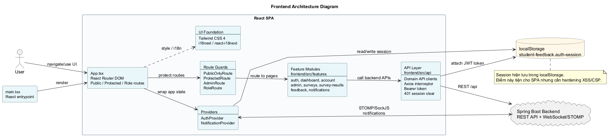

> [Hình 3.3: Frontend Architecture Diagram mô tả React SPA, router, providers, API layer và feature modules]

Luồng frontend điển hình là: page/component gọi hook hoặc API function trong `src/api`, Axios gắn token từ session nếu cần, backend trả response, page cập nhật state và render UI. Các provider như `AuthProvider` và `NotificationProvider` giúp chia sẻ trạng thái xác thực và notification trên toàn ứng dụng.

### 3.6 Routing và phân quyền frontend

Routing chính được khai báo trong `frontend/src/App.tsx`. Các nhóm route chính gồm:

- **Public routes:** `/login`, `/register`, `/forgot-password`, `/reset-password`, `/verify-email`. Các route này nằm dưới `PublicOnlyRoute`, phù hợp cho người dùng chưa đăng nhập.
- **Student routes:** `/dashboard/student`, `/surveys`, `/surveys/:id`, `/feedback`, `/notifications`, `/upload-documents`. Các route này nằm trong vùng protected; student cần session hợp lệ và trạng thái phù hợp để truy cập.
- **Lecturer routes:** `/dashboard/lecturer`, `/survey-results`, `/survey-results/:id`, `/feedback/manage`. Các route này được bảo vệ bằng `RoleRoute` với role `ADMIN` hoặc `LECTURER`, trong đó backend vẫn phải kiểm tra phạm vi dữ liệu.
- **Admin routes:** `/dashboard/admin`, `/admin/users`, `/admin/users/:id`, `/admin/students/pending`, `/admin/surveys`, `/admin/surveys/create`, `/admin/surveys/:id/edit`, `/admin/question-bank`, `/admin/survey-templates`, `/admin/audit-logs`. Các route này được bảo vệ bằng `AdminRoute`.

Frontend lưu session trong `localStorage` với key:

```text
student-feedback.auth-session
```

Trong `authStorage.ts`, frontend đọc session từ localStorage, kiểm tra access token, kiểm tra hạn token dựa trên claim `exp` và xóa session nếu token hết hạn hoặc session student không thuộc trạng thái được phép. Cách lưu này thuận tiện cho SPA vì session có thể được khôi phục sau khi reload trang. Tuy nhiên, localStorage có rủi ro bảo mật nếu ứng dụng bị XSS. Vì vậy, rủi ro này cần được phân tích ở Chương 8 về bảo mật và có thể cân nhắc hardening bằng Content Security Policy, kiểm soát input/output rendering và các cơ chế lưu token an toàn hơn tùy yêu cầu triển khai.

### 3.7 Thiết kế tích hợp ngoài

Hệ thống có nhiều tích hợp ngoài được tổ chức qua adapter, phù hợp với định hướng Ports and Adapters:

- **Resend:** dùng cho email verification và reset password. Backend gọi Resend qua adapter để gửi email xác minh hoặc email đặt lại mật khẩu, giúp tách logic nghiệp vụ tài khoản khỏi chi tiết nhà cung cấp email.
- **MinIO:** dùng để lưu tài liệu sinh viên như student card hoặc national ID trong quá trình onboarding. Đây là dữ liệu nhạy cảm nên cần cấu hình bucket, access key, secret và quyền truy cập cẩn thận.
- **RabbitMQ:** dùng cho task dịch bất đồng bộ. Khi có dữ liệu text cần xử lý, backend có thể gửi message vào queue để giảm thời gian xử lý đồng bộ của request chính.
- **WebSocket/STOMP:** dùng cho realtime notification. Backend lưu notification trong database và có thể đẩy sự kiện realtime tới frontend thông qua WebSocket/STOMP.
- **AI/Gemini-compatible API:** dùng để tạo AI summary cho phản hồi dạng text trong kết quả khảo sát. Adapter AI giúp backend không phụ thuộc trực tiếp vào một provider cụ thể ở tầng nghiệp vụ.
- **Embedding service:** thành phần phụ trợ FastAPI tạo embedding cho nội dung text, phục vụ các tác vụ như nhóm nội dung, so sánh chủ đề hoặc hỗ trợ AI summary. Theo thông tin dự án, service dùng model `intfloat/multilingual-e5-small`.
- **Eclipse BIRT:** dùng để render báo cáo PDF/XLSX từ dữ liệu khảo sát, phục vụ nhu cầu lưu trữ và nộp báo cáo kết quả.

Điểm đáng chú ý là các tích hợp trên không làm backend trở thành microservice thuần túy. Backend chính vẫn là trung tâm điều phối nghiệp vụ; các service như RabbitMQ, MinIO, AI provider và embedding service đóng vai trò phụ trợ hoặc hạ tầng tích hợp.

### 3.8 Nhận xét thiết kế kiến trúc

Các điểm mạnh của thiết kế kiến trúc:

- **Separation of concerns rõ ràng:** frontend, backend, persistence, integration và deployment được tách thành module/package riêng.
- **Backend có kiến trúc rõ:** Ports and Adapters giúp domain/use case không phụ thuộc trực tiếp vào REST controller, JPA repository hoặc provider ngoài.
- **Frontend chia feature hợp lý:** các nhóm `auth`, `admin`, `surveys`, `survey-results`, `feedback`, `notifications`, `dashboard` phản ánh tương đối tốt actor và nghiệp vụ.
- **Có adapter cho external services:** Resend, MinIO, RabbitMQ, WebSocket, AI, embedding và BIRT được đặt ở adapter/out hoặc cấu hình riêng, giảm ràng buộc vào application core.
- **Có CI/CD và deployment artifact:** repository có GitHub Actions, Dockerfile backend/frontend, `docker-compose.yml`, Nginx config và `.env.example`.
- **Có nền tảng vận hành/monitoring/hardening ngoài repo:** theo thông tin triển khai, hệ thống có reverse proxy, VPN management, phân tách mạng, Prometheus/Grafana/Loki, fail2ban và CrowdSec.

Các điểm cần cải thiện hoặc cần lưu ý:

- **`docker-compose.yml` hiện chủ yếu đóng gói frontend/backend:** các thành phần như SQL Server, RabbitMQ, MinIO, AI provider và monitoring nằm ngoài repo hoặc thuộc hạ tầng riêng. Khi bàn giao hoặc tái triển khai, cần có tài liệu môi trường rõ hơn.
- **Production Nginx cần kiểm tra WebSocket proxy:** nếu realtime notification dùng trong production, reverse proxy phải hỗ trợ upgrade WebSocket và timeout phù hợp.
- **Cần bổ sung application-level metrics:** monitoring hiện được mô tả ở mức hạ tầng ngoài repo. Nếu muốn observability sâu hơn, backend nên có metrics nghiệp vụ/kỹ thuật như request latency, survey submit count, queue lag, AI job duration và error rate.
- **Cần tài liệu hóa rõ boundary của external services:** đặc biệt với MinIO, AI provider và embedding service, cần mô tả cơ chế retry, timeout, credential management và fallback khi dịch vụ ngoài không sẵn sàng.

Từ kiến trúc ứng dụng trên, Chương 4 sẽ đi sâu vào cơ sở dữ liệu và mô hình miền. Phần đó sẽ ánh xạ các cụm nghiệp vụ như User & Identity, Survey & Question, Survey Response, Feedback, Notification, Audit và AI Summary sang các bảng, quan hệ và migration cụ thể.

## Chương 4. Thiết kế cơ sở dữ liệu và mô hình miền

### 4.1 Nguồn thiết kế dữ liệu

Nguồn schema chính của hệ thống là các Flyway migration trong:

```text
backend/src/main/resources/db/migration/
```

Các migration này được backend Spring Boot áp dụng khi khởi động, thông qua cấu hình Flyway trong `application.yaml`. Theo `database/README.md`, Flyway migration trong backend là source of truth hiện tại; các file trong thư mục `database/` như `full_schema.sql`, `seed_data.sql` và `database/migrations/` có vai trò hỗ trợ thiết lập thủ công, dữ liệu demo hoặc tham khảo/lịch sử cho giai đoạn trước khi schema được quản lý bằng Flyway.

Ngoài migration, backend có các JPA entity trong package:

```text
backend/src/main/java/com/ttcs/backend/adapter/out/persistence/
```

Các entity này thể hiện cách ứng dụng ánh xạ bảng dữ liệu sang object Java ở tầng persistence adapter. Một điểm cần lưu ý là các class như `RoleEntity` và `StatusEntity` trong code không tương ứng với bảng riêng trong Flyway migration. Role và status được lưu trực tiếp bằng chuỗi enum trong các cột như `User.role`, `Student.status`, `Survey.lifecycle_state`, kèm check constraint ở database và enum/logic kiểm soát ở code.

### 4.2 Nhóm bảng chính

Các bảng chính được nhóm theo domain như sau:

| Nhóm dữ liệu | Bảng |
|---|---|
| Người dùng | `User`, `Admin`, `Lecturer`, `Student`, `Department` |
| Token/Bảo mật | `student_token`, `Password_Reset_Token` |
| Khảo sát | `Survey`, `Question`, `Question_Bank`, `Survey_Assignment`, `Survey_Recipient` |
| Trả lời khảo sát | `Survey_Response`, `Response_Detail` |
| Feedback | `Feedback`, `Feedback_Response` |
| Notification | `Notification`, `Notification_User` |
| Quản trị/Audit | `Audit_Log` |
| Template khảo sát | `Survey_Template`, `Survey_Template_Question` |
| AI Summary | `Survey_AI_Summary`, `Survey_AI_Summary_Job`, `Survey_AI_Source_State`, `Survey_AI_Pending_Change`, `Survey_AI_Summary_Theme_Embedding` |

Ngoài các bảng trên, migration còn bổ sung nhiều cột và index phục vụ bilingual/translation, tối ưu truy vấn survey visibility, notification unread query và AI summary change tracking. Các phần này không tạo thêm bảng nghiệp vụ mới ngoài danh sách đã nêu, nhưng có ý nghĩa quan trọng với hiệu năng và khả năng xử lý bất đồng bộ.

### 4.3 Ý nghĩa nghiệp vụ của các bảng quan trọng

| Bảng | Ý nghĩa nghiệp vụ |
|---|---|
| `User` | Bảng định danh chung cho mọi người dùng, lưu email, mật khẩu đã mã hóa, role và trạng thái verify/active ở mức tài khoản. |
| `Student` | Hồ sơ sinh viên gắn với `User`, gồm mã sinh viên, khoa, trạng thái onboarding, đường dẫn tài liệu xác thực, thông tin review và số lần nộp lại. |
| `Lecturer` | Hồ sơ giảng viên gắn với `User`, gồm tên, mã giảng viên và khoa phụ trách. |
| `Admin` | Hồ sơ quản trị viên gắn với `User`, đại diện cho người có quyền quản trị hệ thống. |
| `Department` | Danh mục khoa/bộ môn, dùng để phân nhóm sinh viên, giảng viên, template hoặc phạm vi khảo sát. |
| `Survey` | Thông tin khảo sát, gồm tiêu đề, mô tả, thời gian, trạng thái lifecycle, cờ hidden và người tạo. |
| `Question` | Câu hỏi cụ thể thuộc một survey, có thể được tạo từ `Question_Bank` hoặc nhập trực tiếp. |
| `Question_Bank` | Ngân hàng câu hỏi dùng để tái sử dụng khi tạo survey hoặc survey template. |
| `Survey_Assignment` | Cấu hình phạm vi khảo sát, mô tả evaluator/subject type và value để xác định đối tượng tham gia hoặc đối tượng được đánh giá. |
| `Survey_Recipient` | Snapshot danh sách sinh viên được giao survey tại thời điểm publish, đồng thời lưu trạng thái đã mở và đã nộp. |
| `Survey_Response` | Một lần nộp khảo sát, gắn với survey và người trả lời là student hoặc lecturer theo constraint. |
| `Response_Detail` | Chi tiết câu trả lời cho từng câu hỏi, lưu rating hoặc comment. Đây là bảng dữ liệu lõi cho thống kê và AI summary. |
| `Feedback` | Phản hồi độc lập ngoài survey do sinh viên gửi, gồm tiêu đề, nội dung và thời điểm tạo. |
| `Feedback_Response` | Phản hồi của staff đối với feedback, gắn với user phản hồi. |
| `Notification` | Nội dung và metadata thông báo, có thể liên kết survey, loại thông báo, action label, người tạo và thời điểm tạo. |
| `Notification_User` | Bảng trung gian giữa notification và user, lưu trạng thái delivered/read theo từng người nhận. |
| `Audit_Log` | Nhật ký thao tác quản trị thành công, lưu actor, loại hành động, target, summary, old/new state và thời điểm tạo. |
| `Survey_AI_Summary` | Kết quả tóm tắt AI cho phản hồi text của survey, gồm model, số comment, summary và các JSON highlights/concerns/actions. |
| `Survey_AI_Summary_Job` | Job generate AI summary, lưu trạng thái job, survey, source hash, người yêu cầu, thời gian chạy và lỗi nếu có. |

### 4.4 Quan hệ dữ liệu chính

#### 4.4.1 Quan hệ one-to-one

- **`User` 1-1 `Admin`:** mỗi admin là một user có role `ADMIN`; `Admin.user_id` vừa là khóa chính vừa là khóa ngoại tới `User.user_id`.
- **`User` 1-1 `Lecturer`:** mỗi lecturer là một user có role `LECTURER`; `Lecturer.user_id` tham chiếu `User.user_id`.
- **`User` 1-1 `Student`:** mỗi student là một user có role `STUDENT`; `Student.user_id` tham chiếu `User.user_id`.
- **`Survey` 1-1 `Survey_AI_Source_State`:** `Survey_AI_Source_State.survey_id` là khóa chính và khóa ngoại tới `Survey`, dùng để lưu trạng thái nguồn dữ liệu phục vụ AI summary incremental.

#### 4.4.2 Quan hệ one-to-many

- **`Department` 1-n `Student`:** một khoa có nhiều sinh viên; `Student.dept_id` tham chiếu `Department.dept_id`.
- **`Department` 1-n `Lecturer`:** một khoa có nhiều giảng viên; `Lecturer.dept_id` tham chiếu `Department.dept_id`.
- **`Admin` 1-n `Survey`:** một admin có thể tạo nhiều survey; `Survey.created_by` tham chiếu `Admin.user_id`.
- **`Survey` 1-n `Question`:** một survey có nhiều câu hỏi; `Question.survey_id` tham chiếu `Survey.survey_id`.
- **`Survey` 1-n `Survey_Recipient`:** một survey có nhiều người nhận; `Survey_Recipient.survey_id` tham chiếu `Survey.survey_id`.
- **`Student` 1-n `Survey_Recipient`:** một student có thể được giao nhiều survey; `Survey_Recipient.student_id` tham chiếu `Student.user_id`.
- **`Survey` 1-n `Survey_Response`:** một survey có nhiều response; `Survey_Response.survey_id` tham chiếu `Survey.survey_id`.
- **`Survey_Response` 1-n `Response_Detail`:** một response có nhiều dòng trả lời chi tiết; `Response_Detail.response_id` tham chiếu `Survey_Response.response_id`.
- **`Question` 1-n `Response_Detail`:** một câu hỏi có thể xuất hiện trong nhiều response detail; `Response_Detail.question_id` tham chiếu `Question.question_id`.
- **`Student` 1-n `Feedback`:** một sinh viên có thể gửi nhiều feedback; `Feedback.student_id` tham chiếu `Student.user_id`.
- **`Feedback` 1-n `Feedback_Response`:** một feedback có thể có nhiều phản hồi từ staff; `Feedback_Response.feedback_id` tham chiếu `Feedback.feedback_id`.
- **`User` 1-n `Feedback_Response`:** một user thuộc staff có thể phản hồi nhiều feedback; `Feedback_Response.responder_user_id` tham chiếu `User.user_id`.
- **`User` 1-n `Audit_Log`:** một user có thể là actor của nhiều bản ghi audit; `Audit_Log.actor_user_id` tham chiếu `User.user_id`.
- **`Survey` 1-n `Notification`:** một survey có thể phát sinh nhiều notification; `Notification.survey_id` tham chiếu `Survey.survey_id`.
- **`Survey` 1-n `Survey_AI_Summary`:** một survey có thể có nhiều bản summary theo thời điểm hoặc source hash khác nhau.
- **`Survey_AI_Summary` 1-n `Survey_AI_Summary_Theme_Embedding`:** một summary có thể có nhiều embedding theo theme/highlight/concern/action.

#### 4.4.3 Quan hệ many-to-many qua bảng trung gian

- **`Survey` n-n `Student` qua `Survey_Recipient`:** mỗi survey có nhiều student nhận khảo sát, và mỗi student có thể nhận nhiều survey. `Survey_Recipient` đồng thời lưu trạng thái tham gia như assigned/opened/submitted.
- **`Notification` n-n `User` qua `Notification_User`:** mỗi notification có thể gửi tới nhiều user, và mỗi user có thể nhận nhiều notification. Bảng trung gian lưu delivered/read theo từng user.
- **`Survey_Template` n-n `Question_Bank` theo mô hình gần đúng qua `Survey_Template_Question`:** một template có nhiều câu hỏi template; mỗi câu hỏi template có thể tham chiếu `Question_Bank`. Do `question_bank_id` có thể null và `Survey_Template_Question` cũng lưu `content`, `type`, `display_order`, quan hệ này không phải many-to-many thuần túy mà là bảng chi tiết template có liên kết tùy chọn tới ngân hàng câu hỏi.

### 4.5 ERD


> [Hình 4.1: TODO - ERD tổng thể hệ thống student-feedback-system]

Do số lượng bảng tương đối lớn và trải rộng qua nhiều domain, nếu vẽ toàn bộ ERD trong một hình có thể khó đọc. Khi đưa vào báo cáo, nên chia ERD thành các sơ đồ nhỏ theo cụm nghiệp vụ:

- **ERD User/Auth domain:** `User`, `Admin`, `Lecturer`, `Student`, `Department`, `student_token`, `Password_Reset_Token`.
- **ERD Survey domain:** `Survey`, `Question`, `Question_Bank`, `Survey_Assignment`, `Survey_Recipient`, `Survey_Response`, `Response_Detail`, `Survey_Template`, `Survey_Template_Question`.
- **ERD Feedback/Notification domain:** `Feedback`, `Feedback_Response`, `Notification`, `Notification_User`, `Audit_Log` nếu muốn gom các bảng vận hành/nghiệp vụ phụ.
- **ERD AI Summary domain:** `Survey_AI_Summary`, `Survey_AI_Summary_Job`, `Survey_AI_Source_State`, `Survey_AI_Pending_Change`, `Survey_AI_Summary_Theme_Embedding` và liên kết tới `Survey`, `Response_Detail`, `Question`.


> [Hình 4.2: TODO - ERD User/Auth domain gồm User, Admin, Lecturer, Student, Department và token]


> [Hình 4.3: TODO - ERD Survey domain gồm Survey, Question, Assignment, Recipient, Response và Template]


> [Hình 4.4: TODO - ERD Feedback/Notification domain gồm Feedback, Feedback_Response, Notification, Notification_User và Audit_Log]


> [Hình 4.5: TODO - ERD AI Summary domain gồm Summary, Job, Source State, Pending Change và Theme Embedding]

### 4.6 Nhận xét thiết kế dữ liệu

Các điểm hợp lý trong thiết kế dữ liệu:

- **Survey lifecycle rõ ràng:** `Survey.lifecycle_state` có các trạng thái `DRAFT`, `PUBLISHED`, `CLOSED`, `ARCHIVED`, giúp tách trạng thái nghiệp vụ khỏi thời gian mở/đóng thực tế.
- **Snapshot `Survey_Recipient` khi publish:** bảng này cố định danh sách sinh viên được giao khảo sát tại thời điểm publish, giúp denominator của báo cáo ổn định và tránh thay đổi ngoài ý muốn khi có sinh viên mới được duyệt sau đó.
- **Có `Audit_Log` cho thao tác quản trị:** các hành động quan trọng như duyệt sinh viên, publish/close/archive survey, thay đổi visibility hoặc cập nhật user có nơi lưu vết.
- **Tách `Survey_Response` và `Response_Detail`:** thiết kế này phù hợp với khảo sát nhiều câu hỏi, giúp response là header và mỗi câu trả lời là một dòng detail.
- **Có `Notification_User`:** notification được tách thành nội dung chung và trạng thái theo từng user, thuận lợi cho unread count, delivered/read tracking và gửi thông báo đến nhiều người.
- **Có các bảng AI summary job/source state/pending change:** nhóm bảng này hỗ trợ xử lý AI summary theo hướng có trạng thái, có job, có phát hiện thay đổi nguồn dữ liệu và có embedding theo theme.
- **Flyway quản lý lịch sử thay đổi schema:** các thay đổi từ schema ban đầu, notification, AI summary, translation, index tối ưu đến change tracking đều được version hóa.

Các điểm cần lưu ý khi mở rộng hoặc vận hành:

- **Role/status lưu bằng enum string:** cách này đơn giản, dễ đọc và phù hợp với quy mô hiện tại, nhưng cần duy trì check constraint ở database và kiểm soát chặt ở code để tránh giá trị không hợp lệ.
- **Dữ liệu định danh sinh viên cần bảo vệ ở MinIO/storage:** các cột `student_card_img` và `national_id_img` chỉ lưu đường dẫn/tham chiếu, nhưng payload thật vẫn là dữ liệu nhạy cảm cần kiểm soát quyền truy cập, bucket policy, secret và thời hạn URL.
- **Bảng response/audit/notification có thể tăng nhanh:** nếu hệ thống mở rộng quy mô, cần bổ sung index theo pattern truy vấn thực tế, cân nhắc partition hoặc archive policy cho `Survey_Response`, `Response_Detail`, `Audit_Log`, `Notification` và `Notification_User`.
- **Quan hệ template-question không phải many-to-many thuần túy:** `Survey_Template_Question` vừa là bảng chi tiết câu hỏi template, vừa có liên kết tùy chọn tới `Question_Bank`; khi vẽ ERD cần thể hiện đúng tính chất này để tránh hiểu sai.

Từ thiết kế dữ liệu và mô hình miền ở Chương 4, báo cáo chuyển sang Chương 5 để trình bày công nghệ sử dụng, cách đóng gói ứng dụng và các thành phần triển khai/vận hành phục vụ hệ thống.

---

# PHẦN 3. TRIỂN KHAI, HẠ TẦNG VÀ VẬN HÀNH

## Chương 5. Công nghệ sử dụng và triển khai ứng dụng

### 5.1 Backend stack

Backend của hệ thống nằm trong thư mục `backend/` và được build bằng Maven. Các công nghệ chính được xác nhận từ `backend/pom.xml`, Dockerfile và package code backend.

| Công nghệ | Vai trò trong dự án |
|---|---|
| Java 21 | Nền tảng runtime và compile cho backend. `pom.xml` khai báo `java.version` là `21`; Docker runtime dùng `eclipse-temurin:21-jre`. |
| Spring Boot 4.0.6 | Framework chính của backend, được khai báo qua `spring-boot-starter-parent` phiên bản `4.0.6`. |
| Spring WebMVC | Cung cấp REST API qua các controller như `AuthController`, `SurveyController`, `AdminSurveyController`, `FeedbackController`, `SurveyResultController`. |
| Spring Security | Xử lý authentication/authorization, kết hợp JWT filter và rule phân quyền trong `SecurityConfig`. |
| Spring Data JPA/Hibernate | Truy cập database thông qua JPA entity, repository và persistence adapter trong `adapter/out/persistence`. |
| Flyway | Quản lý version schema database; migration nằm tại `backend/src/main/resources/db/migration/`. |
| SQL Server JDBC | Driver kết nối Microsoft SQL Server, khai báo dependency `mssql-jdbc` ở runtime. |
| JWT jjwt | Sinh và kiểm tra JWT cho đăng nhập stateless, sử dụng các dependency `jjwt-api`, `jjwt-impl`, `jjwt-jackson`. |
| Spring WebSocket/STOMP | Hỗ trợ realtime notification giữa backend và frontend. |
| Spring AMQP/RabbitMQ | Gửi/nhận task dịch bất đồng bộ, cấu hình qua `RabbitMqConfig` và adapter messaging. |
| MinIO SDK | Lưu trữ tài liệu sinh viên trong onboarding, cấu hình qua `MinioConfig` và adapter storage. |
| Resend API | Gửi email xác minh và các email liên quan đến tài khoản thông qua adapter email. |
| Eclipse BIRT | Xuất báo cáo khảo sát dạng PDF/XLSX; backend có dependency BIRT report engine, PDF emitter và Excel emitter. |
| Maven | Công cụ build/test/package backend, được dùng trong CI với lệnh `./mvnw test` và trong Dockerfile multi-stage. |

Stack backend được chọn theo hướng phục vụ một ứng dụng nghiệp vụ có yêu cầu rõ về bảo mật, persistence, migration, báo cáo, tích hợp message queue, storage và AI summary. Điểm đáng chú ý là nghiệp vụ không nằm trực tiếp trong controller, mà được đặt trong các use case service và port/adapter như đã trình bày ở Chương 3.

### 5.2 Frontend stack

Frontend nằm trong thư mục `frontend/`, là SPA build bằng Vite. Các dependency và script được xác nhận từ `frontend/package.json`.

| Công nghệ | Vai trò trong dự án |
|---|---|
| React 19 | Xây dựng giao diện SPA cho Admin, Lecturer và Student. |
| TypeScript | Kiểm soát kiểu dữ liệu cho component, API response, auth session và domain UI. |
| Vite 8 | Dev server và build tool cho frontend; script build chạy `tsc -b && vite build`. |
| React Router DOM 7 | Khai báo routing trong `App.tsx`, gồm public routes, protected routes, role routes và admin routes. |
| Axios | API layer gọi backend, đặt trong `frontend/src/api/`. |
| Tailwind CSS 4 | Styling chính cho giao diện frontend, tích hợp qua `@tailwindcss/vite` và `index.css`. |
| i18next/react-i18next | Hỗ trợ đa ngôn ngữ trong frontend. |
| STOMP + SockJS | Kết nối realtime notification với backend WebSocket/STOMP. |
| ESLint | Kiểm tra chất lượng code frontend; CI chạy `npm run lint`. |

Frontend tổ chức theo feature-based structure, với các nhóm như `auth`, `admin`, `surveys`, `survey-results`, `feedback`, `notifications`, `dashboard` và `account`. Cách tổ chức này phù hợp với hệ thống có nhiều actor và nhiều luồng nghiệp vụ độc lập.

### 5.3 Database và migration

Database chính của hệ thống là Microsoft SQL Server. Backend kết nối SQL Server thông qua `mssql-jdbc`, sử dụng JPA/Hibernate cho mapping object-relational và Flyway để quản lý thay đổi schema.

Nguồn migration chính nằm tại:

```text
backend/src/main/resources/db/migration/
```

Các file migration trong thư mục này tạo schema ban đầu và bổ sung các thay đổi như notification module, AI summary, bilingual/translation support, index tối ưu truy vấn, survey visibility optimization và AI summary change tracking.

Trong repository cũng có thư mục `database/` với các file như `full_schema.sql`, `seed_data.sql` và `database/migrations/`. Theo `database/README.md`, các file này dùng cho thiết lập thủ công, dữ liệu demo hoặc tham khảo/lịch sử trước khi chuyển sang Flyway. Vì vậy, khi phân tích schema chính thức của ứng dụng, báo cáo ưu tiên Flyway migration trong backend.

### 5.4 Embedding service và AI integration

Repository có module `embedding-service/`, là một service FastAPI độc lập phục vụ tạo embedding cho nội dung text. File `embedding-service/app/main.py` khai báo model:

```text
intfloat/multilingual-e5-small
```

Service này expose các endpoint:

- `GET /health`: trả trạng thái service và tên model.
- `POST /embed`: nhận danh sách text và trả về vector embedding đã normalize.

Backend có `LocalTextEmbeddingAdapter` trong `adapter/out/ai`, gọi local embedding service qua HTTP endpoint `/embed` khi cấu hình `app.ai.embedding.enabled` được bật. Adapter này cho phép backend dùng embedding để hỗ trợ các tác vụ liên quan đến AI summary, ví dụ novelty scoring hoặc xử lý theme embedding.

Ngoài embedding local, backend còn có `ChatCompletionSurveyCommentSummaryAdapter` để gọi AI/Gemini-compatible API thông qua cấu hình `app.ai.base-url`, `app.ai.api-key` và `app.ai.model`. Luồng này được dùng cho chức năng summary/phân tích phản hồi text của khảo sát. Trong phạm vi code hiện tại, không nên mô tả AI như một hệ thống chấm điểm toàn diện; chức năng chính được thể hiện rõ là tạo summary có cấu trúc, phân tích highlights/concerns/actions và hỗ trợ embedding cho nội dung text.

### 5.5 Containerization

Ứng dụng được container hóa bằng Docker với hai Dockerfile riêng cho backend và frontend.

Backend Dockerfile tại `backend/Dockerfile` là multi-stage build:

1. Stage `dependencies` dùng `maven:3.9.9-eclipse-temurin-21`, copy Maven wrapper và `pom.xml`, sau đó chạy `./mvnw dependency:go-offline -B`.
2. Stage `build` copy source code và chạy `./mvnw clean package -DskipTests` để tạo file jar.
3. Stage `runtime` dùng `eclipse-temurin:21-jre`, copy jar thành `app.jar`, expose port `8080` và chạy:

```text
java -jar app.jar
```

Frontend Dockerfile tại `frontend/Dockerfile` cũng là multi-stage build:

1. Stage `dependencies` dùng `node:22-alpine`, chạy `npm ci`.
2. Stage `build` chạy `npm run build` để tạo thư mục `dist`.
3. Stage `runtime` dùng `nginx:1.27-alpine`, copy `nginx.conf` và nội dung `dist` vào `/usr/share/nginx/html`, expose port `80`.

File `frontend/nginx.conf` cấu hình Nginx để serve SPA:

- `location /` dùng `try_files $uri $uri/ /index.html;` để fallback về `index.html`, phù hợp với React Router.
- `location /api/` proxy request về `http://backend:8080`.
- Forward các header như `Host`, `X-Real-IP`, `X-Forwarded-For`, `X-Forwarded-Proto`.

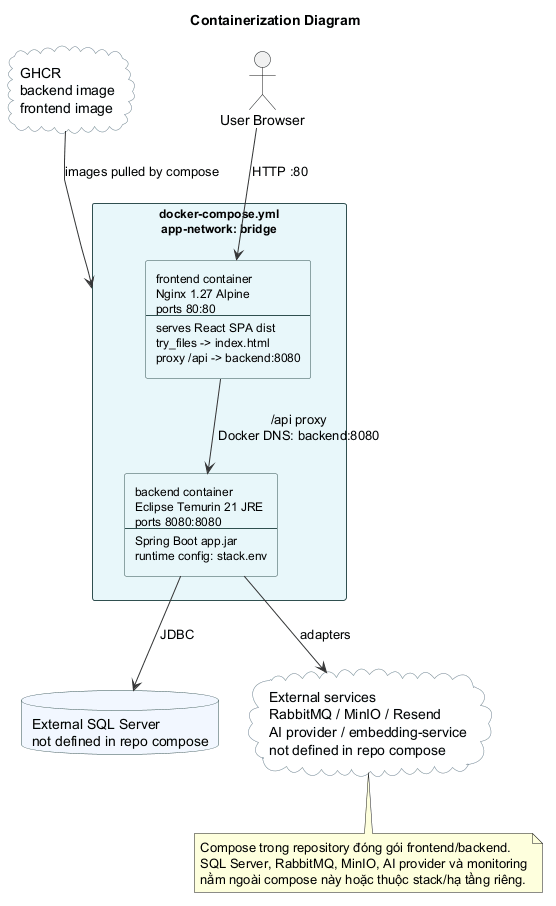

> [Hình 5.1: Containerization Diagram mô tả frontend/backend container, Nginx proxy `/api`, Docker network và các service ngoài compose]

### 5.6 Docker Compose deployment trong repo

File `docker-compose.yml` hiện định nghĩa hai service chính:

- **`backend`:** dùng image `ghcr.io/phanmanhcuongdev/student-feedback-system/backend:${BACKEND_TAG:-latest}`, đọc biến môi trường từ `stack.env`, đặt container name `backend`, restart `unless-stopped`, map port `8080:8080`.
- **`frontend`:** dùng image `ghcr.io/phanmanhcuongdev/student-feedback-system/frontend:${FRONTEND_TAG:-latest}`, đặt container name `frontend`, restart `unless-stopped`, map port `80:80`, `depends_on` backend.
- **`app-network`:** bridge network dùng chung cho frontend và backend.

Compose trong repository hiện đóng gói hai thành phần ứng dụng chính là frontend và backend. Các service như SQL Server, RabbitMQ, MinIO, AI provider, embedding service và monitoring stack không nằm trong compose này. Các thành phần đó được cung cấp bởi hạ tầng ngoài, stack riêng hoặc cấu hình runtime khác theo thông tin triển khai.

### 5.7 CI/CD pipeline với GitHub Actions

Pipeline nằm tại `.github/workflows/ci.yml`. Workflow được kích hoạt khi:

- `push` lên nhánh `main` hoặc `develop`.
- `pull_request` vào nhánh `main` hoặc `develop`.

Pipeline có hai job chính.

Job **quality** đóng vai trò quality gate:

- Checkout source bằng `actions/checkout@v4`.
- Setup Java 21 bằng `actions/setup-java@v4` với distribution `temurin`.
- Setup Node.js 22 bằng `actions/setup-node@v4`, cache npm theo `frontend/package-lock.json`.
- Cấp quyền thực thi cho Maven wrapper.
- Chạy backend test bằng `./mvnw test`.
- Cài frontend dependency bằng `npm ci`.
- Chạy frontend lint bằng `npm run lint`.
- Build frontend bằng `npm run build`.
- Chạy Trivy filesystem scan với scanner `vuln,secret,misconfig`, severity `CRITICAL`, `exit-code: 1`.

Job **docker** phụ thuộc job quality và thực hiện build/push image:

- Login GHCR bằng `GITHUB_TOKEN`.
- Tạo tag image theo branch: `latest` cho `main`, `dev` cho `develop`, kèm tag theo commit SHA.
- Build backend image từ `./backend`.
- Build frontend image từ `./frontend`.
- Chạy Trivy image scan cho backend image và frontend image, severity `CRITICAL`, `exit-code: 1`.
- Push backend/frontend image lên GHCR khi event là `push`.

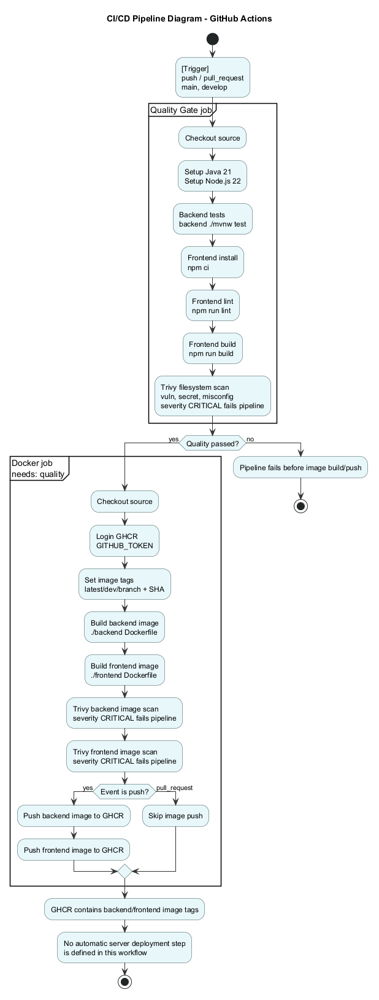

> [Hình 5.2: CI/CD Pipeline Diagram gồm quality gate, image build, image scan và push GHCR]

### 5.8 Giới hạn của pipeline hiện tại

Repository hiện có CI tương đối đầy đủ cho build/test/lint/security scan và tạo Docker image artifact. Tuy nhiên, trong `.github/workflows/ci.yml` chưa tìm thấy bước CD tự động deploy trực tiếp lên server bằng SSH, Kubernetes, Docker Compose remote hoặc công cụ tương đương.

Vì vậy, có thể kết luận trong phạm vi repository hiện tại:

- Có CI, security scan, build Docker image và push GHCR.
- Chưa có CD tự động deploy lên server trong workflow.
- Việc deploy runtime có thể được thực hiện thủ công, qua Portainer, qua compose stack riêng hoặc bằng quy trình vận hành ngoài repo nếu có bằng chứng từ người vận hành. Phần này cần được bổ sung ở chương hạ tầng/vận hành nếu có ảnh hoặc tài liệu triển khai thực tế.

### 5.9 Nhận xét

Các điểm mạnh:

- **Có quality gate:** backend test, frontend lint và frontend build được chạy trước khi build image.
- **Có security scan:** Trivy filesystem scan và Trivy image scan giúp chặn lỗ hổng mức `CRITICAL` trong phạm vi được kiểm tra.
- **Có Docker image artifact:** backend và frontend được build thành image và push lên GHCR khi push code.
- **Có separation build/runtime image:** Dockerfile backend và frontend đều dùng multi-stage, giúp tách môi trường build khỏi runtime.
- **Có env-based config:** backend container dùng `env_file: stack.env`, phù hợp với cấu hình theo môi trường.
- **Có nền tảng maintain lâu dài:** Maven, Vite, Docker, Flyway và GitHub Actions tạo nền tảng ổn định cho kiểm thử, build và vận hành.

Các điểm cần cải thiện:

- **Bổ sung healthcheck container:** `docker-compose.yml` hiện chưa khai báo healthcheck cho backend/frontend; điều này có thể bổ sung để hỗ trợ restart/monitoring tốt hơn.
- **Chạy container non-root:** Dockerfile hiện chưa thể hiện rõ cấu hình user non-root ở runtime; nên hardening thêm nếu triển khai production.
- **Bổ sung CD tự động có kiểm soát:** có thể thêm workflow deploy qua SSH/VPN, Portainer webhook hoặc GitOps tùy hạ tầng, kèm approval gate.
- **Bổ sung production Nginx WebSocket proxy:** nếu realtime notification cần chạy production qua reverse proxy, cần đảm bảo cấu hình `Upgrade`/`Connection` và timeout cho WebSocket/STOMP.
- **Bổ sung security headers cho Nginx:** có thể cấu hình thêm các header như CSP, X-Frame-Options, X-Content-Type-Options, Referrer-Policy tùy yêu cầu bảo mật.

Chương 5 cho thấy repository đã có nền tảng công nghệ và artifact triển khai tương đối rõ: backend/frontend được build, kiểm thử, scan và đóng gói image. Tuy nhiên, triển khai thực tế không chỉ nằm trong repository mà còn phụ thuộc vào VPS, VPN, Proxmox, VLAN, reverse proxy và monitoring. Vì vậy, Chương 6 sẽ tiếp tục trình bày kiến trúc hạ tầng mạng và mô hình triển khai vận hành của hệ thống.

## Chương 6. Thiết kế hạ tầng triển khai và kiến trúc mạng

### 6.1 Bối cảnh triển khai hệ thống

Hệ thống khảo sát ý kiến sinh viên không chỉ gồm hai container frontend và backend. Trong vận hành thực tế, hệ thống còn phụ thuộc vào nhiều thành phần hạ tầng và dịch vụ phụ trợ: database, message queue, object storage, AI provider, embedding service, reverse proxy, monitoring và kênh quản trị hệ thống. Vì vậy, nếu chỉ triển khai frontend/backend mà không thiết kế mạng và vận hành phù hợp, hệ thống sẽ khó đáp ứng các yêu cầu về bảo mật, khả năng quan sát, kiểm soát truy cập và mở rộng.

Theo dữ liệu hạ tầng được người vận hành cung cấp, môi trường triển khai sử dụng Proxmox VE làm nền tảng ảo hóa, VyOS Router VM làm gateway Layer 3, Cisco Switch làm Layer 2 switch/trunk VLAN, Headscale/Tailscale VPN Mesh cho quản trị, VPS public làm điểm ingress qua Nginx reverse proxy và một node riêng cho monitoring. Cách tổ chức này giúp hệ thống khảo sát có một mô hình triển khai gần với thực tế vận hành: public traffic được kiểm soát qua reverse proxy, còn các cổng quản trị và dịch vụ nội bộ không bị đưa trực tiếp ra Internet.

### 6.2 Nguyên tắc thiết kế hạ tầng

Thiết kế hạ tầng của hệ thống dựa trên các nguyên tắc sau:

- **Tách data plane và management plane:** luồng người dùng truy cập ứng dụng được tách khỏi luồng quản trị hạ tầng như SSH, quản trị Proxmox, VyOS, monitoring hoặc cấu hình proxy.
- **Không public các cổng quản trị:** SSH và các giao diện quản trị không mở trực tiếp ra Internet, mà chỉ truy cập qua Tailnet.
- **Không để database/message broker/object storage lộ ra Internet:** SQL Server, RabbitMQ, MinIO và các dịch vụ nội bộ không được public trực tiếp.
- **Public traffic chỉ đi qua reverse proxy:** người dùng Internet truy cập domain công khai, sau đó request được xử lý tại Nginx reverse proxy.
- **Quản trị qua VPN Mesh:** sysadmin truy cập hạ tầng qua Headscale/Tailscale, dùng dải Tailnet `100.64.0.0/10`.
- **Tách Production/Lab/Management bằng VLAN:** VLAN 10 dành cho production, VLAN 20 cho lab/internal và VLAN 99 cho management.
- **Least privilege bằng tag/ACL:** các node Tailnet được gắn tag như `nginx-proxy`, `monitoring`, `hypervisor`, `core-router`, `sysadmin` để có thể kiểm soát quyền truy cập theo vai trò.
- **Chuẩn bị monitoring plane từ đầu:** có monitoring node riêng để quan sát hệ thống, thay vì chỉ bổ sung sau khi xảy ra sự cố.

### 6.3 Kiến trúc mạng tổng thể


> [Hình 6.1: TODO - Network Topology tổng thể gồm Internet, VPS nginx-proxy, Tailnet, Proxmox, VyOS, VLAN và monitoring node]

Kiến trúc mạng tổng thể có thể mô tả theo các lớp:

- **Internet/Public Cloud:** nơi người dùng truy cập domain `survey.cuongdso.id.vn`. Public traffic chỉ đi vào hệ thống qua port 80/443.
- **VPS nginx-proxy:** VPS có hostname `ubuntu-rrbzm1pr`, Tailnet IP `100.64.0.4`, tag `nginx-proxy`. Domain `survey.cuongdso.id.vn` trỏ về VPS này. Nginx trên VPS đóng vai trò public reverse proxy/redirect về frontend production.
- **Headscale control plane:** môi trường có Headscale/Headplane control plane để quản lý Tailnet riêng.
- **VPN Overlay/Tailnet:** Tailnet dùng dải `100.64.0.0/10`, cung cấp overlay network cho quản trị và kết nối nội bộ giữa các node được phép.
- **Proxmox VE:** node hypervisor có Tailnet IP `100.64.0.5`, tag `hypervisor`, dùng để chạy các VM/container phục vụ hệ thống.
- **VyOS Router:** VM router làm gateway Layer 3, định tuyến giữa các VLAN và đóng vai trò kiểm soát luồng mạng nội bộ.
- **Cisco Switch:** Layer 2 switch/trunk VLAN, phục vụ phân tách mạng vật lý/ảo theo VLAN.
- **VLAN 10 Production:** vùng dành cho workload production như frontend, backend, database, RabbitMQ, MinIO hoặc AI worker nếu các thành phần này được triển khai trong vùng production.
- **VLAN 20 Lab/Internal:** vùng thử nghiệm hoặc nội bộ, dùng để giảm ảnh hưởng tới production khi lab.
- **VLAN 99 Management:** vùng quản trị, có bgp-speaker/core-router với IP nội bộ `10.1.99.10`, Tailnet IP `100.64.0.2`, tag `core-router`.
- **Monitoring node:** Vostro Hub có Tailnet IP `100.64.0.6`, tag `monitoring`, phục vụ quan sát hệ thống.

Ngoài ra, sysadmin device có Tailnet IP `100.64.0.1`, tag `sysadmin`, dùng để truy cập các tài nguyên quản trị qua VPN Mesh.

### 6.4 Public access flow


> [Hình 6.2: TODO - Public Access Flow từ người dùng Internet đến frontend/backend production]

Luồng truy cập công khai của người dùng:

```text
User
-> survey.cuongdso.id.vn
-> VPS nginx-proxy
-> Nginx reverse proxy
-> Tailnet/internal route
-> Frontend production
-> Backend API
-> Database/external services nếu cần
```

Trong mô hình này, người dùng không truy cập trực tiếp vào VM/container ứng dụng. Public traffic đi vào domain `survey.cuongdso.id.vn`, domain trỏ về VPS public entrypoint. Nginx trên VPS xử lý request ở port 80/443 và reverse proxy hoặc redirect về frontend production thông qua tuyến nội bộ/Tailnet phù hợp. Khi frontend cần gọi API, request tiếp tục đi tới backend API; backend sau đó truy cập database hoặc các dịch vụ phụ trợ như RabbitMQ, MinIO, AI provider nếu use case yêu cầu.

Lợi ích của thiết kế này:

- VM ứng dụng không cần public trực tiếp ra Internet.
- Bề mặt tấn công giảm vì chỉ có một điểm ingress công khai.
- Có một điểm kiểm soát rõ ràng cho public traffic.
- Dễ gắn Nginx hardening, rate limit, log access và CrowdSec ở lớp public entrypoint.

### 6.5 Management access flow


> [Hình 6.3: TODO - Management Access Flow qua Headscale/Tailscale Tailnet]

Luồng quản trị hệ thống:

```text
Sysadmin device
-> Tailscale/Headscale
-> Proxmox/VyOS/VPS/monitoring
-> SSH hoặc web management chỉ qua Tailnet
```

Theo dữ liệu vận hành được cung cấp, SSH không public và bị khóa tại interface Tailscale. Điều này có nghĩa là các thao tác quản trị như SSH vào VPS, truy cập Proxmox, kiểm tra VyOS hoặc xem monitoring không đi qua Internet public, mà đi qua Tailnet. Management plane vì vậy được tách khỏi public traffic của người dùng cuối.

Cách tổ chức này phù hợp với yêu cầu vận hành hệ thống khảo sát: đội vận hành vẫn có đường quản trị ổn định, nhưng các cổng nhạy cảm không bị lộ ra ngoài. Khi cần mở rộng số lượng node hoặc phân quyền quản trị, Headscale/Tailscale tag và ACL có thể được dùng để giới hạn thiết bị nào được truy cập tài nguyên nào.

### 6.6 Vai trò của các thành phần hạ tầng

| Thành phần | Vai trò | Lý do thiết kế |
|---|---|---|
| Proxmox VE | Nền tảng ảo hóa chạy các VM/container phục vụ hệ thống. | Tập trung quản lý compute resource, dễ tạo/sao lưu/di chuyển workload. |
| VyOS Router | Gateway Layer 3, định tuyến giữa các VLAN và kiểm soát luồng mạng nội bộ. | Cho phép tách mạng theo vùng và áp dụng policy routing/firewall tập trung. |
| Cisco Switch | Layer 2 switch/trunk VLAN. | Hỗ trợ phân tách mạng vật lý/ảo bằng VLAN, kết nối các vùng production, lab và management. |
| Headscale | Control plane cho Tailscale VPN Mesh riêng. | Cung cấp quản trị Tailnet tự chủ, hỗ trợ tag/ACL và truy cập quản trị không public. |
| VPS nginx-proxy | Public entrypoint cho domain `survey.cuongdso.id.vn`, Tailnet IP `100.64.0.4`, tag `nginx-proxy`. | Gom public ingress vào một điểm, xử lý 80/443 bằng Nginx và chuyển tiếp về frontend production. |
| bgp-speaker/core-router | Node trong VLAN 99, IP nội bộ `10.1.99.10`, Tailnet IP `100.64.0.2`, tag `core-router`. | Phục vụ vai trò core routing/BGP speaker trong vùng management theo thiết kế hạ tầng. |
| Vostro Hub monitoring | Monitoring node, Tailnet IP `100.64.0.6`, tag `monitoring`. | Tách monitoring plane khỏi workload chính, phục vụ Prometheus/Grafana/Loki ở Chương 7. |
| VLAN 10 Production | Vùng chạy workload production như frontend/backend/database/RabbitMQ/MinIO/AI worker nếu được triển khai tại đây. | Cách ly production khỏi lab và management, giảm rủi ro ảnh hưởng chéo. |
| VLAN 20 Lab/Internal | Vùng thử nghiệm hoặc nội bộ. | Cho phép thử nghiệm cấu hình/dịch vụ mà không tác động trực tiếp tới production. |
| VLAN 99 Management | Vùng quản trị hạ tầng. | Tách traffic quản trị khỏi workload ứng dụng và public traffic. |

### 6.7 Phân tách mạng bằng VLAN

Hệ thống sử dụng ba VLAN chính:

- **VLAN 10 Production:** vùng dành cho workload production. Các thành phần như frontend, backend, database, RabbitMQ, MinIO hoặc AI worker có thể được đặt trong vùng này nếu thuộc môi trường production.
- **VLAN 20 Lab/Internal:** vùng phục vụ thử nghiệm, lab hoặc dịch vụ nội bộ chưa đưa vào production.
- **VLAN 99 Management:** vùng quản trị cho các thành phần như router, hypervisor, monitoring hoặc node điều phối hạ tầng.

Giao tiếp giữa các VLAN đi qua VyOS Router. Cách thiết kế này giúp kiểm soát luồng mạng theo policy thay vì để tất cả thành phần nằm trong cùng một broadcast domain. Khi một vùng gặp sự cố hoặc bị khai thác, VLAN separation giúp giảm blast radius, tức giảm khả năng sự cố lan sang production hoặc management plane.

Trong bối cảnh hệ thống khảo sát, phân tách VLAN có ý nghĩa trực tiếp: database và object storage không cần public; môi trường lab không ảnh hưởng dữ liệu khảo sát thật; management interface không bị trộn với traffic người dùng; monitoring có thể quan sát nhiều vùng nhưng vẫn được quản lý theo quyền riêng.

### 6.8 Security hardening ở tầng hạ tầng

Các biện pháp hardening hạ tầng được cung cấp gồm:

- **Chỉ public port 80/443:** public traffic chỉ vào hệ thống qua HTTP/HTTPS.
- **Cả 80/443 đều do Nginx xử lý:** Nginx là điểm kiểm soát public traffic, có thể áp dụng logging, redirect, reverse proxy và các rule hardening.
- **SSH không public:** SSH bị giới hạn qua interface Tailscale, tránh để cổng quản trị lộ trực tiếp ra Internet.
- **fail2ban trên Ubuntu 24 LTS:** hỗ trợ chặn các hành vi đăng nhập hoặc request bất thường theo log rule.
- **CrowdSec trên VPS/gateway:** tăng khả năng phát hiện và phản ứng với probing hoặc traffic nguy hiểm ở lớp public/gateway.
- **Headscale ACL/tag tách quyền:** các node được gắn tag như `sysadmin`, `nginx-proxy`, `monitoring`, `hypervisor`, `core-router`, tạo nền tảng phân quyền truy cập theo vai trò.
- **DB/RabbitMQ/MinIO không public:** các dịch vụ dữ liệu và hạ tầng nội bộ không được expose ra Internet.
- **Headscale và nginx-proxy có lớp bảo mật riêng:** đây là hai thành phần nhạy cảm vì một bên quản lý Tailnet, một bên là public ingress.

Một điểm thực tế đáng chú ý là khi dùng OWASP ZAP để probing trong môi trường kiểm thử, CrowdSec đã phát hiện và ban IP. Điều này cho thấy lớp phát hiện probing ở gateway/VPS có hoạt động, dù kết quả này vẫn cần được minh họa bằng log hoặc ảnh chụp nếu đưa vào báo cáo demo/bằng chứng.

### 6.9 Nhận xét và giới hạn

Điểm mạnh của thiết kế hạ tầng:

- **Có tách data plane và management plane:** luồng người dùng và luồng quản trị không đi chung một bề mặt public.
- **Có VPN Mesh quản trị:** sysadmin quản trị qua Headscale/Tailscale thay vì mở SSH public.
- **Có reverse proxy công khai:** public ingress tập trung tại VPS nginx-proxy, thuận lợi cho kiểm soát và hardening.
- **Có VLAN:** production, lab/internal và management được tách vùng rõ ràng.
- **Có monitoring plane:** Vostro Hub monitoring là node riêng, chuẩn bị cho quan sát hệ thống ở Chương 7.
- **Có hardening thực tế:** fail2ban, CrowdSec, giới hạn 80/443 và khóa SSH public giúp giảm rủi ro vận hành.

Giới hạn và việc cần bổ sung:

- **Cần tài liệu hóa đầy đủ firewall rule/ACL:** đặc biệt là rule giữa VLAN, rule Tailnet ACL và rule trên VPS nginx-proxy.
- **Cần backup cấu hình VyOS/Headscale/Nginx:** các cấu hình này là hạ tầng trọng yếu, cần có bản sao lưu và quy trình phục hồi.
- **Cần kiểm tra định kỳ public exposure:** nên định kỳ scan external exposure để bảo đảm DB/RabbitMQ/MinIO/SSH không bị public ngoài ý muốn.
- **Cần bổ sung diagram và bằng chứng ảnh:** các sơ đồ network topology, public access flow, management flow, ảnh cấu hình hoặc log CrowdSec/fail2ban nên được bổ sung vào báo cáo.

Chương 6 đã trình bày cách hệ thống được đặt vào một kiến trúc mạng có phân tách, có reverse proxy, có VPN quản trị và có các lớp hardening hạ tầng. Chương 7 sẽ tiếp tục mô tả monitoring và observability, tức cách theo dõi trạng thái hệ thống sau khi đã được triển khai trong mô hình mạng trên.

## Chương 7. Giám sát và quan sát hệ thống

### 7.1 Nhu cầu giám sát hệ thống

Hệ thống khảo sát ý kiến sinh viên có nhiều thành phần liên quan đến nhau: frontend/backend, database, queue, object storage, AI/embedding, VPS reverse proxy, Proxmox, VPN mesh và monitoring node. Khi hệ thống phát sinh lỗi, nguyên nhân có thể nằm ở nhiều lớp khác nhau: ứng dụng backend, tài nguyên host, kết nối mạng, reverse proxy, queue, storage hoặc hạ tầng ảo hóa.

Nếu không có monitoring, việc xử lý sự cố sẽ phụ thuộc nhiều vào kiểm tra thủ công và log rời rạc. Điều này làm tăng thời gian phát hiện lỗi, khó xác định điểm nghẽn và khó đánh giá trạng thái vận hành lâu dài. Vì vậy, monitoring không được xem là phần “hướng phát triển” nữa, mà là một thành phần đã được triển khai thực tế trong môi trường vận hành.

Monitoring giúp hệ thống:

- Theo dõi tài nguyên CPU, RAM, disk, network và uptime.
- Phát hiện bất thường trên host, container, VPS proxy hoặc monitoring node.
- Hỗ trợ điều tra khi hệ thống chậm, mất kết nối hoặc service down.
- Cung cấp dữ liệu nền để mở rộng hạ tầng và tối ưu vận hành.
- Chuẩn bị cơ sở cho alerting và incident response.

### 7.2 Nguyên tắc thiết kế monitoring plane

Monitoring plane được thiết kế theo các nguyên tắc sau:

- **Không public dashboard ra Internet:** Grafana không được xem như một service public cho người dùng cuối.
- **Thu thập metrics qua Tailnet/VPN:** Prometheus scrape target qua dải Tailnet `100.64.0.0/10`, hạn chế expose endpoint metrics ra public Internet.
- **Monitoring node dùng tag riêng:** Vostro Hub có tag `tag:monitoring`, tách với thiết bị `tag:sysadmin`.
- **Least privilege:** monitoring node chỉ nên truy cập các port metrics/log cần thiết, không mặc định có toàn quyền quản trị hệ thống.
- **Tập trung dữ liệu quan sát về Vostro Hub:** Prometheus, Grafana OSS và Loki được đặt trên Vostro Hub để gom metrics/log về một điểm quan sát.

Thiết kế này phù hợp với tư duy vận hành thực tế: monitoring cần đủ quyền để quan sát, nhưng không nên trở thành một đường tắt quản trị không kiểm soát.

### 7.3 Kiến trúc monitoring stack


> [Hình 7.1: TODO - Monitoring Plane Overview gồm Prometheus, Grafana, Loki, Tailnet targets và sysadmin access]

Monitoring stack chạy trên Vostro Hub:

- **Hostname:** `vostro-3580-r66b28aj`.
- **Tailnet IP:** `100.64.0.6`.
- **Tag:** `tag:monitoring`.
- **OS:** Ubuntu 24.04.4 LTS.
- **Đường dẫn stack:** `/opt/monitoring`.
- **Cách chạy:** Docker Compose.

Các thành phần chính:

- **Prometheus:** thu thập metrics theo mô hình pull-based scraping.
- **Grafana OSS:** trực quan hóa metrics thành dashboard.
- **Loki:** nền tảng lưu/truy vấn log, phục vụ định hướng log observation.

Image được sử dụng:

- `prom/prometheus:v2.51.0`.
- `grafana/grafana-oss:10.4.1`.
- `grafana/loki:latest`.

Grafana bind vào `100.64.0.6:3000`, giúp người quản trị truy cập dashboard qua Tailnet thay vì public Internet. Prometheus listen `:9090`, Loki listen `:3100`, node exporter trên Vostro Hub listen tại `100.64.0.6:9100`.

### 7.4 Prometheus

Prometheus được dùng làm lớp thu thập metrics chính. Mô hình của Prometheus là pull-based: Prometheus chủ động scrape metrics từ các target đã cấu hình theo chu kỳ.

Cấu hình vận hành được cung cấp:

- `scrape_interval`: 15s.
- `evaluation_interval`: 15s.
- Retention: 15d.
- Storage limit: 30GB.
- Prometheus listen: `:9090`.

Các target hiện có:

| Target | Vai trò |
|---|---|
| `localhost:9090` | Prometheus tự giám sát chính nó. |
| `100.64.0.5:9100` | Proxmox host, node exporter. |
| `100.64.0.5:8080` | Proxmox containers. |
| `100.64.0.4:9100` | Cloud VPS nginx-proxy. |
| `100.64.0.6:9100` | Vostro Hub monitoring node. |

Theo dữ liệu vận hành được cung cấp, truy vấn PromQL `up` trả về `1` cho toàn bộ target hiện có. Điều này cho thấy Prometheus đang scrape thành công các target đã cấu hình tại thời điểm kiểm tra.


> [Hình 7.2: TODO - Screenshot Prometheus targets hoặc PromQL `up` trả về 1 cho toàn bộ target]

### 7.5 Grafana

Grafana OSS là lớp trực quan hóa dữ liệu monitoring. Grafana được cấu hình bind vào Tailnet IP:

```text
100.64.0.6:3000
```

Thiết kế này giúp hạn chế exposure, vì dashboard monitoring chỉ truy cập qua Tailnet thay vì mở public. Theo dữ liệu được cung cấp, Grafana đã có dashboard hiển thị các chỉ số:

- CPU.
- Memory/RAM.
- Disk.
- Network traffic.
- Uptime.

Dashboard có thể lọc theo datasource, job hoặc instance tùy cấu hình dashboard. Đây là lớp quan trọng cho vận hành vì người quản trị có thể xem nhanh trạng thái host, proxy và monitoring node mà không cần SSH vào từng máy.


> [Hình 7.3: TODO - Screenshot Grafana dashboard CPU/RAM/Disk/Network/Uptime]

Ngoài dashboard, hệ thống có thông tin về alert/contact point Telegram nếu có ảnh bằng chứng. Phần này cần bổ sung screenshot cấu hình contact point hoặc alert rule nếu đưa vào báo cáo cuối.


> [Hình 7.4: TODO - Screenshot Grafana Telegram alert contact point nếu có bằng chứng]

### 7.6 Loki

Loki đã được triển khai trong monitoring stack để chuẩn bị nền tảng log observation. Loki listen tại:

```text
:3100
```

Trong phạm vi dữ liệu được cung cấp, Loki là thành phần đã chạy trong stack Docker Compose tại `/opt/monitoring`. Nếu cấu hình Loki hiện dùng filesystem backend thì có thể mô tả là lưu log/index trên filesystem local của monitoring node; tuy nhiên phần này cần ảnh hoặc file cấu hình để xác nhận chi tiết trước khi đưa vào bản báo cáo cuối.

Điểm cần viết trung thực là: hiện có thể khẳng định Loki đã được triển khai làm nền tảng log observation, nhưng chưa nên khẳng định đã có full log pipeline cho toàn bộ service nếu chưa có bằng chứng về promtail, log agent hoặc Docker log collector trên từng host/service.

Để hoàn thiện log observation, hệ thống cần bổ sung hoặc chứng minh các thành phần thu log như:

- Promtail hoặc agent tương đương cho backend container.
- Log collection cho Nginx reverse proxy.
- Log collection cho Docker host.
- Log collection cho Proxmox/VyOS nếu cần.
- Dashboard/log panel để truy vấn theo service, host, severity hoặc request path.


> [Hình 7.5: TODO - Screenshot Loki logs panel hoặc Explore view trong Grafana]

### 7.7 Monitoring và bảo mật truy cập

Monitoring là hệ thống nhạy cảm vì nó hiển thị thông tin trạng thái hạ tầng, target, host, tài nguyên và có thể bao gồm log vận hành. Vì vậy, monitoring node không được public dashboard ra Internet. Grafana được truy cập qua Tailnet, phù hợp với thiết kế management plane ở Chương 6.

Việc dùng tag `tag:monitoring` cho Vostro Hub giúp tách quyền quan sát khỏi quyền quản trị trực tiếp. Về nguyên tắc, monitoring node chỉ cần quyền đọc metrics/log cần thiết, không cần toàn quyền SSH hoặc toàn quyền quản trị toàn bộ hạ tầng. Đây là cách tiếp cận gần với Zero Trust và least privilege: mỗi node có vai trò rõ, quyền truy cập theo nhu cầu thực tế, không mở rộng quyền mặc định.

Cách thiết kế này cũng giúp giảm rủi ro khi dashboard hoặc monitoring service có lỗ hổng. Vì dashboard không public, kẻ tấn công bên ngoài không thể trực tiếp truy cập Grafana/Prometheus/Loki nếu không vào được Tailnet và không có quyền phù hợp.

### 7.8 Hạn chế và hướng nâng cấp monitoring

Các hạn chế hiện tại:

- **Monitoring single-node:** Prometheus, Grafana và Loki cùng chạy trên Vostro Hub; nếu node này gặp sự cố, khả năng quan sát hệ thống bị ảnh hưởng.
- **Prometheus/Loki cần bind chặt hơn nếu đang listen rộng:** cần kiểm tra cấu hình listen address để bảo đảm chỉ interface mong muốn được expose.
- **Cần backup dashboard/datasource/config:** Grafana dashboard, datasource, Prometheus config, Loki config và Docker Compose stack cần được sao lưu định kỳ.
- **Chưa thấy đầy đủ exporter cho mọi service phụ trợ:** cần bổ sung exporter cho SQL Server, RabbitMQ, MinIO và Nginx nếu muốn quan sát sâu hơn.
- **Thiếu application-level metrics:** backend nên bổ sung Spring Boot Actuator hoặc OpenTelemetry để theo dõi request latency, error rate, JVM metrics, queue processing và AI job duration.
- **Log pipeline Loki/Promtail cần hoàn thiện:** cần chứng minh hoặc bổ sung agent thu log cho backend, frontend/Nginx, VPS proxy, Docker host và các service quan trọng.
- **Alert rule cần hoàn thiện:** nên có alert cho CPU/RAM/disk cao, service down, target `up == 0`, certificate expiration, queue backlog, HTTP 5xx hoặc storage gần đầy.

Các hướng nâng cấp trên không phủ nhận phần monitoring đã triển khai. Ngược lại, chúng cho thấy hệ thống đã có nền tảng quan sát ban đầu và có lộ trình rõ để nâng từ infrastructure monitoring lên application observability.

Chương 7 đã trình bày monitoring stack thực tế gồm Prometheus, Grafana OSS và Loki trên Vostro Hub, truy cập qua Tailnet và phục vụ quan sát hạ tầng. Chương 8 sẽ tiếp tục phân tích bảo mật hệ thống, bao gồm JWT/RBAC ở tầng ứng dụng, cấu hình CORS/env/secrets, hardening hạ tầng và kết quả security scan.

---

# PHẦN 4. BẢO MẬT, KIỂM THỬ VÀ ĐÁNH GIÁ

## Chương 8. Bảo mật hệ thống

### 8.1 Mô hình bảo mật nhiều lớp

Bảo mật của hệ thống được thiết kế theo nhiều lớp thay vì chỉ dựa vào một cơ chế duy nhất. Với một hệ thống khảo sát có dữ liệu sinh viên, phản hồi, tài liệu xác minh và kết quả thống kê, cách tiếp cận nhiều lớp giúp giảm rủi ro khi một lớp phòng vệ bị vượt qua.

Các lớp bảo mật chính gồm:

- **Application security:** backend dùng Spring Security, JWT Bearer Token, stateless session, RBAC và service-level authorization.
- **Frontend access control:** frontend dùng route guard, role-based navigation, Axios interceptor và xử lý session khi token hết hạn hoặc API trả `401`.
- **CI/CD security gate:** pipeline chạy Trivy filesystem scan và image scan để phát hiện lỗ hổng trước khi image được push.
- **Infrastructure hardening:** public traffic chỉ đi qua Nginx 80/443, SSH chỉ qua Tailnet, DB/RabbitMQ/MinIO không public, có fail2ban và CrowdSec.
- **Monitoring/security response:** monitoring và security tooling giúp phát hiện sự cố, probing hoặc hành vi bất thường trong môi trường vận hành.


> [Hình 8.1: TODO - Security Layers Diagram gồm application, frontend, CI/CD, infrastructure và monitoring/security response]

### 8.2 Authentication bằng JWT

Backend sử dụng JWT Bearer Token cho cơ chế xác thực stateless. Các thành phần chính đã được xác nhận trong code:

- `JwtTokenService`: sinh JWT, parse claim, kiểm tra tính hợp lệ của token.
- `JwtAuthenticationFilter`: đọc header `Authorization`, validate token và set `SecurityContext`.
- `SecurityConfig`: cấu hình `SessionCreationPolicy.STATELESS`, disable CSRF cho API stateless và gắn JWT filter trước `UsernamePasswordAuthenticationFilter`.

Luồng xác thực:

1. Người dùng đăng nhập bằng email và password.
2. Backend kiểm tra email/password bằng `PasswordEncoder`.
3. Nếu hợp lệ, backend sinh JWT chứa `userId`, `role`, subject là email và thời gian hết hạn.
4. Frontend lưu session trong localStorage.
5. Axios interceptor gắn header `Authorization: Bearer <token>` cho request API.
6. `JwtAuthenticationFilter` parse token từ header.
7. Nếu token hợp lệ, backend tạo `UsernamePasswordAuthenticationToken` với authority dạng `ROLE_<role>` và set vào `SecurityContext`.
8. Request tiếp tục đi vào controller/service theo quyền đã xác thực.


> [Hình 8.2: TODO - JWT Authentication Flow từ login, lưu token, gửi Bearer token đến SecurityContext]

Thiết kế stateless giúp backend không cần lưu session phía server, phù hợp với mô hình SPA gọi REST API. Tuy nhiên, bảo mật phụ thuộc vào việc quản lý JWT secret, thời gian hết hạn token và bảo vệ token phía frontend.

### 8.3 Authorization và RBAC

Hệ thống có ba role chính: `ADMIN`, `LECTURER`, `STUDENT`. RBAC được cấu hình ở `SecurityConfig` thông qua path matcher.

| Path/Resource | Role được phép | Ghi chú |
|---|---|---|
| `/api/admin/**` | `ADMIN` | Toàn bộ API quản trị như user, student approval, survey management, audit, template, question bank. |
| `/api/v1/survey-results/**` | `ADMIN`, `LECTURER` | Xem kết quả khảo sát; lecturer còn bị giới hạn scope ở service layer. |
| `/api/v1/feedback/staff`, `/api/v1/feedback/staff/**` | `ADMIN`, `LECTURER` | Staff xem/quản lý feedback. |
| `/api/v1/feedback/*/responses` | `ADMIN`, `LECTURER` | Staff phản hồi feedback. |
| `/api/auth/login` | Public | Đăng nhập. |
| `/api/auth/register-student` | Public | Đăng ký sinh viên. |
| `/api/auth/forgot-password` | Public | Yêu cầu reset password. |
| `/api/auth/reset-password` | Public | Đặt lại mật khẩu. |
| `GET /api/auth/verify-email`, `/api/auth/verify-email/**` | Public | Xác minh email. |
| `/swagger-ui/**`, `/v3/api-docs/**` | Public | Swagger/OpenAPI đang public theo cấu hình hiện tại. |
| `/ws-notifications/**` | Public ở handshake path | WebSocket notification endpoint được permit trong `SecurityConfig`; cần kiểm soát ở tầng message/user nếu mở rộng. |
| Các endpoint còn lại | Authenticated | Cần JWT hợp lệ. |

Ngoài RBAC ở tầng URL, backend còn có service-level authorization:

- **Student submit survey:** `SubmitSurveyService` yêu cầu student tồn tại, trạng thái `ACTIVE`, user đã verified, survey đang published/open và student nằm trong `Survey_Recipient`.
- **Lecturer xem survey result:** `GetSurveyResultService` kiểm tra lecturer profile, department scope, lifecycle/runtime status và assignment trước khi trả chi tiết kết quả.
- **Feedback response:** chỉ `ADMIN` hoặc `LECTURER` được gọi API phản hồi feedback theo rule trong `SecurityConfig`.
- **Notification center:** service notification truy vấn notification theo user nhận; trong nghiệp vụ hiện tại notification center được thiết kế cho student/user cụ thể, không trả dữ liệu người dùng khác.

Cách kết hợp RBAC ở filter chain và kiểm tra nghiệp vụ ở service layer là cần thiết, vì chỉ kiểm tra role thường chưa đủ để bảo vệ phạm vi dữ liệu.

### 8.4 Bảo mật frontend

Frontend có các cơ chế bảo vệ truy cập ở phía UI:

- `ProtectedRoute`: chặn route nội bộ nếu người dùng chưa đăng nhập.
- `PublicOnlyRoute`: tránh để người dùng đã đăng nhập quay lại trang login/register không cần thiết.
- `AdminRoute`: bảo vệ nhóm route `/admin/**` cho Admin.
- `RoleRoute`: bảo vệ route dùng chung cho `ADMIN` và `LECTURER` như survey results và feedback manage.
- Role-based navigation: giao diện điều hướng theo role và trạng thái đăng nhập.
- Axios interceptor: đọc session, gắn `Authorization: Bearer <token>` và `Accept-Language`.
- Khi API trả `401`, frontend xóa session, phát event `auth:session-cleared` và redirect về `/login`.
- `authStorage.ts` decode claim `exp` trong JWT để kiểm tra token hết hạn trước khi dùng session.

Frontend lưu session trong localStorage với key:

```text
student-feedback.auth-session
```

Hạn chế cần ghi nhận: lưu JWT trong localStorage thuận tiện cho SPA và reload trang, nhưng có rủi ro nếu ứng dụng bị XSS. Vì vậy, cần giảm rủi ro bằng các biện pháp như Content Security Policy, sanitize dữ liệu hiển thị, tránh render HTML không tin cậy, bổ sung security headers ở Nginx và kiểm soát dependency frontend.

### 8.5 Bảo mật dữ liệu và file upload

Backend dùng `PasswordEncoder` với `BCryptPasswordEncoder` để hash password. Khi đăng ký hoặc đổi/reset mật khẩu, password không được lưu plain text trong database.

Đối với reset password, code tạo token ngẫu nhiên và lưu `token_hash` trong `Password_Reset_Token`. Điều này tốt hơn so với lưu reset token nguyên văn, vì nếu database bị lộ thì attacker không trực tiếp có token reset đang gửi cho người dùng.

Tài liệu xác minh sinh viên như student card và national ID được lưu qua adapter MinIO/storage. Bảng `Student` chỉ lưu đường dẫn/tham chiếu như `student_card_img` và `national_id_img`. Dù vậy, payload tài liệu là dữ liệu định danh nhạy cảm, cần được bảo vệ bằng bucket policy, credential an toàn, thời hạn URL tải xuống và hạn chế quyền truy cập chỉ cho Admin/phần duyệt hồ sơ.

Các cấu hình nhạy cảm như JWT secret, database connection, MinIO credential, Resend API key, RabbitMQ credential và AI API key không nên lưu trực tiếp trong repository. Runtime config được truyền qua environment hoặc file như `stack.env` trong triển khai Docker Compose. CORS cũng được cấu hình bằng biến `app.web.allowed-origins`, giúp giới hạn origin frontend được phép gọi backend theo từng môi trường.

### 8.6 Audit log

Hệ thống có bảng `Audit_Log` và các service ghi nhận thao tác quản trị quan trọng. Audit log giúp truy vết ai đã thực hiện hành động gì, tác động lên đối tượng nào, trước/sau thay đổi ra sao và vào thời điểm nào.

Các nhóm hành động đã được xác nhận trong code gồm:

- Approve/reject student onboarding trong `AdminStudentApprovalService`.
- Publish, close, archive survey và thay đổi visibility trong `AdminSurveyManagementService`.
- Cập nhật user profile, activate/deactivate user trong `AdminUserManagementService`.

Audit log không thay thế monitoring hay logging kỹ thuật, nhưng là lớp quan trọng cho governance: khi có thay đổi trạng thái tài khoản, khảo sát hoặc hồ sơ sinh viên, hệ thống có dấu vết nghiệp vụ để kiểm tra lại.

### 8.7 Security scanning trong CI/CD với Trivy

Repository có GitHub Actions chạy Trivy ở hai lớp:

- **Trivy filesystem scan:** quét toàn bộ repository với scanner `vuln,secret,misconfig`, severity `CRITICAL`, `exit-code: 1`.
- **Trivy image scan:** quét Docker image backend và frontend sau khi build, severity `CRITICAL`, `exit-code: 1`.

Case study bảo mật của dự án:

1. Ban đầu Trivy phát hiện 5 lỗ hổng mức `CRITICAL`.
2. Các lỗ hổng liên quan đến dependency backend, trong đó có nhóm Spring Boot/Spring Security/Tomcat embedded.
3. Nhóm xử lý bằng cách nâng Spring Boot parent từ `4.0.3` lên `4.0.6`, để BOM của Spring Boot quản lý dependency đã được vá.
4. Runtime image cũng được cập nhật nếu cần để giảm lỗ hổng ở tầng image.
5. Sau khi chạy lại pipeline, Trivy filesystem scan và image scan trả về `0 vulnerabilities` cho các thành phần được kiểm tra.

Ý nghĩa của case này là security gate trong CI/CD có tác dụng thực tế: lỗ hổng được phát hiện trước khi image được push/deploy, buộc nhóm phải nâng dependency thay vì bỏ qua cảnh báo. Đây không chỉ là một bước “cho có” trong pipeline, mà là cơ chế chặn rủi ro trước khi artifact đi vào môi trường vận hành.


> [Hình 8.3: TODO - Screenshot GitHub Actions Trivy filesystem/image scan passed]

### 8.8 Hạ tầng bảo mật và giảm bề mặt tấn công

Ở tầng hạ tầng, hệ thống áp dụng các biện pháp giảm bề mặt tấn công:

- Public chỉ mở port 80/443.
- Cả 80/443 đều đi qua Nginx public entrypoint.
- SSH không public, chỉ truy cập qua Tailscale interface.
- DB/RabbitMQ/MinIO không public ra Internet.
- Quản trị hạ tầng qua Tailnet/Headscale.
- Headscale ACL/tag giúp phân quyền theo vai trò như `sysadmin`, `nginx-proxy`, `monitoring`, `hypervisor`, `core-router`.
- Ubuntu 24 LTS có fail2ban.
- VPS/gateway có CrowdSec.
- Nginx là điểm kiểm soát public traffic, thuận lợi cho logging, hardening, rate limiting và reverse proxy policy.

Thiết kế này phù hợp với nguyên tắc defense in depth: backend vẫn phải bảo vệ API bằng JWT/RBAC, nhưng hạ tầng cũng hạn chế tối đa việc expose các cổng không cần thiết.

### 8.9 Kiểm thử bảo mật bằng OWASP ZAP và phản ứng CrowdSec

OWASP ZAP được sử dụng để kiểm thử web trong môi trường kiểm soát. Trong quá trình kiểm thử, lưu lượng probing/scan do ZAP tạo ra bị CrowdSec phát hiện và ban IP.

Kết quả này cho thấy lớp phát hiện hành vi bất thường ở gateway/VPS có hoạt động thực tế. Đây là bằng chứng hữu ích khi trình bày security hardening, vì hệ thống không chỉ dựa vào cấu hình tĩnh mà còn có cơ chế phản ứng với traffic có dấu hiệu probing.

Tuy nhiên, khi thực hiện kiểm thử định kỳ, cần cấu hình phù hợp để tránh tự khóa IP quản trị hoặc làm gián đoạn quá trình test. Có thể cần whitelist có kiểm soát, rule riêng cho môi trường staging hoặc quy trình test trong khung thời gian đã định.


> [Hình 8.4: TODO - Screenshot OWASP ZAP scan trong môi trường kiểm soát]


> [Hình 8.5: TODO - Screenshot CrowdSec decision ban IP do probing/scan]

### 8.10 Hạn chế và khuyến nghị bảo mật

Các hạn chế và khuyến nghị cần tiếp tục xử lý:

- **Rate limiting app-level:** cần bổ sung rate limit cho login, forgot password, reset password và các endpoint nhạy cảm.
- **Swagger public theo môi trường:** Swagger/OpenAPI đang public theo `SecurityConfig`; production nên giới hạn bằng profile, VPN, Basic Auth hoặc tắt hẳn.
- **Nginx security headers:** cần bổ sung CSP, X-Frame-Options, X-Content-Type-Options, Referrer-Policy và HSTS nếu HTTPS production đã ổn định.
- **Container non-root:** Dockerfile hiện chưa thể hiện rõ runtime user non-root; nên hardening thêm.
- **Docker healthcheck:** nên bổ sung healthcheck cho backend/frontend container để hỗ trợ giám sát và restart an toàn.
- **Secret management:** nếu mở rộng production, nên dùng secret manager hoặc cơ chế quản lý secret tốt hơn file env thủ công.
- **Backup và rotate secret:** cần quy trình rotate JWT secret, API key, database credential, MinIO credential và backup cấu hình quan trọng.
- **ZAP định kỳ trong controlled pipeline:** nên đưa DAST vào pipeline hoặc lịch kiểm thử kiểm soát, có scope rõ ràng để tránh ảnh hưởng production.
- **Kiểm soát WebSocket:** `/ws-notifications/**` đang được permit ở filter chain; cần bảo đảm logic subscribe/message không làm lộ notification giữa người dùng.

Chương 8 đã phân tích bảo mật theo nhiều lớp: ứng dụng, frontend, dữ liệu, CI/CD, hạ tầng và kiểm thử bảo mật. Chương 9 sẽ tiếp tục trình bày hoạt động kiểm thử hệ thống, bao gồm backend tests, frontend lint/build, security scan và các bằng chứng kiểm thử cần bổ sung.

## Chương 9. Kiểm thử hệ thống

### 9.1 Mục tiêu kiểm thử

Hoạt động kiểm thử của hệ thống nhằm bảo đảm các mục tiêu sau:

- Đảm bảo chức năng chính hoạt động đúng theo yêu cầu nghiệp vụ: đăng nhập, onboarding, duyệt sinh viên, quản lý khảo sát, nộp khảo sát, feedback, notification, xem kết quả và AI summary.
- Đảm bảo phân quyền hoạt động đúng giữa `ADMIN`, `LECTURER` và `STUDENT`.
- Đảm bảo pipeline có thể build, test, lint và scan bảo mật trước khi tạo Docker image.
- Đảm bảo container backend/frontend có thể được build và chạy theo cấu hình Docker.
- Đảm bảo monitoring quan sát được các target hạ tầng quan trọng.
- Đảm bảo security gate có khả năng phát hiện rủi ro thực tế, thay vì chỉ tồn tại về mặt hình thức.

### 9.2 Phạm vi kiểm thử

| Nhóm kiểm thử | Nội dung | Công cụ/Bằng chứng |
|---|---|---|
| Functional testing | Kiểm thử các chức năng nghiệp vụ chính theo actor Admin, Lecturer, Student. | Test case thủ công, demo màn hình, backend service tests. |
| API testing | Kiểm thử public endpoint, authenticated endpoint, admin-only endpoint, lecturer/admin endpoint, lỗi validation và lỗi 401/403. | Swagger/OpenAPI, Postman hoặc công cụ tương đương. |
| Integration testing | Kiểm thử luồng có nhiều thành phần như submit survey, persistence adapter, report export, AI summary. | Backend tests trong `backend/src/test/java`, smoke test BIRT. |
| CI/CD testing | Kiểm tra backend test, frontend lint/build, Docker image build và push GHCR. | GitHub Actions `.github/workflows/ci.yml`. |
| Security testing | Quét lỗ hổng dependency/image, kiểm thử web bằng ZAP trong môi trường kiểm soát. | Trivy filesystem/image scan, OWASP ZAP, CrowdSec decision. |
| Deployment testing | Kiểm tra container, Nginx proxy, public domain, port exposure và truy cập quản trị qua Tailnet. | Docker/Portainer, Nginx, kiểm tra domain/port. |
| Monitoring testing | Kiểm tra Prometheus target `up`, Grafana dashboard, alert/contact point nếu có. | Prometheus, Grafana, placeholder ảnh bằng chứng. |

### 9.3 Kiểm thử chức năng

Các test case chức năng cần được ghi nhận theo module như sau. Trong phạm vi báo cáo hiện tại, một số luồng đã có backend automated tests, nhưng kết quả kiểm thử thủ công/demo cần bổ sung bằng ảnh hoặc bảng kết quả thực tế.

| Mã test | Chức năng | Điều kiện | Kết quả mong đợi | Trạng thái |
|---|---|---|---|---|
| TC-AUTH-01 | Authentication | Người dùng nhập email/password hợp lệ. | Đăng nhập thành công, nhận JWT và điều hướng theo role. | TODO: bổ sung kết quả kiểm thử thực tế |
| TC-AUTH-02 | Authentication | Người dùng nhập sai thông tin đăng nhập. | Backend trả lỗi xác thực, không cấp token. | TODO: bổ sung kết quả kiểm thử thực tế |
| TC-ONB-01 | Student onboarding | Student đăng ký và xác minh email. | Tài khoản chuyển sang trạng thái phù hợp để upload giấy tờ. | TODO: bổ sung kết quả kiểm thử thực tế |
| TC-ONB-02 | Admin student approval | Admin duyệt student pending. | Student chuyển `ACTIVE`, có notification và audit log. | TODO: bổ sung kết quả kiểm thử thực tế |
| TC-USER-01 | User management | Admin cập nhật hoặc activate/deactivate user. | Thông tin user thay đổi đúng, thao tác được audit. | TODO: bổ sung kết quả kiểm thử thực tế |
| TC-SUR-01 | Survey management | Admin tạo survey với câu hỏi hợp lệ. | Survey được tạo ở trạng thái `DRAFT`. | TODO: bổ sung kết quả kiểm thử thực tế |
| TC-SUR-02 | Survey publish | Admin publish survey hợp lệ. | Survey chuyển trạng thái published, tạo `Survey_Recipient`. | TODO: bổ sung kết quả kiểm thử thực tế |
| TC-SUB-01 | Student survey submission | Student `ACTIVE`, verified, được gán survey. | Nộp survey thành công, lưu response/detail, cập nhật submitted state. | TODO: bổ sung kết quả kiểm thử thực tế |
| TC-SUB-02 | Student survey submission | Student đã nộp survey trước đó. | Backend từ chối nộp lại. | TODO: bổ sung kết quả kiểm thử thực tế |
| TC-FB-01 | Feedback | Student gửi feedback hợp lệ. | Feedback được lưu và staff có thể xem. | TODO: bổ sung kết quả kiểm thử thực tế |
| TC-NOTI-01 | Notification | User có notification chưa đọc. | Unread count đúng, mark read hoạt động. | TODO: bổ sung kết quả kiểm thử thực tế |
| TC-RES-01 | Survey result/export | Admin/Lecturer xem kết quả survey. | Hiển thị thống kê đúng phạm vi quyền, export báo cáo khi có dữ liệu. | TODO: bổ sung kết quả kiểm thử thực tế |
| TC-AI-01 | AI summary | Survey có comment text và cấu hình AI hợp lệ. | Generate hoặc xem AI summary theo quyền. | TODO: bổ sung kết quả kiểm thử thực tế |

Trong code backend, các test hiện có bao phủ nhiều lớp: `AuthUseCaseServiceTest`, `SubmitSurveyServiceTest`, `AdminStudentApprovalServiceTest`, `AdminSurveyManagementServiceTest`, `GetSurveyResultServiceTest`, `StudentFeedbackServiceTest`, `GetStudentNotificationsServiceTest`, `SurveyAiSummaryServiceTest`, `SurveyReportExportServiceTest`, các persistence adapter test và controller test như `SurveyControllerTest`, `SurveyResultControllerTest`.

### 9.4 Kiểm thử API

API có thể được kiểm thử bằng Swagger/OpenAPI, Postman hoặc công cụ tương đương. Các nhóm API cần kiểm thử gồm:

- Endpoint public: login, register, forgot password, reset password, verify email.
- Endpoint yêu cầu authenticated: survey list/detail, submit survey, feedback, notification.
- Endpoint admin-only: user management, student approval, survey management, question bank, template, audit log.
- Endpoint lecturer/admin: survey results, staff feedback, AI summary.
- Lỗi xác thực/phân quyền: `401 Unauthorized` khi thiếu token hoặc token không hợp lệ; `403 Forbidden` khi role không đủ quyền.
- Validation request: thiếu field bắt buộc, sai type dữ liệu, survey không hợp lệ, student chưa active, submit trùng.


> [Hình 9.1: TODO - Screenshot kiểm thử API bằng Postman hoặc Swagger/OpenAPI]

### 9.5 Kiểm thử phân quyền

| Tình huống | Token/Role | Kết quả mong đợi |
|---|---|---|
| Anonymous gọi API nội bộ như `/api/v1/surveys` | Không có token | Bị từ chối với `401 Unauthorized`. |
| Student gọi `/api/admin/users` | `STUDENT` | Bị từ chối với `403 Forbidden`. |
| Lecturer gọi `/api/admin/surveys` | `LECTURER` | Bị từ chối với `403 Forbidden`. |
| Lecturer xem survey result ngoài phạm vi khoa/assignment | `LECTURER` | Bị từ chối hoặc không có dữ liệu tùy logic service; `GetSurveyResultService` có kiểm tra department scope và assignment. |
| Student chưa `ACTIVE` nộp survey | `STUDENT` | Backend từ chối vì student chưa đủ điều kiện. |
| Student active nhưng không nằm trong `Survey_Recipient` | `STUDENT` | Backend từ chối vì không thuộc danh sách người nhận survey. |
| Student nộp lại survey đã submit | `STUDENT` | Backend trả lỗi đã nộp trước đó. |
| Admin publish survey hợp lệ | `ADMIN` | Publish thành công, tạo recipient snapshot và audit log. |
| Admin/Lecturer phản hồi feedback | `ADMIN` hoặc `LECTURER` | Được phép tạo feedback response. |

Phân quyền cần được kiểm thử ở cả frontend và backend. Frontend route guard giúp giảm thao tác sai từ UI, nhưng backend vẫn là lớp quyết định cuối cùng.

### 9.6 Kiểm thử CI/CD

Pipeline GitHub Actions tại `.github/workflows/ci.yml` kiểm thử tự động các bước chính:

- Backend test bằng `./mvnw test`.
- Frontend install bằng `npm ci`.
- Frontend lint bằng `npm run lint`.
- Frontend build bằng `npm run build`.
- Trivy filesystem scan với severity `CRITICAL`.
- Docker image build cho backend và frontend.
- Trivy image scan cho backend/frontend image.
- Push image lên GHCR khi event là `push`.

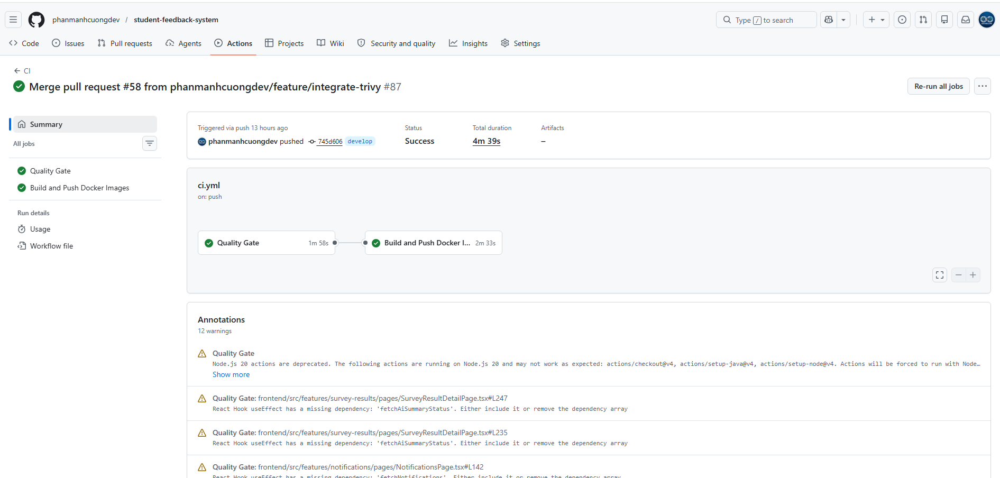

> [Hình 9.2: Screenshot GitHub Actions pipeline passed, thể hiện workflow CI hoàn thành thành công với các job chính]

Trong phạm vi repository hiện tại, frontend có lint/build trong CI nhưng chưa thấy framework unit test hoặc e2e test riêng như Vitest, Jest, Cypress hoặc Playwright. Đây là điểm cần bổ sung nếu muốn tăng mức tự động hóa kiểm thử giao diện.

### 9.7 Kiểm thử bảo mật

Kiểm thử bảo mật được thực hiện ở hai hướng chính:

- **Static/dependency/image scan:** Trivy phát hiện vulnerabilities trong dependency/image. Case study ở Chương 8 cho thấy Trivy từng phát hiện 5 lỗ hổng mức `CRITICAL`, sau đó nhóm nâng Spring Boot parent từ `4.0.3` lên `4.0.6` và scan lại về `0 vulnerabilities` cho các thành phần được kiểm tra.
- **Dynamic web security testing:** OWASP ZAP được dùng trong môi trường kiểm soát để kiểm thử web. Lưu lượng probing/scan bị CrowdSec phát hiện và ban IP.

Ý nghĩa của kết quả này là security testing tạo phản hồi thực tế cho cả codebase và hạ tầng: dependency được cập nhật trước khi image đi xa hơn trong pipeline, còn lớp gateway/proxy có khả năng phát hiện traffic bất thường.

### 9.8 Kiểm thử triển khai và vận hành

Các kiểm thử vận hành cần thực hiện hoặc bổ sung bằng chứng:

- Kiểm tra container status qua Docker hoặc Portainer.
- Kiểm tra backend/frontend container chạy đúng image/tag.
- Kiểm tra Nginx proxy route request `/api` đến backend.
- Kiểm tra domain `survey.cuongdso.id.vn` truy cập được qua public 80/443.
- Kiểm tra SSH chỉ truy cập qua Tailnet, không public Internet.
- Kiểm tra các port nhạy cảm như DB/RabbitMQ/MinIO không public.
- Kiểm tra Prometheus targets `up == 1`.
- Kiểm tra Grafana dashboard hiển thị CPU/RAM/Disk/Network/Uptime.
- Kiểm tra Telegram alert/contact point nếu có ảnh bằng chứng.

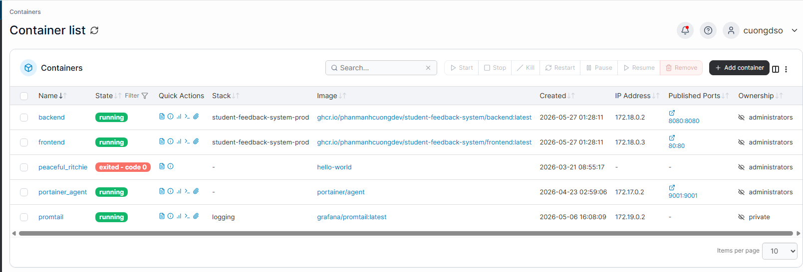

> [Hình 9.3: Portainer/Docker Stack Running, thể hiện backend/frontend container đang chạy]


> [Hình 9.4: TODO - Prometheus Targets Up, thể hiện target monitoring đang scrape thành công]


> [Hình 9.5: TODO - Grafana Dashboard, thể hiện dashboard CPU/RAM/Disk/Network/Uptime]

### 9.9 Đánh giá kết quả kiểm thử

Nhìn chung, hệ thống đã có nền tảng kiểm thử và kiểm soát chất lượng tương đối rõ:

- Các chức năng chính đã được thiết kế để kiểm thử theo module nghiệp vụ.
- Backend có nhiều automated tests cho service, controller, persistence adapter, AI summary và report export.
- Pipeline CI cung cấp kiểm tra tự động cho backend test, frontend lint/build, security scan và Docker image build.
- Security scan đã phát hiện và giúp xử lý lỗ hổng thật, thể hiện giá trị thực tế của security gate.
- Monitoring target `up == 1` cho các target hiện có cho thấy hạ tầng quan sát đã hoạt động ở mức cơ bản.

Các điểm cần bổ sung:

- Frontend cần thêm unit/component test và e2e test cho các flow quan trọng như login, student submit survey, admin publish survey.
- Backend nên mở rộng integration test cho các luồng qua database thật hoặc test container nếu điều kiện cho phép.
- Cần bổ sung API regression test bằng Postman/Newman hoặc công cụ tương đương.
- Cần có performance/load test nếu hệ thống mở rộng quy mô người dùng hoặc số lượng khảo sát lớn.
- Cần bổ sung bằng chứng ảnh cho CI passed, ZAP/CrowdSec, Docker stack, Prometheus và Grafana trong bản báo cáo cuối.

Chương 9 đã trình bày cách hệ thống được kiểm thử từ chức năng, API, phân quyền, CI/CD, bảo mật đến vận hành. Chương 10 sẽ chuyển sang phần kết quả thực hiện và demo, nơi các màn hình và bằng chứng chạy thực tế cần được trình bày trực quan hơn.

## Chương 10. Kết quả thực hiện và demo

### 10.1 Kết quả chức năng

Bảng sau tổng hợp các module chức năng đã được triển khai trong repository và các bằng chứng cần bổ sung vào báo cáo cuối. Các bằng chứng nên là ảnh giao diện, ảnh API response, ảnh pipeline hoặc ảnh log/monitoring tùy từng module.

| Module | Kết quả đạt được | Vai trò sử dụng | Bằng chứng cần bổ sung |
|---|---|---|---|
| Authentication | Có đăng nhập JWT, đổi mật khẩu, forgot/reset password, route guard frontend và Axios interceptor. | Admin, Lecturer, Student | Ảnh login, response login, session redirect theo role. |
| Student registration/email verification | Có đăng ký sinh viên, gửi email xác minh và verify email. | Student | Ảnh register, verify email, email mẫu nếu có. |
| Student document upload | Có upload student card/national ID phục vụ onboarding. | Student | Ảnh màn hình upload, trạng thái upload thành công. |
| Admin student approval | Có danh sách sinh viên pending, xem tài liệu, approve/reject, notification và audit log. | Admin | Ảnh pending students, approve/reject dialog, notification/audit log. |
| Admin user management | Có danh sách user, chi tiết user, cập nhật, activate/deactivate. | Admin | Ảnh users page, user detail, kết quả activate/deactivate. |
| Survey management | Có tạo/cập nhật survey, lifecycle `DRAFT/PUBLISHED/CLOSED/ARCHIVED`, hide/show. | Admin | Ảnh danh sách survey, form create/edit, trạng thái lifecycle. |
| Question bank | Có quản lý ngân hàng câu hỏi dùng lại cho survey/template. | Admin | Ảnh question bank page. |
| Survey template | Có quản lý template khảo sát và câu hỏi template. | Admin | Ảnh survey templates page. |
| Student survey list/detail/submit | Student xem survey được giao, xem chi tiết và nộp câu trả lời. | Student | Ảnh survey list, survey detail, submit success. |
| Feedback | Student gửi feedback độc lập ngoài survey. | Student | Ảnh feedback form, feedback history nếu có. |
| Staff feedback response | Admin/Lecturer xem và phản hồi feedback. | Admin, Lecturer | Ảnh manage feedback, response detail. |
| Notification realtime | Có notification, unread count, mark read và WebSocket/STOMP notification. | Admin, Lecturer, Student | Ảnh notification center/bell, realtime notification nếu có. |
| Survey result/statistics | Admin/Lecturer xem kết quả, metrics, rating breakdown và comments theo quyền. | Admin, Lecturer | Ảnh survey results list/detail. |
| Export report PDF/XLSX | Backend có BIRT report export cho kết quả khảo sát. | Admin, Lecturer | Ảnh file PDF/XLSX export hoặc response tải file. |
| AI summary | Có AI summary cho phản hồi text, job/source state/pending change/theme embedding. | Admin, Lecturer | Ảnh màn hình AI summary, trạng thái generate. |
| Audit log | Có audit log cho thao tác quản trị quan trọng. | Admin | Ảnh audit logs page. |
| Admin/Lecturer/Student dashboard | Có dashboard riêng theo vai trò trong frontend. | Admin, Lecturer, Student | Ảnh dashboard của từng actor. |

### 10.2 Hình ảnh giao diện ứng dụng

Nhóm ảnh giao diện cần thể hiện các chức năng trực tiếp của người dùng cuối và người quản trị.


> [Hình 10.1: TODO - Login Page, thể hiện form đăng nhập và trạng thái xác thực]


> [Hình 10.2: TODO - Student Dashboard, thể hiện góc nhìn của sinh viên sau khi đăng nhập]


> [Hình 10.3: TODO - Admin Dashboard, thể hiện tổng quan quản trị hệ thống]

Nhóm ảnh quản trị khảo sát cần thể hiện cách Admin tạo, quản lý và phát hành survey.


> [Hình 10.4: TODO - Survey Management, thể hiện danh sách khảo sát và trạng thái lifecycle]


> [Hình 10.5: TODO - Create Survey, thể hiện form tạo/cập nhật khảo sát, câu hỏi và phạm vi người nhận]

Nhóm ảnh sinh viên tham gia khảo sát và kết quả khảo sát cần thể hiện luồng từ trả lời đến thống kê.


> [Hình 10.6: TODO - Student Survey Detail, thể hiện nội dung survey và form trả lời]


> [Hình 10.7: TODO - Survey Result Detail, thể hiện metrics, rating breakdown và comments]

Nhóm ảnh feedback, notification và AI cần thể hiện các tính năng bổ sung ngoài luồng khảo sát cơ bản.


> [Hình 10.8: TODO - Feedback Management, thể hiện staff xem và phản hồi feedback]


> [Hình 10.9: TODO - Notification Center, thể hiện notification list, unread/read state]


> [Hình 10.10: TODO - AI Summary, thể hiện bản tóm tắt phản hồi text và trạng thái generate]

### 10.3 Kết quả triển khai ứng dụng

Hệ thống đã được chuẩn bị artifact triển khai bằng Docker. Backend và frontend có Dockerfile multi-stage, CI build image và push lên GHCR khi có push vào nhánh được cấu hình. Runtime config được truyền qua environment hoặc `stack.env` trong Docker Compose.

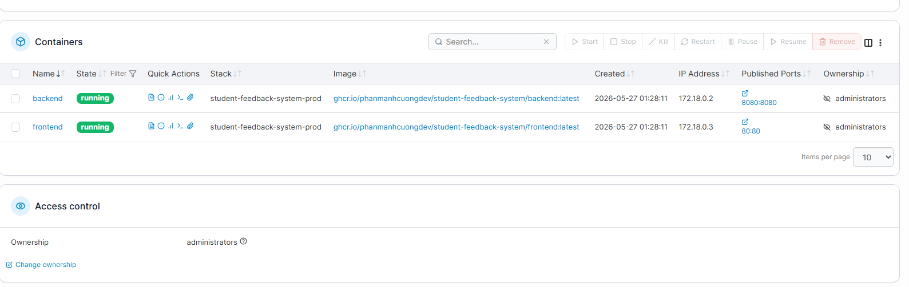

> [Hình 10.11: Docker/Portainer Stack, thể hiện backend/frontend container đang chạy]

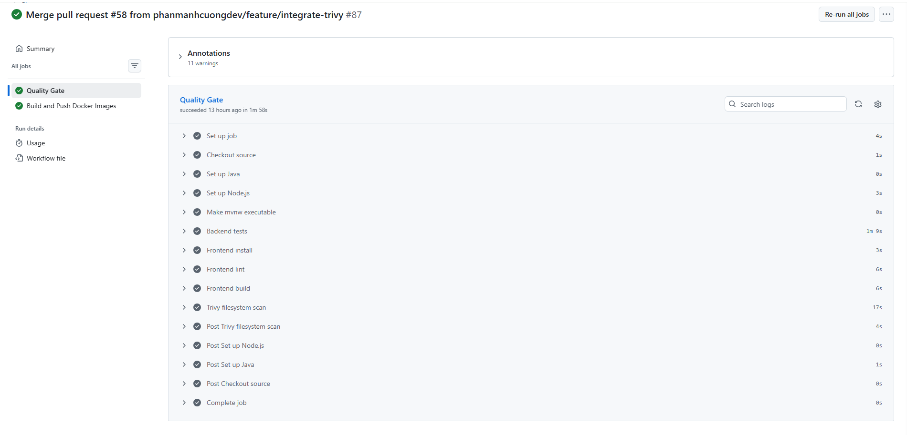

> [Hình 10.12: GitHub Actions Quality Gate, thể hiện backend test, frontend lint/build và Trivy filesystem scan passed]

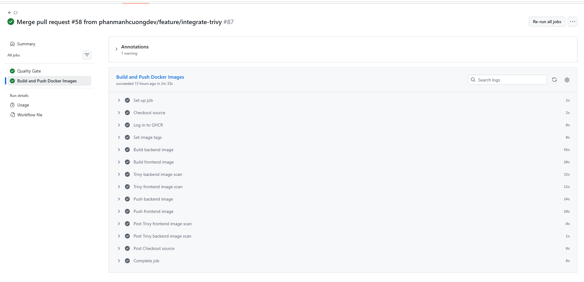

> [Hình 10.13: GitHub Actions Docker job, thể hiện Docker image build, Trivy image scan và push image lên GHCR]

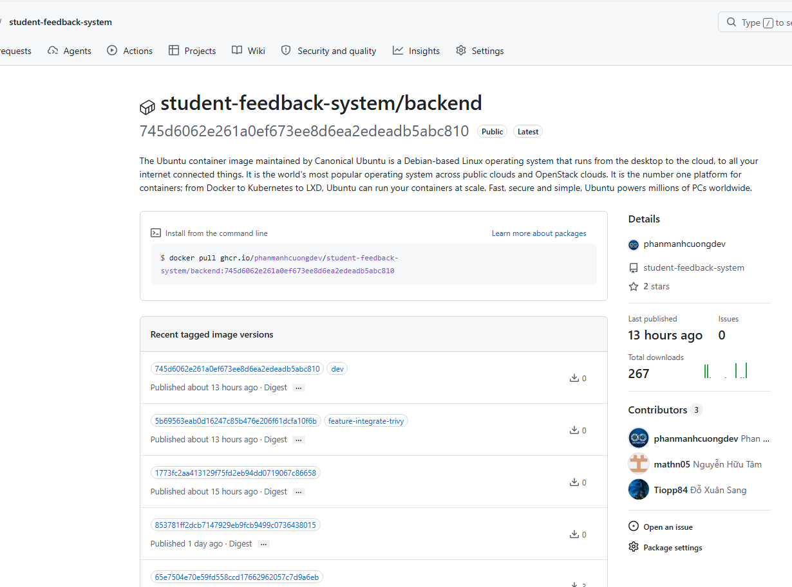

> [Hình 10.14: GHCR backend image package, thể hiện image tags đã được push lên GitHub Container Registry]

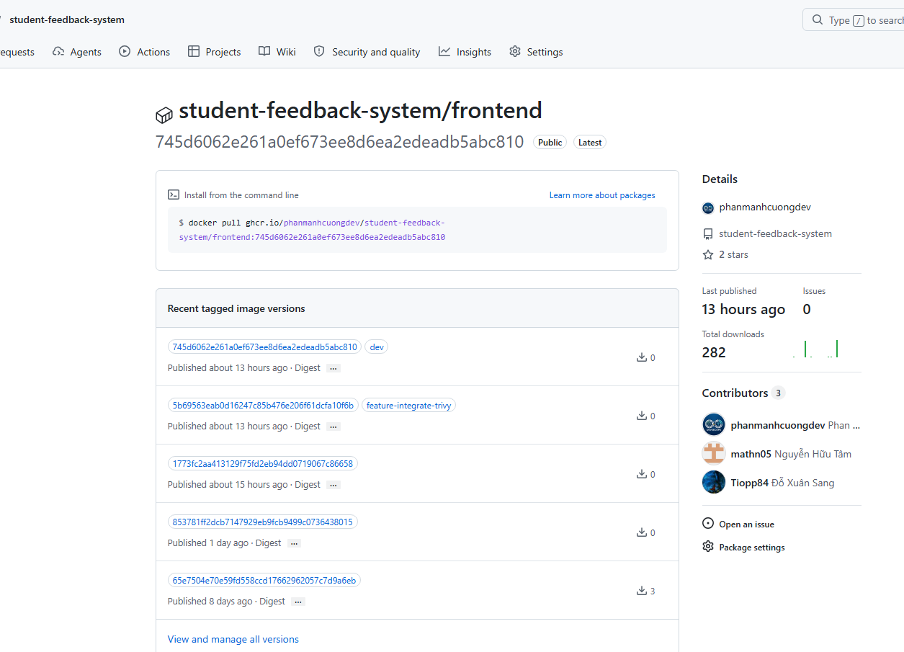

> [Hình 10.15: GHCR frontend image package, thể hiện image tags đã được push lên GitHub Container Registry]

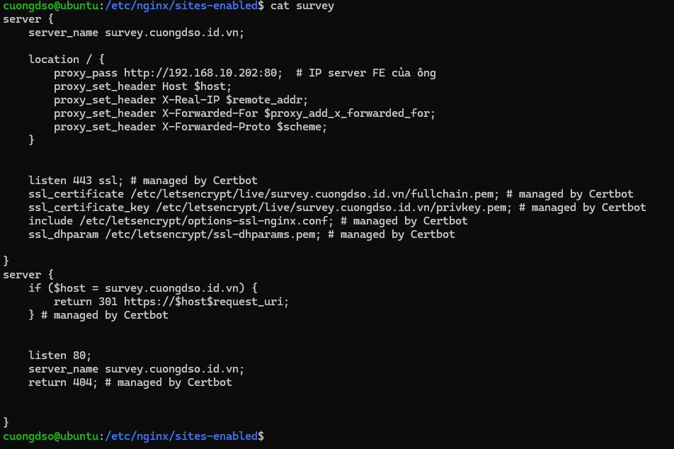

> [Hình 10.16: Cấu hình Nginx reverse proxy cho domain public, thể hiện redirect HTTP sang HTTPS, SSL/TLS và proxy traffic tới frontend production]

Trong phạm vi repository, Docker Compose hiện định nghĩa frontend và backend image từ GHCR. Việc deploy runtime có thể được quản lý bằng Docker/Portainer hoặc stack ngoài repo nếu người vận hành bổ sung ảnh/bằng chứng.

### 10.4 Kết quả hạ tầng và bảo mật

Hạ tầng triển khai được thiết kế theo hướng giảm bề mặt tấn công: public chỉ mở 80/443 qua Nginx, SSH quản trị đi qua Tailnet, DB/RabbitMQ/MinIO không public, Headscale/Tailscale hỗ trợ management plane, fail2ban và CrowdSec hỗ trợ bảo vệ ở tầng host/gateway.


> [Hình 10.17: TODO - Proxmox Overview, thể hiện node/VM/container liên quan hệ thống]


> [Hình 10.18: TODO - Headscale Nodes, thể hiện Tailnet nodes và tags]


> [Hình 10.19: TODO - CrowdSec Decisions, thể hiện quyết định ban IP hoặc phát hiện probing]


> [Hình 10.20: TODO - Public Ports Check, thể hiện chỉ 80/443 public và không public SSH/DB/RabbitMQ/MinIO]

### 10.5 Kết quả monitoring

Monitoring stack đã được triển khai trên Vostro Hub với Prometheus, Grafana OSS và Loki. Prometheus scrape target hạ tầng qua Tailnet; Grafana dashboard hiển thị CPU/RAM/Disk/Network/Uptime; Loki là nền tảng log observation; alerting giúp phát hiện bất thường nếu đã cấu hình contact point/rule.


> [Hình 10.21: TODO - Grafana Node Exporter Dashboard, thể hiện CPU/RAM/Disk/Network/Uptime]


> [Hình 10.22: TODO - Prometheus Targets, thể hiện target `up == 1`]


> [Hình 10.23: TODO - Loki Panel, thể hiện log observation nếu đã có log pipeline]


> [Hình 10.24: TODO - Telegram Alert, thể hiện contact point hoặc alert notification nếu có bằng chứng]

### 10.6 Tổng hợp danh sách hình cần bổ sung

- [x] Use Case Diagram.
- [x] Activity Diagram onboarding.
- [x] Activity Diagram publish survey.
- [x] Activity Diagram submit survey.
- [x] Sequence Diagram login.
- [x] Sequence Diagram submit survey.
- [x] Sequence Diagram AI summary.
- [x] Sequence Diagram realtime notification.
- [x] Domain Model tổng quát.
- [ ] ERD tổng thể.
- [x] System Architecture Diagram.
- [ ] Network Topology.
- [ ] Monitoring Plane.
- [ ] Security Layers.
- [x] GitHub Actions.
- [ ] Trivy scan.
- [ ] ZAP scan.
- [ ] CrowdSec ban IP.
- [ ] UI screenshots.
- [x] Portainer/Docker stack screenshots.
- [ ] Proxmox/Headscale screenshots.

Chương 10 tổng hợp kết quả thực hiện và các bằng chứng cần bổ sung cho phần demo. Chương 11 sẽ đánh giá mức độ đạt được, nêu hạn chế còn tồn tại và đề xuất hướng phát triển tiếp theo cho hệ thống.

## Chương 11. Đánh giá, hạn chế và hướng phát triển

### 11.1 Đánh giá kết quả đạt được

#### 11.1.1 Về nghiệp vụ

Hệ thống đã hỗ trợ được quy trình chính của bài toán khảo sát/phản hồi sinh viên trong môi trường đào tạo. Các actor chính gồm Admin, Lecturer và Student được phân quyền rõ ràng theo chức năng. Student có quy trình đăng ký, xác minh email, upload giấy tờ và chờ Admin duyệt trước khi tham gia khảo sát. Điều này giúp hệ thống kiểm soát tốt hơn tính hợp lệ của người tham gia.

Phần khảo sát có lifecycle rõ ràng từ `DRAFT` đến `PUBLISHED`, `CLOSED`, `ARCHIVED`. Khi publish, hệ thống tạo snapshot người nhận trong `Survey_Recipient`, giúp phạm vi khảo sát ổn định và phục vụ thống kê. Ngoài khảo sát, hệ thống còn có feedback, notification, xuất báo cáo và AI summary, cho thấy phạm vi bài toán không chỉ dừng ở lưu câu trả lời mà còn hướng đến vận hành và khai thác dữ liệu phản hồi.

#### 11.1.2 Về kiến trúc phần mềm

Backend được tổ chức theo Ports and Adapters/Hexagonal Architecture, giúp tách controller, use case, domain model, port và adapter. Cách tổ chức này tạo nền tảng maintain tốt hơn so với việc để controller gọi trực tiếp repository. Các tích hợp như MinIO, RabbitMQ, AI provider, embedding service, JWT và BIRT được đặt qua adapter/cấu hình riêng, giúp giảm phụ thuộc của nghiệp vụ vào công nghệ cụ thể.

Frontend được tổ chức theo feature-based structure, phù hợp với hệ thống có nhiều actor và nhiều nhóm chức năng. Database được quản lý bằng Flyway migration, giúp schema có lịch sử thay đổi rõ ràng. Audit log, domain model và các bảng theo cụm nghiệp vụ như User, Survey, Response, Feedback, Notification, AI Summary giúp mô hình hệ thống có cấu trúc tương đối rõ.

#### 11.1.3 Về DevSecOps và vận hành

Repository đã có Dockerfile cho backend/frontend, GitHub Actions pipeline, backend test, frontend lint/build, Trivy filesystem scan, Docker image build, Trivy image scan và push image lên GHCR. Đây là nền tảng DevSecOps quan trọng vì artifact triển khai được tạo tự động và có security gate trước khi được push.

Ở tầng vận hành, hệ thống được đặt trong môi trường có reverse proxy, VPN management, VLAN, Headscale/Tailscale, Proxmox, VyOS, fail2ban, CrowdSec và monitoring stack Prometheus/Grafana/Loki. Monitoring không còn là ý tưởng tương lai mà đã có triển khai trên Vostro Hub. Cách tiếp cận này thể hiện hệ thống được nhìn như một sản phẩm cần vận hành, không chỉ là phần mềm chạy cục bộ.

### 11.2 Hạn chế

#### 11.2.1 Hạn chế ứng dụng

- Hệ thống chưa có mobile app riêng cho sinh viên hoặc giảng viên.
- Frontend hiện chưa thấy dùng form/schema validation chuyên dụng như Zod, Yup hoặc React Hook Form.
- Trong phạm vi code frontend hiện tại, chưa thấy React Query/SWR để quản lý server state, cache, retry và invalidation.
- Frontend cần thêm automated tests, đặc biệt là component test và end-to-end test cho các flow chính.

#### 11.2.2 Hạn chế backend

- Backend đã có nhiều test, nhưng vẫn cần tiếp tục tăng coverage cho các nhánh lỗi, integration test và security-related behavior.
- Cần bổ sung application-level metrics bằng Spring Boot Actuator hoặc OpenTelemetry để quan sát request latency, error rate, JVM metrics, queue processing và AI job duration.
- Cần rate limiting cho các endpoint nhạy cảm như login, forgot password và reset password.
- Swagger/OpenAPI đang public theo cấu hình hiện tại; production nên giới hạn theo môi trường hoặc chỉ mở qua VPN.

#### 11.2.3 Hạn chế triển khai

- `docker-compose.yml` trong repo hiện chủ yếu đóng gói frontend/backend.
- SQL Server, RabbitMQ, MinIO, AI provider, embedding service và monitoring stack nằm ở hạ tầng ngoài hoặc stack riêng, nên cần tài liệu hóa rõ khi bàn giao.
- GitHub Actions hiện chưa có bước CD tự động deploy trực tiếp lên server.
- Container có thể cần hardening thêm như chạy non-root user và bổ sung healthcheck.

#### 11.2.4 Hạn chế monitoring

- Monitoring hiện là single-node trên Vostro Hub; nếu node này gặp sự cố thì khả năng quan sát bị ảnh hưởng.
- Cần exporter cho SQL Server, RabbitMQ, MinIO và Nginx để quan sát sâu hơn các service phụ trợ.
- Cần hoàn thiện log pipeline Loki/Promtail hoặc agent tương đương để thu log từ backend, Nginx, Docker host và các service quan trọng.
- Cần backup dashboard, datasource, Prometheus config, Loki config và Docker Compose monitoring stack.

#### 11.2.5 Hạn chế bảo mật

- Frontend lưu JWT trong localStorage, thuận tiện cho SPA nhưng có rủi ro nếu xảy ra XSS.
- Cần bổ sung CSP và security headers ở Nginx như X-Frame-Options, X-Content-Type-Options, Referrer-Policy và HSTS.
- Cần cơ chế secret rotation/secret management tốt hơn nếu hệ thống mở rộng production.
- Cần kiểm thử OWASP ZAP định kỳ trong môi trường kiểm soát, có whitelist/quy trình rõ để tránh tự khóa IP quản trị.

### 11.3 Hướng phát triển

- **Hoàn thiện application metrics:** tích hợp Spring Boot Actuator hoặc OpenTelemetry để thu thập metrics ở tầng ứng dụng, giúp phân tích latency, error rate và throughput.
- **Bổ sung exporter cho service phụ trợ:** triển khai exporter cho SQL Server, RabbitMQ, MinIO và Nginx để monitoring không chỉ dừng ở host metrics.
- **Hoàn thiện Loki/Promtail log pipeline:** thu log từ backend, frontend/Nginx, VPS proxy, Docker host và các thành phần hạ tầng quan trọng.
- **Thêm backup automation:** tự động backup database, Flyway history, cấu hình VyOS, Headscale, Nginx, Grafana dashboard và Prometheus config.
- **Thêm CD tự động có approval gate:** triển khai workflow deploy có kiểm soát qua VPN/SSH, Portainer webhook, GitOps hoặc công cụ phù hợp, nhưng cần có bước approve trước production.
- **Cân nhắc Kubernetes hoặc Docker Swarm khi cần scale:** chỉ nên thực hiện khi nhu cầu mở rộng hoặc high availability thực sự xuất hiện.
- **Thêm SSO/OAuth2:** tích hợp đăng nhập qua tài khoản trường hoặc identity provider để giảm quản lý tài khoản cục bộ.
- **Thêm rate limiting/WAF:** bảo vệ login, forgot password, API public và reverse proxy trước brute-force hoặc request bất thường.
- **Cải thiện AI:** bổ sung sentiment analysis, topic clustering, anomaly detection và so sánh xu hướng phản hồi theo kỳ học.
- **Thêm mobile app hoặc responsive PWA:** cải thiện trải nghiệm sinh viên khi tham gia khảo sát trên thiết bị di động.
- **Tăng test coverage:** bổ sung integration test, frontend unit/component test, e2e test và performance test cho các luồng có tải lớn.

### 11.4 Tổng kết giá trị kỹ thuật của dự án

Giá trị kỹ thuật chính của dự án nằm ở việc hệ thống không chỉ dừng lại ở xây dựng các màn hình CRUD cho khảo sát. Repository và hạ tầng đi kèm cho thấy một vòng đời tương đối đầy đủ của sản phẩm phần mềm: từ phân tích yêu cầu, thiết kế nghiệp vụ, thiết kế kiến trúc, cài đặt frontend/backend, migration cơ sở dữ liệu, kiểm thử, CI/CD, security scanning đến triển khai và quan sát hệ thống trong môi trường vận hành.

Ở tầng ứng dụng, backend được tổ chức theo Ports and Adapters / Hexagonal Architecture, giúp tách use case khỏi framework, database và dịch vụ ngoài. Frontend được chia theo feature, có route guard, API layer và session handling phù hợp với React SPA nhiều vai trò. Database có Flyway migration và mô hình domain rõ quanh User, Survey, Response, Feedback, Notification, Audit và AI Summary.

Ở tầng DevSecOps, pipeline không chỉ build ứng dụng mà còn chạy test, lint, build Docker image và quét bảo mật. Việc Trivy từng phát hiện lỗ hổng critical và nhóm xử lý bằng nâng cấp dependency cho thấy security scanning có tác dụng thực tế trong quá trình phát triển, không chỉ là bước trang trí trong pipeline.

Ở tầng vận hành, hệ thống không mở toàn bộ service ra Internet. Public entrypoint được gom qua Nginx reverse proxy; quản trị đi qua VPN Mesh; SSH không public; DB/RabbitMQ/MinIO không được expose trực tiếp. fail2ban và CrowdSec bổ sung lớp bảo vệ ở host/gateway. Monitoring đã được triển khai bằng Prometheus, Grafana OSS và Loki trên monitoring node, nên observability là một phần của hiện trạng vận hành, không chỉ là đề xuất tương lai.

Nhìn tổng thể, dự án tạo được nền tảng kỹ thuật đủ rõ để onboard thành viên mới, maintain lâu dài và mở rộng có kiểm soát. Các hạn chế vẫn tồn tại, nhưng chúng được nhận diện cụ thể và có hướng phát triển thực tế, thay vì che giấu trong báo cáo.

---

# KẾT LUẬN

Đề tài “Hệ thống khảo sát ý kiến sinh viên” xuất phát từ nhu cầu thu thập, quản lý và phân tích phản hồi của sinh viên trong môi trường đào tạo. Thay vì sử dụng các biểu mẫu rời rạc hoặc xử lý thủ công, hệ thống hướng đến một quy trình tập trung, có phân quyền, có kiểm soát trạng thái khảo sát và có khả năng tổng hợp kết quả.

Giải pháp được xây dựng gồm frontend React SPA, backend Spring Boot, cơ sở dữ liệu SQL Server quản lý bằng Flyway migration và các thành phần tích hợp như RabbitMQ, MinIO, Resend, WebSocket/STOMP, BIRT, AI/Gemini-compatible API và embedding service. Backend chính được tổ chức theo Ports and Adapters/Hexagonal Architecture, giúp tách nghiệp vụ khỏi framework và adapter bên ngoài. Frontend được tổ chức theo feature-based structure, phù hợp với các nhóm actor Admin, Lecturer và Student.

Hệ thống không chỉ dừng ở chức năng khảo sát cơ bản. Các chức năng như onboarding sinh viên, duyệt hồ sơ, survey lifecycle, recipient snapshot, feedback, notification realtime, audit log, export report và AI summary cho thấy hệ thống có định hướng triển khai thực tế. Thiết kế này giúp dữ liệu khảo sát không chỉ được lưu trữ mà còn có thể được kiểm soát, khai thác và vận hành lâu dài.

Một điểm quan trọng của đề tài là DevSecOps được đưa vào từ sớm. Repository có Docker containerization, GitHub Actions, backend test, frontend lint/build, Trivy filesystem scan, Docker image scan và image artifact trên GHCR. Case Trivy phát hiện lỗ hổng critical và nhóm nâng Spring Boot parent để xử lý cho thấy security gate có giá trị thực tế.

Ở tầng vận hành, hệ thống được đặt trong bối cảnh hạ tầng có reverse proxy, VPN management, VLAN, Tailnet, Proxmox, VyOS, fail2ban, CrowdSec và monitoring stack Prometheus/Grafana/Loki. Điều này giúp báo cáo không chỉ mô tả phần mềm, mà còn thể hiện cách hệ thống được triển khai, quan sát và bảo vệ trong môi trường vận hành.

Về mặt học thuật, đề tài giúp vận dụng nhiều nội dung của quy trình phát triển phần mềm: phân tích yêu cầu, phân tích nghiệp vụ, thiết kế kiến trúc, thiết kế cơ sở dữ liệu, xây dựng frontend/backend, kiểm thử, CI/CD, bảo mật và vận hành. Các chương trong báo cáo phản ánh quá trình đi từ bài toán đến mô hình hệ thống, từ code đến hạ tầng, từ chức năng đến khả năng maintain.

Tổng kết lại, hệ thống đã có nền tảng tốt để tiếp tục onboard người dùng, maintain và mở rộng. Dù vẫn còn hạn chế về CD tự động, frontend automated tests, application metrics, secret management và log pipeline, kiến trúc hiện tại đủ rõ để nhóm tiếp tục phát triển theo hướng production-ready hơn.

---

# TÀI LIỆU THAM KHẢO

TODO: bổ sung link và chuẩn trích dẫn theo yêu cầu môn học.

- Tài liệu Spring Boot.
- Tài liệu Spring Security.
- Tài liệu React.
- Tài liệu Vite.
- Tài liệu Microsoft SQL Server.
- Tài liệu Flyway.
- Tài liệu Docker.
- Tài liệu GitHub Actions.
- Tài liệu Trivy.
- Tài liệu Prometheus.
- Tài liệu Grafana.
- Tài liệu Loki.
- Tài liệu OWASP ZAP.
- Tài liệu CrowdSec.
- Tài liệu Tailscale/Headscale.
- Tài liệu MinIO.
- Tài liệu RabbitMQ.

---

# PHỤ LỤC

## Phụ lục A. Danh sách API chính

TODO: bổ sung bảng endpoint chi tiết nếu cần nộp kèm API contract.

Các nhóm API chính:

- `/api/auth`: đăng ký, đăng nhập, xác minh email, upload documents, onboarding status, đổi/quên/reset mật khẩu.
- `/api/admin/users`: quản lý người dùng.
- `/api/admin/students`: duyệt/từ chối sinh viên và xem tài liệu onboarding.
- `/api/admin/surveys`: quản lý khảo sát.
- `/api/admin/question-bank`: quản lý ngân hàng câu hỏi.
- `/api/admin/survey-templates`: quản lý mẫu khảo sát.
- `/api/admin/audit-logs`: xem audit log.
- `/api/v1/surveys`: student xem/nộp khảo sát.
- `/api/v1/survey-results`: admin/lecturer xem kết quả và export.
- `/api/v1/feedback`: student gửi feedback, staff phản hồi.
- `/api/v1/notifications`: notification center.
- `/api/v1/survey-results/{surveyId}/ai-summary`: AI summary.

## Phụ lục B. Danh sách biến môi trường

TODO: bổ sung bảng đầy đủ từ `.env.example`, `application.yaml`, Docker/stack config và cấu hình hạ tầng thực tế.

Các nhóm biến môi trường cần trình bày:

- Database connection.
- JWT secret và token expiration.
- CORS allowed origins.
- MinIO endpoint/access key/secret key/bucket.
- Resend API key và email config.
- RabbitMQ host/queue/exchange/routing key.
- AI provider base URL/API key/model.
- Embedding service base URL/model/enabled flag.
- Frontend API base URL.
- Docker image tags và runtime config trong `stack.env`.

## Phụ lục C. Danh sách migration database

Nguồn migration chính:

```text
backend/src/main/resources/db/migration/
```

Các migration hiện có:

- `V1__initial_schema.sql`
- `V2__notification_module.sql`
- `V3__survey_ai_summary.sql`
- `V4__add_bilingual_support.sql`
- `V5__translation_reply_columns_defaults.sql`
- `V6__add_translation_cache_metadata.sql`
- `V7__add_translation_lookup_indexes.sql`
- `V8__add_translation_update_integrity_constraints.sql`
- `V9__ensure_survey_question_translation_support.sql`
- `V10__add_bilingual_translation_targets.sql`
- `V11__add_survey_translation_support.sql`
- `V12__optimize_student_survey_visibility.sql`
- `V13__add_survey_response_translation_support.sql`
- `V14__optimize_notification_query.sql`
- `V15__survey_ai_summary_change_tracking.sql`
- `V16__survey_ai_summary_theme_embedding.sql`

## Phụ lục D. Danh sách hình ảnh cần bổ sung

- [x] Use Case Diagram tổng quát.
- [x] Activity Diagram onboarding sinh viên.
- [x] Activity Diagram tạo và publish khảo sát.
- [x] Activity Diagram sinh viên nộp khảo sát.
- [x] Sequence Diagram đăng nhập JWT.
- [x] Sequence Diagram nộp khảo sát.
- [x] Sequence Diagram AI summary.
- [x] Sequence Diagram realtime notification.
- [ ] ERD tổng thể và ERD theo domain.
- [x] System Architecture Diagram.
- [x] Backend Hexagonal Architecture Diagram.
- [x] Frontend Architecture Diagram.
- [x] Containerization Diagram.
- [ ] Network Topology.
- [ ] Public Access Flow.
- [ ] Management Access Flow.
- [ ] Monitoring Plane Overview.
- [ ] Security Layers Diagram.
- [ ] JWT Authentication Flow.
- [x] GitHub Actions pipeline.
- [ ] Trivy scan passed.
- [ ] OWASP ZAP scan.
- [ ] CrowdSec ban IP.
- [ ] UI screenshots.
- [x] Portainer/Docker stack screenshots.
- [ ] Proxmox/Headscale screenshots.
- [ ] Prometheus/Grafana/Loki screenshots.

## Phụ lục E. Ghi chú triển khai hạ tầng

TODO: bổ sung ảnh/bằng chứng triển khai thực tế từ người vận hành.

Các thông tin hạ tầng đã được cung cấp và sử dụng trong báo cáo:

- Proxmox VE làm nền tảng ảo hóa.
- VyOS Router VM làm gateway Layer 3.
- Cisco Switch làm Layer 2 switch/trunk VLAN.
- VLAN 10 Production, VLAN 20 Lab/Internal, VLAN 99 Management.
- Headscale/Tailscale VPN Mesh dùng dải `100.64.0.0/10`.
- VPS nginx-proxy public entrypoint: Tailnet IP `100.64.0.4`, hostname `ubuntu-rrbzm1pr`, tag `nginx-proxy`.
- Domain `survey.cuongdso.id.vn` trỏ về VPS nginx-proxy.
- Monitoring node Vostro Hub: Tailnet IP `100.64.0.6`, tag `monitoring`.
- Proxmox node: Tailnet IP `100.64.0.5`, tag `hypervisor`.
- bgp-speaker/core-router: IP nội bộ `10.1.99.10`, Tailnet IP `100.64.0.2`, tag `core-router`.
- Sysadmin device: Tailnet IP `100.64.0.1`, tag `sysadmin`.
- Public chỉ mở 80/443 qua Nginx.
- SSH chỉ qua Tailscale interface.
- DB/RabbitMQ/MinIO không public.
- fail2ban trên Ubuntu 24 LTS.
- CrowdSec trên gateway/VPS.

---

# CHECKLIST HÌNH ẢNH VÀ SƠ ĐỒ CẦN BỔ SUNG

## UML/Phân tích nghiệp vụ

| Tên ảnh | File path đề xuất | Mục trong báo cáo | Nội dung cần thể hiện | Mức ưu tiên |
|---|---|---|---|---|
| Use Case Diagram tổng quát (đã bổ sung) | `diagrams/png/use-case-overview.png` | 1.10 | Actor Guest, Student, Lecturer, Admin, System/Scheduler và các use case chính theo nhóm Account & Student, Administration, Results & Communication. | Bắt buộc |
| Activity Diagram onboarding sinh viên (đã bổ sung) | `diagrams/png/activity-student-onboarding.png` | 2.3 | Đăng ký, verify email, upload giấy tờ, Admin approve/reject, audit log, notification và luồng upload lại khi bị reject. | Nên có |
| Activity Diagram tạo và publish khảo sát (đã bổ sung) | `diagrams/png/activity-survey-publish.png` | 2.3 | Admin tạo draft, thêm câu hỏi/assignment, publish, tạo `Survey_Recipient`, audit log và notification. | Nên có |
| Activity Diagram sinh viên nộp khảo sát (đã bổ sung) | `diagrams/png/activity-submit-survey.png` | 2.3 | Student xem survey, mở chi tiết, nhập câu trả lời, submit, lưu response/detail và dispatch translation task nếu có text. | Nên có |
| Sequence Diagram đăng nhập JWT (đã bổ sung) | `diagrams/png/sequence-login-jwt.png` | 2.4 | Frontend, AuthController, AuthUseCaseService, JwtTokenService, persistence adapter và SQL Server. | Nên có |
| Sequence Diagram nộp khảo sát (đã bổ sung) | `diagrams/png/sequence-submit-survey.png` | 2.4 | Frontend, SurveyController, SubmitSurveyService, persistence adapter, SQL Server, RabbitMQ nếu có text. | Nên có |
| Sequence Diagram generate AI summary (đã bổ sung) | `diagrams/png/sequence-ai-summary.png` | 2.4 | Frontend, SurveyAiSummaryController, service, persistence, AI provider, embedding service. | Nên có |
| Sequence Diagram realtime notification (đã bổ sung) | `diagrams/png/sequence-notification.png` | 2.4 | NotificationService, persistence adapter, SQL Server, WebSocket/STOMP adapter, frontend notification provider. | Có thì tốt |
| Domain Model tổng quát (đã bổ sung) | `diagrams/png/domain-model-overview.png` | 2.5 | Các cụm User & Identity, Survey, Response, Feedback, Notification/Audit, Report & AI Summary. | Có thì tốt |

## Kiến trúc ứng dụng

| Tên ảnh | File path đề xuất | Mục trong báo cáo | Nội dung cần thể hiện | Mức ưu tiên |
|---|---|---|---|---|
| System Architecture Diagram tổng thể (đã bổ sung) | `diagrams/png/system-architecture.png` | 3.1 | Browser, React SPA, reverse proxy/Nginx, Spring Boot backend, application core, SQL Server, RabbitMQ, MinIO, Resend, AI/embedding và BIRT export. | Bắt buộc |
| Backend Hexagonal Architecture Diagram (đã bổ sung) | `diagrams/png/backend-hexagonal-architecture.png` | 3.3 | Inbound adapters, application core, input/output ports, domain services/models, outbound adapters, config và infrastructure. | Nên có |
| Frontend Architecture Diagram (đã bổ sung) | `diagrams/png/frontend-architecture.png` | 3.5 | React SPA, Router, AuthProvider, NotificationProvider, route guards, API layer, feature modules, localStorage và backend API/WebSocket. | Có thì tốt |

## Database

| Tên ảnh | File path đề xuất | Mục trong báo cáo | Nội dung cần thể hiện | Mức ưu tiên |
|---|---|---|---|---|
| ERD tổng thể hệ thống | `assets/erd-overview.png` | 4.5 | Toàn bộ bảng chính hoặc các cụm chính và quan hệ trọng tâm. | Bắt buộc |
| ERD User/Auth domain | `assets/erd-user-auth.png` | 4.5 | `User`, `Admin`, `Lecturer`, `Student`, `Department`, `student_token`, `Password_Reset_Token`. | Bắt buộc nếu ERD tổng thể quá lớn |
| ERD Survey domain | `assets/erd-survey-domain.png` | 4.5 | `Survey`, `Question`, `Question_Bank`, `Survey_Assignment`, `Survey_Recipient`, `Survey_Response`, `Response_Detail`, template. | Bắt buộc nếu ERD tổng thể quá lớn |
| ERD Feedback/Notification domain | `assets/erd-feedback-notification.png` | 4.5 | `Feedback`, `Feedback_Response`, `Notification`, `Notification_User`, `Audit_Log`. | Nên có |
| ERD AI Summary domain | `assets/erd-ai-summary.png` | 4.5 | `Survey_AI_Summary`, job, source state, pending change, theme embedding và liên kết tới survey/response. | Nên có |

## Deployment/CI-CD

| Tên ảnh | File path đề xuất | Mục trong báo cáo | Nội dung cần thể hiện | Mức ưu tiên |
|---|---|---|---|---|
| Containerization Diagram (đã bổ sung) | `diagrams/png/containerization-diagram.png` | 5.5 | Backend image, frontend image, Nginx serve SPA/proxy `/api`, Docker network và các service ngoài compose. | Bắt buộc |
| CI/CD Pipeline Diagram (đã bổ sung) | `diagrams/png/cicd-pipeline.png` | 5.7 | Quality job, backend test, frontend lint/build, Trivy fs scan, Docker build, image scan, push GHCR và ghi rõ chưa có CD tự động. | Bắt buộc |
| GitHub Actions Pipeline Passed (đã bổ sung) | `diagrams/png/github-actions-passed.png` | 9.6 | Pipeline chạy thành công ở GitHub Actions, thể hiện workflow/job passed. | Bắt buộc |
| GitHub Actions Quality Gate demo (đã bổ sung) | `diagrams/png/demo-github-actions-quality.png` | 10.3 | Bằng chứng backend test, frontend lint/build và Trivy filesystem scan passed. | Nên có |
| GitHub Actions Docker job demo (đã bổ sung) | `diagrams/png/demo-github-actions-docker.png` | 10.3 | Bằng chứng Docker image build, Trivy image scan và push backend/frontend image. | Nên có |
| GHCR Backend Image (đã bổ sung) | `diagrams/png/demo-ghcr-images-backend.png` | 10.3 | Backend image tags trên GHCR. | Có thì tốt |
| GHCR Frontend Image (đã bổ sung) | `diagrams/png/demo-ghcr-images-frontend.png` | 10.3 | Frontend image tags trên GHCR. | Có thì tốt |
| Docker/Portainer Stack Running (đã bổ sung) | `diagrams/png/portainer-stack.png` | 9.8 | Backend/frontend container đang chạy. | Nên có |
| Docker/Portainer Stack demo (đã bổ sung) | `diagrams/png/demo-portainer-stack.png` | 10.3 | Stack runtime hoặc container status trong Docker/Portainer. | Nên có |
| Nginx Proxy Public Domain (đã bổ sung) | `diagrams/png/demo-nginx-proxy.png` | 10.3 | Domain public đi qua Nginx proxy tới frontend production, có redirect HTTPS và SSL/TLS. | Nên có |

## Network/Infrastructure

| Tên ảnh | File path đề xuất | Mục trong báo cáo | Nội dung cần thể hiện | Mức ưu tiên |
|---|---|---|---|---|
| Network Topology tổng thể | `assets/network-topology.png` | 6.3 | Internet, VPS nginx-proxy, Tailnet, Proxmox, VyOS, VLAN 10/20/99, monitoring node. | Bắt buộc |
| Public Access Flow | `assets/public-access-flow.png` | 6.4 | User -> domain -> VPS Nginx -> Tailnet/internal route -> frontend/backend. | Nên có |
| Management Access Flow qua Tailnet | `assets/management-access-flow.png` | 6.5 | Sysadmin device -> Headscale/Tailscale -> Proxmox/VyOS/VPS/monitoring qua Tailnet. | Nên có |
| Proxmox Overview | `assets/demo-proxmox.png` | 10.4 | Proxmox node/VM/container liên quan hệ thống. | Nên có |
| Headscale Nodes | `assets/demo-headscale-nodes.png` | 10.4 | Tailnet nodes, Tailnet IP, tags như `nginx-proxy`, `monitoring`, `hypervisor`, `core-router`. | Nên có |
| Public Ports Check | `assets/demo-public-ports.png` | 10.4 | Chỉ public 80/443; SSH/DB/RabbitMQ/MinIO không public. | Có thì tốt |

## Monitoring

| Tên ảnh | File path đề xuất | Mục trong báo cáo | Nội dung cần thể hiện | Mức ưu tiên |
|---|---|---|---|---|
| Monitoring Plane Overview | `assets/monitoring-plane-overview.png` | 7.3 | Vostro Hub, Prometheus, Grafana, Loki, Tailnet targets, sysadmin access. | Bắt buộc |
| Prometheus Targets Up | `assets/prometheus-targets-up.png` | 7.4 | Prometheus targets hoặc PromQL `up` trả về `1` cho target hiện có. | Bắt buộc |
| Prometheus Targets Up kiểm thử | `assets/prometheus-targets-up.png` | 9.8 | Bằng chứng monitoring target đang scrape thành công. | Bắt buộc |
| Prometheus Targets demo | `assets/demo-prometheus-targets.png` | 10.5 | Target list trong demo monitoring. | Bắt buộc |
| Grafana Dashboard - Node Exporter | `assets/grafana-node-exporter-dashboard.png` | 7.5 | CPU/RAM/Disk/Network/Uptime dashboard. | Bắt buộc |
| Grafana Dashboard kiểm thử | `assets/grafana-dashboard.png` | 9.8 | Dashboard monitoring trong phần kiểm thử vận hành. | Bắt buộc |
| Grafana Node Exporter Dashboard demo | `assets/demo-grafana-node-exporter.png` | 10.5 | Dashboard Grafana dùng trong demo kết quả monitoring. | Bắt buộc |
| Grafana Telegram Alert Contact Point | `assets/grafana-telegram-alert.png` | 7.5 | Contact point Telegram hoặc alert rule nếu có bằng chứng. | Có thì tốt |
| Telegram Alert demo | `assets/demo-telegram-alert.png` | 10.5 | Alert notification/contact point trong phần demo. | Có thì tốt |
| Loki Logs Panel | `assets/loki-logs-panel.png` | 7.6 | Grafana Explore hoặc Loki panel nếu đã có log pipeline. | Có thì tốt |
| Loki Panel demo | `assets/demo-loki-panel.png` | 10.5 | Bằng chứng Loki query/log observation nếu có. | Có thì tốt |

## Security

| Tên ảnh | File path đề xuất | Mục trong báo cáo | Nội dung cần thể hiện | Mức ưu tiên |
|---|---|---|---|---|
| Security Layers Diagram | `assets/security-layers.png` | 8.1 | Application security, frontend access control, CI/CD security gate, infrastructure hardening, monitoring/security response. | Bắt buộc |
| JWT Authentication Flow | `assets/jwt-auth-flow.png` | 8.2 | Login, JWT issuance, localStorage session, Bearer token, JwtAuthenticationFilter, SecurityContext. | Bắt buộc |
| GitHub Actions Trivy Scan Passed | `assets/trivy-scan-passed.png` | 8.7 | Trivy filesystem/image scan passed sau khi xử lý vulnerabilities. | Nên có |
| OWASP ZAP Scan Evidence | `assets/zap-scan.png` | 8.9 | ZAP scan trong môi trường kiểm soát. | Nên có |
| CrowdSec Decision Ban IP | `assets/crowdsec-ban-ip.png` | 8.9 | CrowdSec decision ban IP khi phát hiện probing/scan. | Nên có |
| API Testing Evidence | `assets/api-testing.png` | 9.4 | Postman/Swagger test public/authenticated/admin/lecturer endpoints. | Có thì tốt |
| CrowdSec Decisions demo | `assets/demo-crowdsec-decisions.png` | 10.4 | CrowdSec decisions hoặc bằng chứng phát hiện probing. | Nên có |

## Demo UI

| Tên ảnh | File path đề xuất | Mục trong báo cáo | Nội dung cần thể hiện | Mức ưu tiên |
|---|---|---|---|---|
| Login Page | `assets/demo-login.png` | 10.2 | Form đăng nhập và trạng thái xác thực. | Bắt buộc |
| Student Dashboard | `assets/demo-student-dashboard.png` | 10.2 | Góc nhìn student sau đăng nhập. | Bắt buộc |
| Admin Dashboard | `assets/demo-admin-dashboard.png` | 10.2 | Tổng quan quản trị hệ thống. | Bắt buộc |
| Survey Management | `assets/demo-survey-management.png` | 10.2 | Danh sách khảo sát, trạng thái lifecycle, thao tác quản trị. | Bắt buộc |
| Create Survey | `assets/demo-create-survey.png` | 10.2 | Form tạo/cập nhật survey, câu hỏi và phạm vi người nhận. | Bắt buộc |
| Student Survey Detail | `assets/demo-student-survey-detail.png` | 10.2 | Nội dung survey và form trả lời của student. | Bắt buộc |
| Survey Result Detail | `assets/demo-survey-result-detail.png` | 10.2 | Metrics, rating breakdown, comments, quyền Admin/Lecturer. | Bắt buộc |
| Feedback Management | `assets/demo-feedback-management.png` | 10.2 | Staff xem và phản hồi feedback. | Nên có |
| Notification Center | `assets/demo-notification-center.png` | 10.2 | Notification list, unread/read state. | Nên có |
| AI Summary | `assets/demo-ai-summary.png` | 10.2 | Summary text, highlights/concerns/actions, trạng thái generate. | Nên có |
